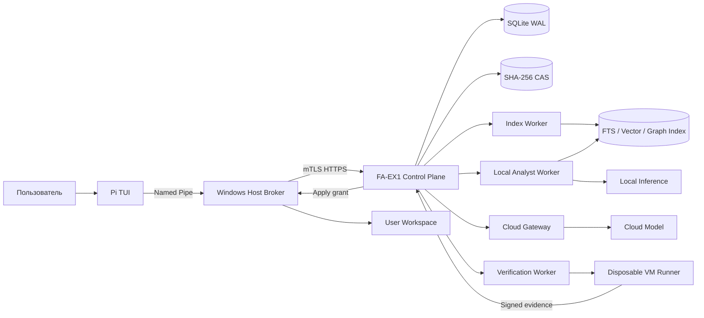
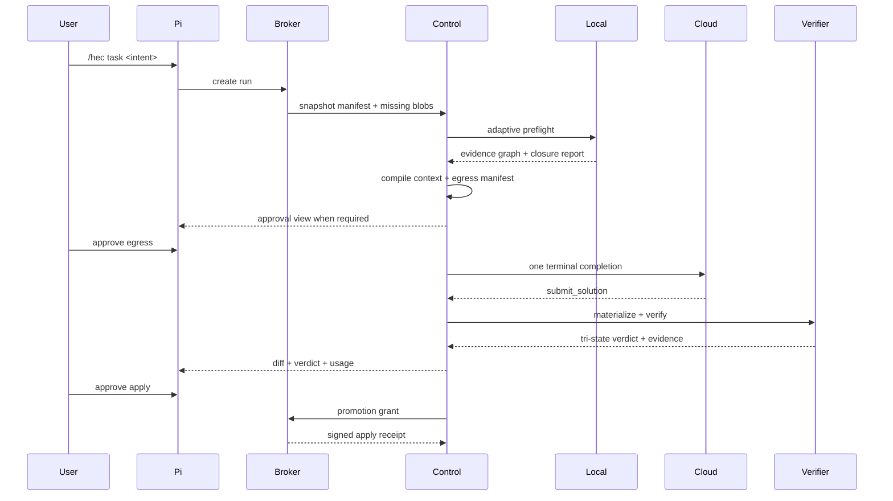

# Pi Hybrid Epistemic Compiler

## Полная архитектурная и implementation-спецификация

> **Для agentic workers:** этот документ — единственный нормативный источник реализации. Реализовывать строго по dependency waves раздела 31; номера задач — стабильные идентификаторы, а не линейный порядок запуска. Перед кодом прочитать разделы 0, 3, 5, 9, 11, 12 и 37. Использовать `superpowers:subagent-driven-development` либо `superpowers:executing-plans`. Отмечать checkbox только после прохождения указанных проверок. Не создавать commit и не выполнять push без отдельного явного запроса пользователя. Не изобретать архитектуру, протоколы, состояния, схемы или обходные пути.

**Версия спецификации:** 1.1  
**Дата фиксации:** 2026-08-27  
**Статус:** нормативная спецификация полного production-состояния  
**Целевая архитектура:** Hybrid Epistemic Compiler  
**Цель:** построить расширение экосистемы Pi, которое заметно повышает качество решения произвольных software-engineering задач, сохраняя среднее и p95 количества cloud API completions не выше обычного Pi с той же cloud-моделью.

Нормативные версии на дату фиксации, которые implementation agent MUST перепроверить и затем закрепить exact lockfile:

| Компонент                         | Floor на 2026-08-27                               | Правило                                        |
| --------------------------------- | ------------------------------------------------- | ---------------------------------------------- |
| Node.js                           | 24.20.0 LTS Krypton                               | latest active LTS, не Current                  |
| pnpm                              | latest stable ≥ 10                                | exact в `packageManager`                       |
| TypeScript                        | latest stable ≥ 5.9                               | exact                                          |
| `@earendil-works/pi-coding-agent` | 0.84.3                                            | exact, все `@earendil-works/pi-*` одной версии |
| `typebox`                         | latest stable ≥ 1.3.7, совместимый с выбранным Pi | exact                                          |
| Fastify                           | latest 5.x ≥ 5.12.1                               | exact                                          |
| `@fastify/type-provider-typebox`  | latest 6.x совместимый с Fastify 5                | exact                                          |
| `better-sqlite3`                  | latest stable                                     | exact                                          |
| Rust                              | latest stable toolchain                           | pin в `rust-toolchain.toml`                    |
| SQLite                            | bundled by `better-sqlite3` / `rusqlite`          | latest stable of those crates                  |

---

## 0. Контракт агента-реализатора

Этот раздел имеет приоритет над вкусом, привычками и «упрощениями» реализующего агента.

### 0.1. Что считается готовым кодом

Каждый production file MUST быть полным: никаких `TODO`, `FIXME`, `unimplemented!()`, `panic!("later")`, `throw new Error("not implemented")`, закомментированной реализации, skipped/disabled tests, `any`, `as unknown as`, неограниченного `eslint-disable` и заглушек «вернём потом». Если контракт ещё не нужен текущей задаче, файл не создаётся.

### 0.2. Запрещено изобретать

Реализующий агент MUST NOT:

- добавлять новые `RunState`, HTTP routes, broker methods, ChangeOperation kinds, evidence tools, cloud tools или artifact roles;
- запускать обычный Pi `AgentSession.prompt()` для cloud execution;
- давать local model write/shell/git/deploy tools;
- выбирать реализацию или писать patch локальной моделью;
- вводить экономические квоты, Prometheus/OTel, PostgreSQL, Qdrant, MinIO, Kafka, Temporal, Prisma, Nest, DI-контейнер;
- делать worktree/Docker единственной sandbox boundary;
- парсить свободный текст cloud model вместо schema;
- отправлять tool result обратно cloud model;
- параллелить несколько cloud completions;
- переписывать `AGENTS.md`/skills перед передачей cloud model;
- хранить secrets в prompt, CAS plaintext, argv, logs или usage ledger;
- менять инварианты раздела 3 без явного одобрения пользователя.

Если спецификация кажется неполной, агент MUST остановиться и зафиксировать вопрос. Догадка, противоречащая контракту, запрещена.

### 0.3. Обязательный цикл каждой задачи

1. Прочитать связанные разделы и уже существующие контракты.
2. Написать failing tests, включая adversarial/property cases из Acceptance.
3. Убедиться, что тесты падают по правильной причине.
4. Реализовать минимальный полный код, удовлетворяющий контракту.
5. Прогнать package tests и корневой `check` затронутых пакетов.
6. Только после Acceptance отмечать checkbox.

TDD обязателен для domain, CAS, state-store, verification, security, cloud-gateway и native runner. UI/deploy задачи всё равно требуют воспроизводимых проверок.

### 0.4. Единственный источник типов

TypeScript interfaces в этом документе — нормативные shapes. Runtime schemas MUST быть TypeBox в `packages/contracts` с `additionalProperties: false`. Rust types генерируются из тех же schemas. Дублировать shape вручную в apps запрещено.

### 0.5. Как читать объём

Документ большой намеренно. Реализация идёт по волнам:

- Wave 0–4: фундамент, контракты, reducer, SQLite, CAS, API.
- Wave 5–8: broker/snapshot, instructions, index, evidence.
- Wave 9–12: local analyst, preflight, context/egress, cloud gateway.
- Wave 13–16: changeset, sandbox, verification, repair, promotion.
- Wave 17–18: Pi UX, usage, qualification, evaluation, hardening.

Не начинать Pi extension, пока нет broker protocol, control API и run reducer. Не начинать cloud dispatch, пока нет ContextPacket/EgressManifest/CAS receipts.

---

## 1. Как читать этот документ

Ключевые слова `MUST`, `MUST NOT`, `SHOULD`, `SHOULD NOT` и `MAY` используются в смысле RFC 2119.

Порядок приоритета требований:

1. Инварианты раздела 3.
2. Контракт агента-реализатора раздела 0.
3. Security-инварианты раздела 24.
4. Нормативные контракты и state machine этой спецификации.
5. Явный запрос пользователя для конкретного run.
6. Доверенные project-level `AGENTS.md`, rules и skills в области их применимости.
7. Наблюдаемое состояние репозитория, тестов, CI и документации.
8. Model-derived hypotheses, usable only as retrieval control hints and never as requirements, proof, cloud instructions or repair text.

Если два требования одного уровня конфликтуют, система MUST сохранить конфликт как отдельный артефакт и запросить решение пользователя. Она MUST NOT молча выбирать интерпретацию.

Эта спецификация является единственным источником архитектурных решений для первой production-версии. Альтернативы разрешены только при выполнении зафиксированного evolution trigger из раздела 29 и после отдельного одобрения пользователя.

---

## 2. Определение успеха

### 2.1. Главная продуктовая метрика

```text
Strict-1C True Task Success =
  paired task-replicates, externally adjudicated as correct
  AND locally ACCEPTED after exactly one accepted cloud completion
  / all pre-registered eligible paired task-replicates
```

External adjudication is blind to arm and uses sealed hidden tests/contracts plus human review where no deterministic oracle exists. `request_context`, `needs_user_input`, malformed response, отказ модели, local false rejection/inconclusive and любой второй cloud completion считаются неуспехом для `Strict-1C`, даже если задача позднее решена repair-проходом. `Operational Strict-1C` (только local `ACCEPTED`) публикуется отдельно и никогда не заменяет true success.

### 2.2. Cloud completion

Один cloud completion — один принятый cloud-провайдером запрос генерации ответа. Каждый follow-up после tool call, context expansion, format correction или repair считается отдельным completion.

Отдельно учитываются:

- `logical_cloud_calls`;
- `provider_transport_attempts`;
- `provider_accepted_completions`;
- `context_followups`;
- `repair_completions`;
- `ambiguous_outcomes`.

Сетевой запрос, который доказуемо не был принят провайдером, не является completion, но остаётся transport attempt. Ambiguous acceptedness консервативно считается completion в quality/call-budget evaluation до provider reconciliation.

### 2.3. Baseline

Baseline MUST запускать обычный Pi:

- на том же snapshot;
- с тем же исходным запросом;
- с теми же project instructions и skills;
- с той же cloud deployment, reasoning profile и output limit;
- в том же verification environment;
- без искусственного ограничения числа turns.

Baseline starts from an independent pristine copy, may use the ordinary Pi tool loop exactly as shipped, and its final workspace is evaluated by the same arm-blind external adjudicator. HEC-only verifier results are not used to score baseline correctness.

### 2.4. Production quality gates

Система не считается достигшей основной цели, пока на закрытом temporal/repository holdout одновременно не выполнены условия:

1. Point estimate `Strict-1C True Task Success` минимум на 20% выше baseline относительно либо минимум на 8 процентных пунктов выше абсолютно.
2. Нижняя граница one-sided 95% task-clustered paired-bootstrap CI для разницы true success больше нуля.
3. Верхняя граница one-sided 95% paired-bootstrap CI для разницы mean cloud completions `HEC - baseline` не больше нуля.
4. Верхняя граница one-sided 95% stratified paired-bootstrap CI для разницы p95 cloud completions `HEC - baseline` не больше нуля.
5. `False Verified Rate = local ACCEPTED but externally incorrect / all local ACCEPTED` имеет upper 95% Wilson bound < 1% и не выше baseline completion-claim false-success rate.
6. Ни один pre-registered обязательный срез `backend`, `frontend`, `mobile`, `systems`, `data`, `infrastructure`, `polyglot` не регрессирует более чем на 2 процентных пункта; CI и insufficient-power status показываются для каждого slice.
7. В adversarial role-isolation suite local model ни разу не становится источником применённого кода, cloud instruction, requirement, verdict или repair guidance.
8. Все gates рассчитаны на одном frozen holdout, fixed task weights и pre-registered exclusion/adjudication rules; post-result exclusions запрещены.

Стоимость, токены и latency измеряются и показываются, но MUST NOT использоваться как причина блокировки run.

---

## 3. Неподвижные инварианты

1. **Только cloud model создаёт решение и код.** Любой production patch, новый test, конфигурация, schema, migration, script, документация задачи и иное изменение репозитория MUST происходить из cloud response.
2. **Local model не решает задачу.** Она MAY извлекать факты, строить retrieval queries, связывать evidence, выявлять причины, противоречия, риски и пробелы, но MUST NOT выбирать окончательную реализацию, писать patch или изменять goal.
3. **Обычный успешный путь содержит один cloud completion.**
4. **Cloud model не получает generic shell, filesystem write, Git mutation, deployment или secret tools.**
5. **Project instructions первичны для workflow.** Доверенные применимые `AGENTS.md`, rules и skills MUST передаваться cloud model без смыслового переписывания.
6. **Нет stack allowlist/denylist.** Неизвестный язык или build system снижает глубину автоматического анализа, но не запрещает run.
7. **Нет экономических квот.** Нельзя останавливать run из-за цены, токенов, числа cloud calls, числа repairs или суммарного времени.
8. **Security limits обязательны.** Per-process timeout, CPU, RAM, disk, PID, output, network и cancellation limits не являются экономическими квотами.
9. **Нет Prometheus, Grafana, OpenTelemetry, telemetry SaaS или отдельного metrics backend.**
10. **Есть локальный durable run/usage ledger.** Без него невозможны resume, воспроизводимость и визуализация расхода.
11. **Model output не является доказательством.** Cloud claims и local findings — недоверенные утверждения до независимой проверки.
12. **Любой run привязан к immutable snapshot.**
13. **Patch применяется и проверяется вне пользовательского workspace.**
14. **Только пользователь либо заранее одобренная локальная policy может инициировать promotion.**
15. **Commit, push, deploy, signing и production mutation не входят в lifecycle решения задачи.**
16. **Дополнительные cloud completions последовательны.** Best-of-N, voting и параллельная генерация нескольких candidate patches запрещены.
17. **Неизвестность сохраняется.** Отсутствие evidence MUST давать `INCONCLUSIVE`, а не искусственный `ACCEPTED`.
18. **Фактическая cloud deployment важнее имени модели.** Capability определяется проверенным сочетанием provider, endpoint, model revision, runtime behavior и account policy.

---

## 4. Не-цели

Система не должна:

- заменять Pi собственным терминальным агентом;
- автоматически принимать архитектурные решения local model;
- автоматически merge/commit/push/deploy;
- обещать exactly-once billing там, где provider не поддерживает idempotency и result lookup;
- навязывать проекту язык, framework, package manager, formatter или test runner;
- исполнять project skill scripts во время discovery;
- считать Git worktree, Docker, WSL2 или process-level ограничения полноценной sandbox boundary;
- хранить secrets в prompt, CAS, logs, command line или usage ledger;
- строить собственную универсальную LSP-реализацию;
- обучать local model online на приватном коде без отдельной явной политики;
- использовать public benchmark score как единственный критерий качества.

---

## 5. Зафиксированные архитектурные решения

### ADR-001: thin Pi extension

Pi extension отвечает только за команды, TUI, отображение, пользовательские решения и связь с локальным broker. Durable orchestration MUST жить вне Pi process.

### ADR-002: FA-EX1 control plane

FA-EX1 запускает authoritative control plane, CAS, state database, index, local inference и sandbox orchestration. Control plane — единственный writer authoritative state.

### ADR-003: Pi SDK только внутри local analyst

`AgentSession` Pi SDK переиспользуется как read-only local agent loop с `SessionManager.inMemory()` и custom evidence tools. Он не является state store и не управляет cloud execution.

### ADR-004: direct one-shot cloud completion

Cloud request выполняется напрямую через Pi AI model runtime либо provider adapter, а не через обычный Pi `AgentSession.prompt()` loop. SDK retries отключены. Terminal tool result не отправляется модели.

### ADR-005: SQLite + filesystem CAS

Single-user authoritative state хранится в SQLite WAL с `synchronous=FULL`. Артефакты хранятся в immutable SHA-256 filesystem CAS. PostgreSQL, object storage и broker не входят в исходную topology.

### ADR-006: schema-first HTTPS

Windows broker, FA-EX1 services и runners взаимодействуют по OpenAPI 3.1/JSON Schema 2020-12 через mTLS HTTPS. MCP MAY предоставлять только необязательный read-only façade.

### ADR-007: Rust host runner

Host snapshot, Windows path safety, VSS, Job Objects и crash-safe promotion реализуются отдельным Rust runner. TypeScript не должен эмулировать handle-based Win32 guarantees строковыми path-проверками.

### ADR-008: VM boundary для project code

Недоверенные build/test/project commands выполняются в disposable VM. Rootless OCI внутри выделенной VM MAY использоваться как environment backend. Worktree используется только как Git convenience внутри sandbox.

### ADR-009: Adaptive Epistemic Preflight

Local plane строит evidence graph до эпистемического fixed point. Stopping зависит от закрытия proof-relevant unknowns и исчерпания полезного frontier, а не от фиксированного числа rounds, hops или retrieved chunks.

### ADR-010: tri-state verification

Verdict имеет только `ACCEPTED`, `REJECTED`, `INCONCLUSIVE`. Пользовательский override хранится отдельно и не переписывает объективный verdict.

### ADR-011: host broker is the privileged authority

Pi extension is an untrusted UX client. In production secure mode Pi runs under a dedicated restricted Windows token/AppContainer and broker-owned Job Object with no workspace write/execute ACL, no inheritable workspace handle, no network route to FA/provider and no child-process escape. It cannot sign approvals, mint capabilities, execute project commands, write the workspace or call control-plane mutation routes directly. The Windows broker owns the authenticated user session, trusted approval surface, host policy, workspace handles and promotion journal. Control-plane capabilities authorize only remote orchestration/runner/cloud actions; snapshot and workspace-promotion authority is minted and consumed solely by the broker after local policy and, where required, an exact user-signed approval decision.

Running Pi with the normal interactive user token is explicitly `COMPATIBILITY_UNCONFINED`, because that process could modify the workspace outside this protocol. Such a run is visually marked, excluded from role-isolation claims and cannot pass production security acceptance. Merely checking executable path, Authenticode signature or named-pipe client PID is not a sandbox.

---

## 6. Целевая topology



### 6.1. Процессы и полномочия

| Компонент                       | Читает                                        | Пишет                                         | Не имеет                                                                          |
| ------------------------------- | --------------------------------------------- | --------------------------------------------- | --------------------------------------------------------------------------------- |
| Pi extension (restricted token) | broker-filtered non-sensitive run projections | private ephemeral UI state                    | workspace write/exec, direct FA/provider network, capability signing, credentials |
| Windows broker                  | approved workspace roots                      | snapshot cache, apply journal, approved files | cloud credentials, arbitrary project execution                                    |
| Control plane                   | contracts, artifacts, operation results       | authoritative DB, CAS, cloud receipts         | direct host filesystem                                                            |
| Index worker                    | immutable snapshots                           | rebuildable index                             | cloud credentials, workspace mutation                                             |
| Local analyst                   | evidence API                                  | restricted advisory traces                    | authoritative ledger/verdict, write/exec tools, cloud credentials                 |
| Cloud gateway                   | compiled request                              | response receipt, usage                       | workspace, sandbox, secrets from project                                          |
| Verification worker             | candidate snapshot, plans                     | evidence artifacts                            | provider credentials, user workspace                                              |
| Secret broker                   | opaque secret mapping, signed injection grant | one-use sealed secret payload                 | model context, project artifacts, workspace, cloud request                        |
| Disposable runner               | one candidate + recipe                        | disposable overlay                            | control DB, LAN, host mounts, signing keys                                        |

### 6.2. Сетевые границы

- Pi extension общается только с Windows broker через ACL-protected named pipe.
- Windows broker устанавливает исходящее mTLS-соединение к FA-EX1.
- Named pipe validates Windows user SID, AppContainer/restricted-token SID, broker Job membership, process creation time and broker instance nonce; executable identity is defense in depth only. Request payloads cannot assert a different principal/project.
- Workstation has no inbound listener. Control plane never connects directly to Pi or workspace.
- Verification runners lease bounded jobs over outbound authenticated channels; sandbox VMs receive only a single job capability and return signed evidence over that channel.
- Every mTLS peer maps certificate SAN/SPIFFE identity to a server-side principal and fixed role; client-supplied role, project, run and workspace claims are ignored unless authorized by that mapping.
- Local inference слушает только loopback либо private Unix socket.
- Provider credentials доступны только process identity cloud gateway/control plane.
- Sandbox network по умолчанию `none`.
- Sandbox MUST NOT видеть FA-EX1 LAN, control API, CAS API или model endpoints.

---

## 7. Нормальный lifecycle: один cloud completion



### 7.1. Детальный порядок

1. Pi передаёт исходный user text verbatim.
2. Windows broker создаёт immutable snapshot manifest.
3. Control plane принимает snapshot только после наличия и проверки всех CAS blobs.
4. Instruction resolver строит effective rule/skill manifests.
5. Index worker создаёт либо повторно использует index revision для точного snapshot.
6. Verification planner выполняет начальные baseline checks, обязательные по user/project workflow.
7. Local analyst выполняет Adaptive Epistemic Preflight и MAY запросить дополнительные baseline observations только по existing verifier capability/check ID; executable/argv строит deterministic planner, не model. `BaselineSeal` финализируется до cloud request.
8. Context compiler создаёт reproducible `ContextPacket`.
9. Egress gateway сканирует финальные bytes и создаёт `EgressManifest`.
10. Standing approval применяется только при полном совпадении policy, provider, classification и content classes; иначе broker открывает trusted native approval surface, а Pi показывает только non-authoritative preview/status.
11. Cloud gateway атомарно фиксирует canonical request и начинает один completion.
12. Cloud MUST вернуть ровно один terminal variant: `submit_solution` либо `request_context`.
13. `submit_solution` валидируется без model-based format repair.
14. ChangeSet материализуется из pristine baseline.
15. Verification plan монотонно расширяется с учётом фактического diff.
16. Все независимые checks исполняются до создания repair packet.
17. Pi показывает verdict, proof-obligation matrix, diff, usage и unresolved facts.
18. При `ACCEPTED` пользователь MAY одобрить promotion.
19. Broker применяет ChangeSet только если workspace всё ещё совпадает с base preconditions.

---

## 8. Исключительные lifecycle

### 8.1. `request_context`

`request_context` завершает текущий cloud completion и MUST содержать конкретные missing claim IDs, evidence kinds и path/symbol hints.

Control plane:

1. отклоняет запросы вида «пришли весь репозиторий»;
2. запускает только релевантные local retrieval actions;
3. создаёт новый versioned `ContextDelta`;
4. повторно выполняет egress scan;
5. создаёт новый logical cloud call;
6. учитывает второй completion во всех метриках.

### 8.2. Repair

Repair разрешён только после полного verification report.

- Один active candidate.
- Один consolidated repair packet.
- Один следующий cloud completion.
- Новый candidate строится от исходного baseline, а не поверх mutable previous workspace.
- Repair MUST вернуть полный replacement ChangeSet.
- Число repairs не ограничено экономикой.
- Exact-state cycle переводит run в `PAUSED_NO_PROGRESS`.

### 8.3. Ambiguous cloud outcome

Если provider мог принять запрос, но полный response receipt отсутствует:

- state становится `CLOUD_OUTCOME_UNKNOWN`;
- автоматический повтор запрещён;
- reconciliation выполняется только если adapter умеет lookup;
- пользователь MAY явно создать новый logical call после предупреждения о возможном дубле.

### 8.4. Workspace drift

Если workspace изменён после snapshot:

- существующий verdict остаётся валиден только для sealed snapshot;
- promotion запрещается;
- создаётся новый snapshot;
- ChangeSet повторно валидируется и полностью проверяется;
- автоматический three-way merge на host запрещён.

---

## 9. Структура monorepo

```text
.
├── package.json
├── pnpm-workspace.yaml
├── tsconfig.base.json
├── eslint.config.mjs
├── prettier.config.mjs
├── vitest.workspace.ts
├── Cargo.toml
├── rust-toolchain.toml
├── justfile
├── client
│   ├── bootstrap.ps1
│   ├── deploy
│   └── apps
│       └── pi-extension
│           ├── package.json
│           ├── src
│           │   ├── index.ts
│           │   ├── broker-client.ts
│           │   ├── commands.ts
│           │   ├── session-pointer.ts
│           │   └── ui
│           │       ├── approvals.ts
│           │       ├── context-view.ts
│           │       ├── diff-view.ts
│           │       ├── status-widget.ts
│           │       └── usage-view.ts
│           └── test
├── faex1
│   ├── bootstrap.sh
│   ├── config
│   │   └── models
│   ├── deploy
│   │   ├── inference
│   │   ├── systemd
│   │   └── backup
│   ├── sandbox-images
│   └── apps
│       ├── control-plane
│       │   ├── package.json
│       │   └── src
│       │       ├── main.ts
│       │       ├── app.ts
│       │       ├── config.ts
│       │       ├── api
│       │       │   ├── artifacts.ts
│       │       │   ├── approvals.ts
│       │       │   ├── operations.ts
│       │       │   ├── projects.ts
│       │       │   ├── runners.ts
│       │       │   └── runs.ts
│       │       ├── orchestration
│       │       │   ├── handlers.ts
│       │       │   ├── reducer.ts
│       │       │   ├── recovery.ts
│       │       │   └── scheduler.ts
│       │       └── services
│       │           ├── cloud-dispatch.ts
│       │           ├── context-jobs.ts
│       │           ├── promotion.ts
│       │           └── verification-jobs.ts
│       ├── context-worker
│       │   └── src
│       │       ├── main.ts
│       │       ├── index-handler.ts
│       │       ├── preflight-handler.ts
│       │       └── context-handler.ts
│       ├── verification-worker
│       │   └── src
│       │       ├── main.ts
│       │       ├── materialize-handler.ts
│       │       └── verify-handler.ts
│       └── secret-broker
│           └── src
│               ├── main.ts
│               ├── grant-verifier.ts
│               └── sealed-injection.ts
├── native
│   └── runner
│       ├── Cargo.toml
│       ├── build.rs
│       └── src
│           ├── main.rs
│           ├── api_client.rs
│           ├── config.rs
│           ├── local_store.rs
│           ├── operations.rs
│           ├── snapshot
│           │   ├── manifest.rs
│           │   ├── mod.rs
│           │   └── chunker.rs
│           ├── promotion
│           │   ├── journal.rs
│           │   ├── mod.rs
│           │   └── recovery.rs
│           └── platform
│               ├── linux.rs
│               ├── macos.rs
│               └── windows
│                   ├── handles.rs
│                   ├── jobs.rs
│                   ├── mod.rs
│                   ├── paths.rs
│                   ├── replace.rs
│                   └── vss.rs
├── packages
│   ├── contracts
│   ├── domain
│   ├── state-store
│   ├── cas
│   ├── client
│   ├── security
│   ├── instructions
│   ├── repository
│   ├── evidence
│   ├── preflight
│   ├── context-compiler
│   ├── models
│   ├── cloud-gateway
│   ├── sandbox
│   ├── verification
│   ├── usage
│   └── test-support
├── migrations
│   ├── control
│   └── runner
├── config
│   ├── policies
│   ├── pricing
│   └── schemas
└── test
    ├── contract
    ├── crash
    ├── e2e
    ├── fixtures
    ├── security
    └── evaluation
```

### 9.1. Правила исходного кода

- TypeScript MUST использовать `strict`, `noUncheckedIndexedAccess`, `exactOptionalPropertyTypes`, `noImplicitOverride` и project references.
- Imports MUST находиться в начале module.
- Switch по union/enum MUST иметь `never`-exhaustiveness check.
- Один production source file SHOULD оставаться меньше 500 строк; 800 строк — hard review gate.
- JSON Schema определяется только в `packages/contracts`; ручные дубли TypeScript/Rust shapes запрещены.
- Rust types генерируются из canonical schemas в build step.
- Domain packages не импортируют apps.
- I/O скрывается за интерфейсами; domain reducers и verdict engine остаются pure.
- В production code запрещены placeholders, disabled tests и закомментированная реализация.
- Новая dependency добавляется только последней стабильной версией, затем фиксируется exact lockfile.

### 9.2. Technology baseline платформы

На старте implementation agent MUST разрешить последние стабильные версии, выполнить qualification и зафиксировать exact lockfiles. Floors на 2026-08-27:

- Node.js latest active LTS: 24.20.0 Krypton; Current 26.x запрещён как runtime pin;
- latest pnpm ≥ 10;
- latest TypeScript ≥ 5.9;
- `@earendil-works/pi-coding-agent` latest stable, floor 0.84.3, и все `@earendil-works/pi-*` одной версии;
- TypeBox как единственный runtime/schema source, floor 1.3.7 и совместимость с выбранным Pi;
- Fastify latest 5.x, floor 5.12.1, плюс `@fastify/type-provider-typebox` latest 6.x;
- `better-sqlite3` latest stable;
- SQLite FTS5 и `sqlite-vec` для initial exact local retrieval;
- Vitest и `fast-check` latest stable;
- Pino/Fastify local JSON logging без network transport;
- latest stable Rust toolchain;
- Rust crates `tokio`, `reqwest` с rustls, `serde`, `rusqlite`, `windows`, `sha2`, `uuid`, `time`, `gix`, `proptest` и `tracing` только с local file/journal sink.

ORM, dependency-injection framework и external workflow engine не используются. SQL migrations и repository methods остаются explicit. New package MUST проходить license, maintenance, provenance и vulnerability checks до добавления.

### 9.3. Dependency graph

```text
A -> B means package B may import package A.

contracts -> domain, cas, security, client, repository, instructions,
             evidence, models, sandbox, verification, preflight,
             context-compiler, cloud-gateway, usage, test-support
domain -> state-store, evidence, verification, preflight
cas -> repository, context-compiler
security -> sandbox, verification, context-compiler, cloud-gateway
repository -> instructions, evidence, verification, preflight
instructions -> verification, preflight, context-compiler
evidence -> verification, preflight, context-compiler
models -> preflight, context-compiler, cloud-gateway
sandbox -> verification
preflight -> context-compiler
state-store -> usage

apps/* -> composition only; no package may import apps/*
```

Любой неуказанный production package edge запрещён. Cycles между packages проверяются deterministic repository script из TypeScript project references, package manifests и Cargo metadata. Shared contracts move upward; importing a concrete worker/service to avoid an interface is forbidden.

### 9.4. Имена пакетов

Все TypeScript packages используют scope `@pi-hec`. Cargo package native runner — `pi-hec-runner`.

```text
@pi-hec/contracts
@pi-hec/domain
@pi-hec/state-store
@pi-hec/cas
@pi-hec/client
@pi-hec/security
@pi-hec/instructions
@pi-hec/repository
@pi-hec/evidence
@pi-hec/preflight
@pi-hec/context-compiler
@pi-hec/models
@pi-hec/cloud-gateway
@pi-hec/sandbox
@pi-hec/verification
@pi-hec/usage
@pi-hec/test-support
@pi-hec/control-plane
@pi-hec/context-worker
@pi-hec/verification-worker
@pi-hec/secret-broker
@pi-hec/pi-extension
```

Root package name: `pi-hec`. Workspace protocol: `pnpm`. Node package manager field MUST pin exact pnpm version.

### 9.5. Канонический каркас, который Task 1 создаёт буквально

`package.json` (root):

```json
{
  "name": "pi-hec",
  "private": true,
  "type": "module",
  "engines": {
    "node": ">=24.20.0"
  },
  "packageManager": "pnpm@10.0.0",
  "scripts": {
    "lint": "eslint . && cargo fmt --all -- --check",
    "typecheck": "tsc -b",
    "test": "vitest run && cargo nextest run --workspace",
    "test:e2e": "vitest run --config vitest.e2e.config.ts",
    "test:security": "vitest run --config vitest.security.config.ts",
    "build": "tsc -b && cargo build --workspace --release",
    "check": "pnpm lint && pnpm typecheck && pnpm test && cargo clippy --workspace --all-targets -- -D warnings"
  }
}
```

`packageManager` MUST быть заменён на фактически установленную latest stable pnpm до первого lockfile. `engines.node` MUST совпасть с выбранным LTS.

`pnpm-workspace.yaml`:

```yaml
packages:
  - "client/apps/*"
  - "faex1/apps/*"
  - "packages/*"
```

`.npmrc`:

```ini
save-exact=true
engine-strict=true
ignore-scripts=false
```

`tsconfig.base.json`:

```json
{
  "compilerOptions": {
    "target": "ES2023",
    "lib": ["ES2023"],
    "module": "NodeNext",
    "moduleResolution": "NodeNext",
    "strict": true,
    "noUncheckedIndexedAccess": true,
    "exactOptionalPropertyTypes": true,
    "noImplicitOverride": true,
    "noFallthroughCasesInSwitch": true,
    "noImplicitReturns": true,
    "noUnusedLocals": true,
    "noUnusedParameters": true,
    "verbatimModuleSyntax": true,
    "isolatedModules": true,
    "declaration": true,
    "declarationMap": true,
    "sourceMap": true,
    "skipLibCheck": true,
    "composite": true
  }
}
```

`rust-toolchain.toml`:

```toml
[toolchain]
channel = "stable"
components = ["rustfmt", "clippy"]
```

Каждый package MUST иметь `src/index.ts`, `package.json` с `"type": "module"`, `tsconfig.json` с `references` только на разрешённые edges раздела 9.3, и `test/` даже если сначала содержит только smoke import. Domain packages MUST NOT зависеть от Fastify, Pi TUI, Windows APIs или QEMU.

### 9.6. Канонический TypeBox pattern

Все wire schemas создаются только так:

```typescript
import { Type, type Static } from "typebox";

export const RunIdSchema = Type.String({
  pattern: "^run_[0-9a-f]{8}-[0-9a-f]{4}-7[0-9a-f]{3}-[89ab][0-9a-f]{3}-[0-9a-f]{12}$",
});

export const CloudResultSchema = Type.Union([ContextRequestSchema, SubmittedSolutionSchema], {
  additionalProperties: false,
});

export type CloudResult = Static<typeof CloudResultSchema>;
```

`Type.Object` MUST передавать `{ additionalProperties: false }`. Discriminated unions MUST использовать литеральное `kind`/`disposition`. Cross-field invariants реализуются отдельными validators в `packages/contracts/src/invariants`, не комментариями.

---

## 10. Канонические идентификаторы и сериализация

```typescript
declare const sha256Brand: unique symbol;
declare const objectDigestBrand: unique symbol;
declare const payloadDigestBrand: unique symbol;
declare const domainDigestBrand: unique symbol;

export type Digest = `sha256:${string}` & {
  readonly [sha256Brand]: true;
};
export type ObjectDigest = Digest & {
  readonly [objectDigestBrand]: true;
};
export type PayloadDigest = Digest & {
  readonly [payloadDigestBrand]: true;
};
export type DomainDigest<TDomain extends string> = Digest & {
  readonly [domainDigestBrand]: TDomain;
};
export type RunId = `run_${string}`;
export type OperationId = `op_${string}`;
export type SnapshotId = `snap_${string}`;
export type CloudCallId = `call_${string}`;
export type EvidenceId = `evidence_${string}`;
export type RequirementId = `req_${string}`;
export type ObligationId = `obl_${string}`;
export type CandidateId = `candidate_${string}`;
export type CheckId = `check_${string}`;
export type ApprovalId = `approval_${string}`;

export type SchemaVersion = number;

export interface ArtifactEnvelope<TPayload> {
  schemaName: string;
  schemaVersion: SchemaVersion;
  payload: TPayload;
  payloadDigest: PayloadDigest;
  signatures: readonly {
    keyId: string;
    algorithm: "Ed25519" | "ECDSA-P256-SHA256";
    signedAt: string;
    signerCertificateObjectDigest: ObjectDigest;
    signature: string;
  }[];
}
```

Правила:

- Lifecycle IDs `RunId`, `OperationId`, `CloudCallId`, `SnapshotId`, `CandidateId` и `ApprovalId` генерируются UUIDv7 и получают type prefix.
- `EvidenceId`, index entity IDs и immutable artifact identity выводятся из content, kind, snapshot и source range; rebuild MUST воспроизводить их.
- Content identity — lowercase raw SHA-256 exact bytes.
- JSON payload перед digest MUST canonicalize по RFC 8785.
- All non-CAS domain hashes use `taggedHash(domain, version, payload) = SHA-256(RFC8785({ domain, version, payload }))`; ad-hoc concatenation/framing is forbidden.
- `payloadDigest = taggedHash("artifact-payload", 1, { schemaName, schemaVersion, payload })`; signatures and outer digest are excluded.
- `payloadDigest` и `signatures` находятся только в `ArtifactEnvelope` и никогда не включаются в digest projection.
- If payload schema includes `schemaVersion`, it MUST exactly equal envelope `schemaVersion`; mismatch is rejected before migration or signature verification.
- Each envelope signature covers `taggedHash("artifact-signature-input", 1, { schemaName, schemaVersion, payloadDigest, keyId, algorithm, signedAt, signerCertificateObjectDigest })`. После deterministic signature ordering canonical serialization полного envelope получает отдельный `ObjectDigest = SHA-256(exact_envelope_bytes)` при записи в CAS.
- Signatures are sorted by `{keyId, algorithm, signedAt}`, unique and verified against the certificate/key registry, validity interval, accepted-ingestion time and revocation effective time. Ed25519 uses canonical RFC 8032 encoding; ECDSA uses strict DER, P-256 point validation and low-S normalization. `signedAt` is not trusted alone: historical validity requires a durable control/broker receipt created before revocation; otherwise revocation fails closed. The exhaustive generated signer registry declares exact roles/counts per schema: enrolled admin for proposed `ProjectPolicy`; control for approval subjects/challenges/display artifacts, ledgers/context/plans/cloud requests/receipts and cloud cancellation receipts; verifier for candidate manifests/evidence/verdicts/no-change receipts; runner for snapshots/apply receipts and sandbox results; broker for approval grants and broker-operation cancellation receipts; enrolled user key for approval decisions. A schema omitted from the signer registry cannot be used as an authority artifact. Missing, duplicate-role or unauthorized signatures fail closed.
- Envelope `ObjectDigest` is computed only after deterministic signature ordering. Re-signing creates a new object identity but the same payload identity; references bind whichever identity their protocol requires.
- Cross-artifact fields use suffix `*ObjectDigest` and contain CAS `ObjectDigest`; `*RootDigest`, `contentDigest`, `quoteDigest` and failure fingerprints use an explicitly registered raw/domain digest type.
- Поле `*Digest` внутри payload всегда ссылается на другой artifact либо на явно определённый Merkle/content root; self-digest fields в payload запрещены.
- Timestamp — RFC 3339 UTC с миллисекундами.
- Paths внутри contracts — `/`-separated normalized relative paths.
- Host-native path никогда не передаётся cloud model.
- Схемы используют JSON Schema 2020-12 и `additionalProperties: false`.
- Каждый schema name имеет monotonic immutable integer registry и explicit read/write compatibility matrix.
- Каждая новая revision помечается `additive`, `breaking` или `migration-required`; schema bytes старой revision никогда не меняются.
- Неизвестная revision отклоняется, пока installed registry не содержит exact reader/migrator.
- Migration создаёт новый envelope; старый artifact не переписывается.
- Repository MUST содержать golden canonicalization/digest/signature vectors для TypeScript и Rust.
- В HTTP `Content-Digest: sha-256=:base64:` кодирует CAS `ObjectDigest` exact transmitted bytes, представленный внутри lowercase hex после `sha256:`.

Runtime schemas use these exact lexical/value constraints:

```text
Digest/ObjectDigest/PayloadDigest/DomainDigest:
  ^sha256:[0-9a-f]{64}$

RunId:       ^run_[0-9a-f]{8}-[0-9a-f]{4}-7[0-9a-f]{3}-[89ab][0-9a-f]{3}-[0-9a-f]{12}$
OperationId: ^op_[0-9a-f]{8}-[0-9a-f]{4}-7[0-9a-f]{3}-[89ab][0-9a-f]{3}-[0-9a-f]{12}$
SnapshotId:  ^snap_[0-9a-f]{8}-[0-9a-f]{4}-7[0-9a-f]{3}-[89ab][0-9a-f]{3}-[0-9a-f]{12}$
CloudCallId: ^call_[0-9a-f]{8}-[0-9a-f]{4}-7[0-9a-f]{3}-[89ab][0-9a-f]{3}-[0-9a-f]{12}$
CandidateId: ^candidate_[0-9a-f]{8}-[0-9a-f]{4}-7[0-9a-f]{3}-[89ab][0-9a-f]{3}-[0-9a-f]{12}$
ApprovalId:  ^approval_[0-9a-f]{8}-[0-9a-f]{4}-7[0-9a-f]{3}-[89ab][0-9a-f]{3}-[0-9a-f]{12}$

EvidenceId:    ^evidence_[a-z2-7]{52}$
RequirementId: ^req_[a-z2-7]{52}$
ObligationId:  ^obl_[a-z2-7]{52}$
CheckId:       ^check_[a-z2-7]{52}$
```

- UUID parsing additionally verifies version 7, RFC 4122 variant and canonical lowercase round-trip; regex alone is not accepted.
- Project/workspace/runner/deployment/schema/producer IDs are NFC, 1–128 UTF-8 bytes and match `^[a-z0-9][a-z0-9._-]*$`; display names are separate.
- All JSON numbers are finite safe integers unless explicitly a confidence. Counts, offsets, byte sizes, tokens, durations, revisions and sequence values are integers in `[0, 9007199254740991]`; positive lengths/limits additionally have minimum `1`.
- Confidence/trust fractions are finite numbers in `[0,1]`. Decimal money is a string matching `^(0|[1-9][0-9]*)(\.[0-9]{1,18})?$`; exponent, sign, comma, NaN and infinity are forbidden.
- Timestamp syntax is canonical UTC `YYYY-MM-DDTHH:mm:ss.SSSZ`, must parse to a real instant, and must round-trip exactly; leap-second input is rejected.
- Byte ranges are zero-based half-open with `0 <= start < end`; line ranges are one-based inclusive with `1 <= start <= end`. Empty content uses `SourceRange.kind:"whole"`, never an invalid zero range.
- Canonical base64 fields use RFC 4648 standard alphabet with required minimal `=` padding and zero unused bits; base64url fields use URL alphabet without padding. Decoded size is bounded before allocation.
- General IDs/reasons are at most 256/16,384 UTF-8 bytes, task text 262,144 bytes, normalized path 32,767 bytes and one path segment 1,024 bytes. Lower host safety profiles may narrow operational input but cannot alter artifact interpretation.
- JSON is decoded from strict UTF-8 with no BOM, duplicate object names or unpaired surrogates; schema uses `maxItems`, `maxLength`, `uniqueItems` and cross-field validators. Absolute collection/byte ceilings are host safety controls, never usage/cost gates.

Digest projection registry is normative and generated into TS/Rust:

```typescript
export interface DigestProjection<TPayload extends JsonValue> {
  domain: string;
  version: number;
  payload: TPayload;
}
```

Revision 1 registry includes `artifact-payload`, `artifact-signature-input`, `task-request`, `snapshot-root`, `git-history-root`, `directory-tree`, `quote`, `evidence-node`, `evidence-edge`, `evidence-bundle`, `requirement-id`, `obligation-id`, `check-id`, `changeset-normalized`, `candidate-tree`, `sandbox-output-tree`, `failure-signature`, `observation-signature`, `verification-evidence-root`, `omission-root`, `state-fingerprint`, `approval-subject`, `cloud-request-binding`, `provider-wire-request`, `storage-record` and `storage-record-signature-input`. Every projection lists included fields, sorting/key normalization, whether `projectId` is mandatory and its result branded type. Optional absent field is omitted; explicit `null` is allowed only where its schema says so; undefined/NaN/infinity/unsafe integers are rejected. Byte strings are unpadded base64url inside tagged JSON. No caller may choose a domain string outside this registry.

---

## 11. Core contracts

### 11.1. Source и provenance

```typescript
export type EvidenceDirectness = "observed" | "static-derived" | "model-derived" | "asserted";

export type SourceRange =
  | { kind: "whole" }
  | {
      kind: "bytes";
      byteStart: number;
      byteEnd: number;
      displayLines?: {
        startLine: number;
        endLine: number;
      };
    };

export type SourceRef =
  | {
      origin: "repository";
      sourceKind: "project-instruction" | "repository" | "git-history";
      snapshotId: SnapshotId;
      artifactObjectDigest: ObjectDigest;
      path: string;
      range: SourceRange;
      quoteDigest: DomainDigest<"quote">;
    }
  | {
      origin: "artifact";
      sourceKind: "user-task" | "platform-policy" | "runtime" | "model-output";
      artifactObjectDigest: ObjectDigest;
      range: SourceRange;
      quoteDigest: DomainDigest<"quote">;
    }
  | {
      origin: "external";
      sourceKind: "external-documentation";
      fetchReceiptObjectDigest: ObjectDigest;
      artifactObjectDigest: ObjectDigest;
      url: string;
      range: SourceRange;
      quoteDigest: DomainDigest<"quote">;
    };

export interface Provenance {
  source: SourceRef;
  extractorId: string;
  extractorVersion: string;
  queryId?: string;
  observedAt: string;
  contentDigest: Digest;
}

export interface TrustVector {
  authority: number;
  directness: EvidenceDirectness;
  extractorReliability: number;
  freshness: number;
  independenceGroup: string;
  adversarialRisk: number;
}
```

For `SourceRef`, byte ranges are zero-based half-open ranges over exact artifact bytes; optional display lines are one-based inclusive metadata and MUST map to the same bytes under the recorded encoding/newline index. `kind: "whole"` quotes the whole artifact. `quoteDigest = taggedHash("quote", 1, { bytesBase64url })`. Repository refs must resolve path→blob in the stated snapshot; external refs must resolve through the stated fetch receipt. Any mismatch makes the evidence inadmissible.

### 11.2. Task Envelope

```typescript
export interface TaskEnvelope {
  schemaVersion: 1;
  runId: RunId;
  originalRequest: string;
  originalRequestDigest: DomainDigest<"task-request">;
  userScope: {
    allowedPathGlobs: readonly string[];
    forbiddenPathGlobs: readonly string[];
    forbiddenOperations: readonly string[];
  };
  attachments: readonly SourceRef[];
  requestedDeploymentId?: string;
  requestedVerificationCommands: readonly CommandSpec[];
  createdAt: string;
}
```

Empty `allowedPathGlobs` means весь repository snapshot, кроме host/platform-protected paths. Candidate loci, найденные local model, никогда не превращаются в allowlist. Только user/platform/trusted-project sources могут сузить scope.

All path-glob fields use only `pi-hec-pathglob/v1`, implemented once as golden-vector-driven TS/Rust libraries:

- subject is an NFC, `/`-separated, repository-root-relative path; absolute paths, empty segments, `.`/`..`, NUL and backslash separators are invalid;
- patterns are root-anchored; `*` matches zero or more non-`/` code points, `?` one non-`/` code point, `[abc]`/`[a-z]` an ASCII class, and `**` is special only as a complete segment and matches zero or more complete segments;
- backslash escapes the next metacharacter; dangling escapes, negation, brace expansion, extglobs, locale classes and platform-native syntax are forbidden;
- leading-dot segments have no special behavior;
- maximum pattern is 1,024 UTF-8 bytes, 128 segments and 32 `**` segments; compiler produces a bounded automaton, never regex backtracking;
- case-sensitive directories compare Unicode scalar values exactly; case-insensitive directories use the pinned Unicode simple-fold table recorded in `SnapshotManifest`;
- broker rejects a snapshot if host filesystem equality/collision behavior differs from the recorded canonical comparison for any captured path;
- each array is set-union, forbidden wins over allowed, and host-protected paths win over every project/user pattern.

The dialect/version and Unicode table object digest are part of snapshot root, policy digest and every scope-bearing approval subject. Fixtures cover escaped metacharacters, dotfiles, empty `**`, non-ASCII folds, per-directory Windows case sensitivity and macOS decomposition.

### 11.3. Requirement Ledger

```typescript
export interface RequirementBase {
  id: RequirementId;
  text: string;
  sourceRefs: readonly SourceRef[];
  priority: "MUST" | "SHOULD";
  state: "CLEAR" | "AMBIGUOUS" | "CONFLICTING";
}

export type Requirement =
  | (RequirementBase & {
      kind: "authoritative";
      source: "USER_EXPLICIT" | "PLATFORM_POLICY" | "PROJECT_INSTRUCTION" | "PUBLIC_CONTRACT";
      normative: true;
    })
  | (RequirementBase & {
      kind: "deterministic-check";
      source: "EXISTING_TEST" | "INFERRED_CHECK";
      normative: false;
    });

export type AuthoritativeRequirement = Extract<Requirement, { kind: "authoritative" }>;

export type DeterministicCheckRequirement = Extract<Requirement, { kind: "deterministic-check" }>;

export interface RequirementLedger {
  schemaVersion: 1;
  runId: RunId;
  originalRequest: string;
  originalRequestDigest: DomainDigest<"task-request">;
  requirements: readonly Requirement[];
  nonGoals: readonly AuthoritativeRequirement[];
  conflicts: readonly {
    id: string;
    requirementIds: readonly RequirementId[];
    explanation: string;
    sourceRefs: readonly SourceRef[];
  }[];
  openQuestions: readonly {
    id: string;
    question: string;
    correctnessImpact: "blocking" | "material" | "advisory";
    sourceRefs: readonly SourceRef[];
  }[];
}
```

Local model MUST NOT create, edit, reprioritize or delete ledger entries. It may only propose evidence/retrieval actions against unresolved claim IDs. A deterministic requirement normalizer creates entries from exact authorized source ranges, preserves a verbatim quote, assigns `source` from provenance and rejects text not entailed by those bytes. `INFERRED_CHECK` is emitted only by deterministic capability/contract analyzers and is always `normative: false`; it cannot override user or project intent.

### 11.4. Repository snapshot

```typescript
export type SnapshotPlatformMetadata =
  | {
      kind: "windows";
      fileId: string;
      reparseTag?: number;
      securityDescriptorDigest: Digest;
      alternateStreams: readonly {
        name: string;
        contentDigest: Digest;
        byteSize: number;
      }[];
    }
  | {
      kind: "posix";
      device: string;
      inode: string;
      mode: number;
      ownerId: number;
      groupId: number;
      xattrsDigest: Digest;
    };

export interface SnapshotEntryBase {
  path: string;
  platformMetadata: SnapshotPlatformMetadata;
}

export type SnapshotEntry =
  | (SnapshotEntryBase & {
      entryType: "file";
      contentDigest: Digest;
      size: number;
      gitMode: "100644" | "100755";
      gitObjectId?: string;
      storage:
        | {
            kind: "blob";
            objectDigest: ObjectDigest;
          }
        | {
            kind: "chunks";
            chunks: readonly [
              {
                digest: ObjectDigest;
                offset: number;
                length: number;
              },
              ...{
                digest: ObjectDigest;
                offset: number;
                length: number;
              }[],
            ];
          };
    })
  | (SnapshotEntryBase & {
      entryType: "directory";
      childNameComparison: "case-sensitive" | "case-insensitive";
    })
  | (SnapshotEntryBase & {
      entryType: "symlink";
      symlinkTarget: string;
      gitMode: "120000";
    })
  | (SnapshotEntryBase & {
      entryType: "submodule";
      gitObjectId: string;
      gitMode: "160000";
    });

export interface SnapshotManifest {
  schemaVersion: 1;
  snapshotId: SnapshotId;
  repositoryId: string;
  workspaceId: string;
  gitHead?: string;
  gitBranch?: string;
  gitIndexDigest?: Digest;
  gitHistoryRootDigest?: DomainDigest<"git-history-root">;
  gitHistoryManifestObjectDigest?: ObjectDigest;
  dirty: boolean;
  filesystem: {
    platform: "windows" | "linux" | "macos";
    rootChildNameComparison: "case-sensitive" | "case-insensitive";
    unicodeNormalization: "NFC" | "NFD" | "none";
    unicodeSimpleFoldTableObjectDigest: ObjectDigest;
    pathGlobDialect: "pi-hec-pathglob/v1";
    volumeIdentity: string;
  };
  entries: readonly SnapshotEntry[];
  ignoredPathDigests: readonly Digest[];
  excludedPaths: readonly {
    path: { kind: "normalized-path"; value: string } | { kind: "project-hmac"; value: string };
    reason: string;
    correctnessImpact: "none" | "possible" | "blocking";
  }[];
  rootDigest: DomainDigest<"snapshot-root">;
  createdAt: string;
  runnerId: string;
}
```

`SnapshotManifest.rootDigest` is not the manifest self-digest. It is:

```text
taggedHash("snapshot-root", 1, {
  repositoryId,
  workspaceId,
  gitHead,
  gitIndexDigest,
  gitHistoryRootDigest,
  dirty,
  filesystem: {
    rootChildNameComparison,
    unicodeNormalization,
    unicodeSimpleFoldTableObjectDigest,
    pathGlobDialect,
    volumeIdentity
  },
  entries: sortByUtf8Path(entries),
  ignoredPathDigests: sortLex(ignoredPathDigests),
  excludedPaths: sortByCanonicalPathRef(excludedPaths)
})
```

`snapshotId`, timestamps, runner ID, signatures and `rootDigest` are excluded from this projection. TS/Rust golden vectors MUST cover empty trees, non-ASCII paths, case-sensitive directories, symlink/submodule entries, executable modes and chunked blobs.

For `storage.kind: "blob"`, object bytes MUST equal the complete file and hash to `contentDigest`. Chunk lists start at offset 0, are gapless/non-overlapping, have positive lengths, end exactly at `size`, and reconstruct bytes hashing to `contentDigest`; each chunk object length/digest is verified before snapshot commit. Directory paths are implied neither by files nor ChangeSet and occur exactly once in the manifest.

### 11.5. Evidence graph

```typescript
export type EvidenceNodeKind =
  | "task"
  | "requirement"
  | "constraint"
  | "invariant"
  | "directory"
  | "file"
  | "symbol"
  | "code-region"
  | "test"
  | "test-result"
  | "coverage-region"
  | "stack-frame"
  | "dependency"
  | "build-config"
  | "schema"
  | "api-contract"
  | "commit"
  | "diff-hunk"
  | "instruction"
  | "fact"
  | "hypothesis"
  | "risk"
  | "unknown"
  | "conflict"
  | "external-documentation";

export interface EvidenceNode {
  id: EvidenceId;
  kind: EvidenceNodeKind;
  identityKey: string;
  authorship: "DETERMINISTIC" | "USER" | "LOCAL_MODEL" | "CLOUD_MODEL";
  label: string;
  contentObjectDigest?: ObjectDigest;
  status: "verified" | "probable" | "unknown" | "conflicted" | "invalidated";
  trust: TrustVector;
  provenance: readonly Provenance[];
  estimatedTokens: number;
}

export type EvidenceRelation =
  | "CONTAINS"
  | "DEFINES"
  | "EXTENDS"
  | "IMPLEMENTS"
  | "IMPORTS"
  | "REFERENCES"
  | "MAY_CALL"
  | "CALLS_OBSERVED"
  | "READS"
  | "WRITES"
  | "FLOWS_TO"
  | "SANITIZES"
  | "COVERED_BY"
  | "FAILS_AT"
  | "PRODUCES"
  | "CHANGED_WITH"
  | "INTRODUCED_BY"
  | "BLAMES"
  | "SUPPORTS"
  | "CONTRADICTS"
  | "DERIVED_FROM"
  | "RESOLVES"
  | "SATISFIES"
  | "AFFECTS"
  | "CANDIDATE_LOCUS"
  | "APPLIES_TO"
  | "OVERRIDES";

export interface EvidenceEdge {
  id: string;
  from: EvidenceId;
  to: EvidenceId;
  relation: EvidenceRelation;
  polarity: "positive" | "negative";
  confidence: number;
  provenance: readonly Provenance[];
}

export interface EvidenceGraph {
  schemaVersion: 1;
  snapshotId: SnapshotId;
  nodes: readonly EvidenceNode[];
  edges: readonly EvidenceEdge[];
}
```

Evidence identities use lowercase base32url of domain-separated SHA-256:

```text
EvidenceNode.id =
  "evidence_" + base32(taggedHash("evidence-node", 1, {
    snapshotId, kind, identityKey, contentObjectDigest,
    provenanceIdentities: sortProvenanceIdentities(provenance)
  }))
EvidenceEdge.id =
  "edge_" + base32(taggedHash("evidence-edge", 1, {
    from, to, relation, polarity,
    provenanceIdentities: sortProvenanceIdentities(provenance)
  }))
EvidenceBundle.id =
  "bundle_" + base32(taggedHash("evidence-bundle", 1, {
    purpose,
    nodeIds: sortLex(nodeIds),
    edgeIds: sortLex(edgeIds),
    exactSourceRefs: sortSourceRefs(exactSourceRefs)
  }))
```

`base32` encodes the raw 32 hash bytes as lowercase unpadded RFC 4648 base32. Provenance identity includes source object/range/quote digest plus extractor ID/version, but excludes `observedAt`, query rank and other volatile metadata. `label`, trust scores, status, token estimate, retrieval rank and confidence are mutable annotations excluded from identity. Only deterministic/user nodes can become production context evidence. Local/cloud-authored nodes remain advisory and cannot be transmuted to `DETERMINISTIC`; an extractor must create a distinct independently reproduced node.

### 11.6. Context packet

```typescript
export interface EvidenceBundle {
  id: string;
  purpose:
    | "requirement-witness"
    | "causal-path"
    | "interface-contract"
    | "regression-surface"
    | "runtime-observation"
    | "counter-evidence"
    | "instruction-scope"
    | "verification-capability";
  nodeIds: readonly EvidenceId[];
  edgeIds: readonly string[];
  exactSourceRefs: readonly SourceRef[];
  mandatory: boolean;
}

export interface InlineSourcePayload {
  sourceRef: SourceRef;
  mediaType: string;
  content:
    | {
        encoding: "utf-8";
        text: string;
      }
    | {
        encoding: "base64";
        base64: string;
      };
}

export interface InlineEvidencePayload {
  evidenceId: EvidenceId;
  node: EvidenceNode;
  sources: readonly [InlineSourcePayload, ...InlineSourcePayload[]];
}

export interface LoadedSkillBody {
  skillId: string;
  descriptor: SkillDescriptor;
  verbatimContent: string;
}

export interface CloudControlEnvelope {
  schemaVersion: 1;
  runId: RunId;
  role: "CLOUD_EXECUTOR";
  userScope: TaskEnvelope["userScope"];
  allowedResultKinds: readonly ["submit_solution", "request_context"];
  allowedChangeOperations: readonly ChangeOperation["kind"][];
  forbiddenCapabilities: readonly [
    "generic-read",
    "shell",
    "workspace-write",
    "git-mutation",
    "secret-access",
    "deployment",
  ];
  resultSchemaObjectDigest: ObjectDigest;
  contextRequestPolicy: {
    existingUnresolvedClaimsOnly: true;
    cumulativeEgressReapproval: true;
  };
}

export interface ContextPacket {
  schemaVersion: 1;
  runId: RunId;
  snapshotId: SnapshotId;
  snapshotRootDigest: DomainDigest<"snapshot-root">;
  requirementLedgerObjectDigest: ObjectDigest;
  instructionManifestObjectDigest: ObjectDigest;
  skillManifestObjectDigest: ObjectDigest;
  control: CloudControlEnvelope;
  requirementLedger: RequirementLedger;
  instructionManifest: InstructionManifest;
  skillManifest: SkillManifest;
  authoritativeInstructions: readonly {
    scope: string;
    precedence: number;
    sourceRef: SourceRef;
    verbatimContent: string;
  }[];
  repositoryMap: readonly {
    path: string;
    kind: string;
    symbols: readonly string[];
    relationIds: readonly string[];
  }[];
  bundles: readonly EvidenceBundle[];
  relations: readonly EvidenceEdge[];
  evidencePayloads: readonly InlineEvidencePayload[];
  loadedSkills: readonly LoadedSkillBody[];
  verifiedFacts: readonly EvidenceId[];
  unknowns: readonly EvidenceId[];
  conflicts: readonly EvidenceId[];
  risks: readonly EvidenceId[];
  verificationCapabilities: readonly VerificationCapability[];
  omissionManifest: {
    omittedEvidenceRootDigest: DomainDigest<"omission-root">;
    countsByReason: Readonly<
      Record<"duplicate" | "lower-utility" | "untrusted" | "window-capacity", number>
    >;
    criticalOmissions: readonly {
      evidenceId: EvidenceId;
      reason: "untrusted" | "window-capacity";
    }[];
  };
  tokenization: {
    deploymentId: string;
    inputTokens: number;
    reservedOutputTokens: number;
    tokenizerRevision: string;
  };
}
```

Every bundle and every ID in `verifiedFacts/unknowns/conflicts/risks` MUST resolve to included independently reproduced nodes with verified provenance and inline bodies, or to structural nodes whose complete metadata is inline. Missing body/ref is a compilation failure. Local-model-authored hypotheses, summaries, labels and rationale MUST NOT appear in production `ContextPacket`; they only drive local retrieval.

`omittedEvidenceRootDigest` commits to sorted `{evidenceId, reason}` pairs stored as a separate artifact. A mandatory bundle, authoritative instruction, requirement witness, exact failing assertion or critical counter-evidence may not be omitted for token capacity; compilation must select a larger qualified deployment or enter the matching capacity state. A `criticalOmissions` entry makes dispatch invalid until resolved or explicitly converted to a user-visible blocking unknown.

Every `repositoryMap.relationId` and bundle `edgeId` resolves exactly once in `relations`; each evidence ID resolves exactly once in `evidencePayloads`. Every effective instruction descriptor maps to exactly one `authoritativeInstructions` body with matching scope/precedence/source/content digest. Every skill descriptor exists in inline `skillManifest`, and every loaded body matches its descriptor digest. Full `RequirementLedger` includes non-goals/conflicts/open questions verbatim. Verification capabilities include typed source refs and producer identity, not display names. These closure checks run before tokenization and again over the final serialized bytes.

### 11.7. Cloud result

```typescript
export interface CloudResultBinding {
  schemaVersion: 1;
  runId: RunId;
  cloudCallId: CloudCallId;
  requestBindingDigest: DomainDigest<"cloud-request-binding">;
  contextPacketObjectDigest: ObjectDigest;
  baseSnapshotId: SnapshotId;
  baseSnapshotRootDigest: DomainDigest<"snapshot-root">;
}

export interface ContextRequest extends CloudResultBinding {
  kind: "request_context";
  missingClaimIds: readonly EvidenceId[];
  requestedEvidenceKinds: readonly EvidenceNodeKind[];
  pathOrSymbolHints: readonly string[];
  requestedSkillIds: readonly string[];
  reason: string;
}

export type ChangeOperation =
  | {
      kind: "text_patch";
      path: string;
      expectedBeforeDigest: Digest;
      expectedAfterDigest: Digest;
      unifiedDiff: string;
      insertedLineEnding: "LF" | "CRLF";
      finalNewline: "PRESENT" | "ABSENT";
    }
  | {
      kind: "create_text";
      path: string;
      content: string;
      expectedAfterDigest: Digest;
      gitMode: "100644" | "100755";
      expectedAbsent: true;
    }
  | {
      kind: "create_directory";
      path: string;
      expectedAbsent: true;
    }
  | {
      kind: "write_binary";
      path: string;
      expectedBeforeDigest: Digest | null;
      mediaType: string;
      base64Content: string;
      expectedAfterDigest: Digest;
      gitMode: "100644" | "100755";
    }
  | {
      kind: "delete";
      path: string;
      expectedBeforeDigest: Digest;
    }
  | {
      kind: "delete_directory";
      path: string;
      expectedTreeDigest: DomainDigest<"directory-tree">;
      expectedEmptyAtOperation: true;
    }
  | {
      kind: "move";
      from: string;
      to: string;
      expectedBeforeDigest: Digest;
      expectedDestinationDigest: Digest | null;
    }
  | {
      kind: "set_git_mode";
      path: string;
      expectedBeforeDigest: Digest;
      expectedCurrentMode: "100644" | "100755";
      newMode: "100644" | "100755";
    }
  | {
      kind: "symlink";
      path: string;
      target: string;
      expectedBeforeDigest: Digest | null;
      expectedAfterDigest: Digest;
    };

export interface ChangeSet {
  schemaVersion: 1;
  baseSnapshotId: SnapshotId;
  baseSnapshotRootDigest: DomainDigest<"snapshot-root">;
  operations: readonly [ChangeOperation, ...ChangeOperation[]];
}

export interface SubmittedResultBase extends CloudResultBinding {
  kind: "submit_solution";
  summary: string;
  assumptions: readonly {
    statement: string;
    evidenceIds: readonly EvidenceId[];
  }[];
  unresolvedFacts: readonly string[];
}

export interface CloudVerificationProposal {
  kind: "project-command";
  executable: string;
  argv: readonly string[];
  workingDirectory: string;
  relatedRequirementIds: readonly RequirementId[];
  expectedSignal: string;
}

export type SubmittedSolution =
  | (SubmittedResultBase & {
      disposition: "solution";
      changeSet: ChangeSet;
      requirementTrace: readonly {
        requirementId: RequirementId;
        satisfaction: "changed" | "already-satisfied";
        operationIndexes: readonly number[];
        testPaths: readonly string[];
        evidenceIds: readonly EvidenceId[];
      }[];
      verificationProposals: readonly CloudVerificationProposal[];
    })
  | (SubmittedResultBase & {
      disposition: "no_change";
      noChangeEvidenceIds: readonly EvidenceId[];
      requirementTrace: readonly {
        requirementId: RequirementId;
        evidenceIds: readonly EvidenceId[];
      }[];
    })
  | (SubmittedResultBase & {
      disposition: "needs_user_input";
      questions: readonly {
        clientQuestionKey: string;
        prompt: string;
        correctnessImpact: "blocking" | "material";
        relatedRequirementIds: readonly RequirementId[];
      }[];
      blockedRequirementIds: readonly RequirementId[];
    });

export type CloudResult = ContextRequest | SubmittedSolution;
```

Нормативные TypeBox tool schemas, которые cloud gateway регистрирует как единственные tools:

```typescript
export const SubmitSolutionToolParametersSchema = Type.Union([
  Type.Object(
    {
      kind: Type.Literal("submit_solution"),
      runId: RunIdSchema,
      cloudCallId: CloudCallIdSchema,
      requestBindingDigest: DomainDigestSchema,
      contextPacketObjectDigest: ObjectDigestSchema,
      baseSnapshotId: SnapshotIdSchema,
      baseSnapshotRootDigest: DomainDigestSchema,
      summary: Type.String({ minLength: 1, maxLength: 16384 }),
      assumptions: Type.Array(AssumptionSchema, { maxItems: 64 }),
      unresolvedFacts: Type.Array(Type.String({ minLength: 1 }), {
        maxItems: 64,
      }),
      disposition: Type.Literal("solution"),
      changeSet: ChangeSetSchema,
      requirementTrace: Type.Array(SolutionRequirementTraceSchema, {
        minItems: 1,
      }),
      verificationProposals: Type.Array(CloudVerificationProposalSchema, {
        maxItems: 32,
      }),
    },
    { additionalProperties: false },
  ),
  Type.Object(
    {
      kind: Type.Literal("submit_solution"),
      runId: RunIdSchema,
      cloudCallId: CloudCallIdSchema,
      requestBindingDigest: DomainDigestSchema,
      contextPacketObjectDigest: ObjectDigestSchema,
      baseSnapshotId: SnapshotIdSchema,
      baseSnapshotRootDigest: DomainDigestSchema,
      summary: Type.String({ minLength: 1, maxLength: 16384 }),
      assumptions: Type.Array(AssumptionSchema, { maxItems: 64 }),
      unresolvedFacts: Type.Array(Type.String({ minLength: 1 }), {
        maxItems: 64,
      }),
      disposition: Type.Literal("no_change"),
      noChangeEvidenceIds: Type.Array(EvidenceIdSchema, { minItems: 1 }),
      requirementTrace: Type.Array(NoChangeRequirementTraceSchema, {
        minItems: 1,
      }),
    },
    { additionalProperties: false },
  ),
  Type.Object(
    {
      kind: Type.Literal("submit_solution"),
      runId: RunIdSchema,
      cloudCallId: CloudCallIdSchema,
      requestBindingDigest: DomainDigestSchema,
      contextPacketObjectDigest: ObjectDigestSchema,
      baseSnapshotId: SnapshotIdSchema,
      baseSnapshotRootDigest: DomainDigestSchema,
      summary: Type.String({ minLength: 1, maxLength: 16384 }),
      assumptions: Type.Array(AssumptionSchema, { maxItems: 64 }),
      unresolvedFacts: Type.Array(Type.String({ minLength: 1 }), {
        maxItems: 64,
      }),
      disposition: Type.Literal("needs_user_input"),
      questions: Type.Array(CloudQuestionSchema, { minItems: 1, maxItems: 16 }),
      blockedRequirementIds: Type.Array(RequirementIdSchema, { minItems: 1 }),
    },
    { additionalProperties: false },
  ),
]);

export const RequestContextToolParametersSchema = Type.Object(
  {
    kind: Type.Literal("request_context"),
    runId: RunIdSchema,
    cloudCallId: CloudCallIdSchema,
    requestBindingDigest: DomainDigestSchema,
    contextPacketObjectDigest: ObjectDigestSchema,
    baseSnapshotId: SnapshotIdSchema,
    baseSnapshotRootDigest: DomainDigestSchema,
    missingClaimIds: Type.Array(EvidenceIdSchema, { minItems: 1, maxItems: 32 }),
    requestedEvidenceKinds: Type.Array(EvidenceNodeKindSchema, { maxItems: 16 }),
    pathOrSymbolHints: Type.Array(Type.String({ minLength: 1, maxLength: 1024 }), {
      maxItems: 32,
    }),
    requestedSkillIds: Type.Array(Type.String({ minLength: 1, maxLength: 256 }), {
      maxItems: 16,
    }),
    reason: Type.String({ minLength: 1, maxLength: 16384 }),
  },
  { additionalProperties: false },
);
```

Cloud MUST emit exactly one top-level result. Multiple tool calls, mixed terminal calls, non-whitespace assistant prose outside structured arguments, unknown fields, incomplete streams и `finish_reason=length` are protocol failures.

Cloud question text, summaries, assumptions and unresolved facts are model claims only. They cannot create/modify requirements, evidence status or commands. Control assigns content-derived question IDs and shows the question with related authoritative requirements; only a persisted user answer may update the ledger. Each `CloudVerificationProposal` is revalidated by the deterministic planner, which creates a new canonical `CommandSpec` with authority `CLOUD_PROPOSED`; the proposal itself is never executable and cannot request environment, network, mounts or secrets.

Cloud-result JSON Schemas set `additionalProperties:false` recursively and enforce these cross-field rules:

- `request_context` has at least one unique `missingClaimId`; every ID already exists as unresolved in the bound ContextPacket, and requested kinds/skills/hints can only refine those claims.
- `solution.requirementTrace` contains exactly one entry for every authoritative `MUST` and no unknown/duplicate requirement. `changed` has at least one valid, unique operation index; `already-satisfied` has no operation indexes and at least one included admissible evidence ID. Every ChangeOperation index is referenced by at least one trace entry.
- Every trace evidence ID and test path resolves inside the bound ContextPacket/snapshot. `SHOULD` requirements omitted from trace appear explicitly in `unresolvedFacts`.
- `no_change` has at least one unique evidence ID and exactly one evidence-backed trace entry for every authoritative `MUST`; it is invalid if any trace needs mutation or the ledger requires creation/change/deletion.
- `needs_user_input` has at least one unique question and blocked requirement ID. Every blocked ID exists and is `AMBIGUOUS`/`CONFLICTING`; questions that merely delegate an implementation choice already decidable from evidence are rejected.
- All IDs/indices are unique and canonically sorted where order has no semantic meaning; `operationIndexes` are strictly increasing. Empty strings and whitespace-only model claims are invalid.

ChangeSet semantics:

1. Operations применяются строго в указанном порядке к ephemeral view.
2. `expectedBeforeDigest` проверяется непосредственно перед своей operation.
3. `null` означает обязательное отсутствие path.
4. `text_patch` MUST содержать hunks только для поля `path`; file headers с другим path запрещены.
5. Patch parser принимает unified diff, serialized как UTF-8/LF, и exact context match; fuzzy/offset apply запрещён.
6. `text_patch` разрешён только для valid UTF-8 source без NUL; исходный UTF-8 BOM сохраняется. Для иных encodings используется `write_binary`.
7. Existing untouched logical lines сохраняют свои exact original terminators; inserted/replaced lines используют `insertedLineEnding`; наличие последнего terminator задаётся `finalNewline`.
8. `move.expectedDestinationDigest === null` требует отсутствующий destination; digest разрешает replace только exact ожидаемых bytes. Unstated overwrite запрещён.
9. `set_git_mode` меняет только canonical Git mode `100644 ↔ 100755`; ACL, owner и platform attributes не моделируются ChangeSet.
10. Два operations MAY касаться одного logical path только в canonical chains `move → text_patch → set_git_mode` или `text_patch → set_git_mode`. Create/write уже задают final mode.
11. Любая иная повторная запись, source/destination overlap или alias через case/Unicode/symlink отклоняется как ambiguous.
12. После каждой operation materializer хеширует affected entry; после всей transaction он пересчитывает result Merkle root и проверяет path length, reserved names, Unicode normalization, case-fold, hardlink, ADS и symlink containment.
13. Case-only rename на case-insensitive filesystem выполняется broker-internal temporary name, который не является ChangeOperation и journaled вместе с move.
14. `.git` и platform-owned paths никогда не меняются. Project `AGENTS.md`, skills или `.pi/hec.json` MAY быть частью явно требуемого ChangeSet, но их новое содержимое начинает действовать только в следующем run.
15. `ChangeSet.operations` MUST быть non-empty. Отсутствие изменений представляется только `disposition: "no_change"` без `changeSet`. Limits on operation count/decoded bytes protect resources and produce a context-capacity/resource state; они не являются economic caps.
16. Parent directory MUST exist immediately before every file/symlink create or move destination. New parents require ordered top-down `create_directory`; no implicit parent creation is allowed.
17. `delete_directory` requires an empty directory at that operation and exact pre-operation directory-tree digest; deletion is bottom-up. Existing parent directories are never removed implicitly.
18. Revision 1 `move` supports file/symlink entries only. Directory rename is encoded as explicit destination directories, per-entry moves and bottom-up source directory deletion.
19. File before/after digest is raw SHA-256 of exact file bytes. Symlink digest is raw SHA-256 of exact UTF-8 bytes of its validated normalized target string. Every byte-producing operation verifies its required `expectedAfterDigest` immediately; mismatch rejects the whole candidate.

```typescript
export interface CandidateManifest {
  schemaVersion: 1;
  candidateId: CandidateId;
  runId: RunId;
  sourceCloudCallId: CloudCallId;
  sourceCloudResultObjectDigest: ObjectDigest;
  requestEnvelopeObjectDigest: ObjectDigest;
  changeSetObjectDigest: ObjectDigest;
  baseSnapshotId: SnapshotId;
  baseSnapshotRootDigest: DomainDigest<"snapshot-root">;
  materializedTreeDigest: DomainDigest<"candidate-tree">;
  changedPaths: readonly string[];
  materializerVersionObjectDigest: ObjectDigest;
  createdAt: string;
}

export interface NoChangeReceipt {
  schemaVersion: 1;
  runId: RunId;
  cloudCallId: CloudCallId;
  cloudResultObjectDigest: ObjectDigest;
  requestEnvelopeObjectDigest: ObjectDigest;
  contextPacketObjectDigest: ObjectDigest;
  requirementLedgerObjectDigest: ObjectDigest;
  baselineSealObjectDigest: ObjectDigest;
  verdictReportObjectDigest: ObjectDigest;
  snapshotId: SnapshotId;
  snapshotRootDigest: DomainDigest<"snapshot-root">;
  completedAt: string;
}

export type SuccessfulRunResult =
  | {
      schemaVersion: 1;
      runId: RunId;
      kind: "applied";
      candidateManifestObjectDigest: ObjectDigest;
      applyReceiptObjectDigest: ObjectDigest;
      resultingSnapshotRootDigest: DomainDigest<"snapshot-root">;
    }
  | {
      schemaVersion: 1;
      runId: RunId;
      kind: "no_change";
      noChangeReceiptObjectDigest: ObjectDigest;
      unchangedSnapshotRootDigest: DomainDigest<"snapshot-root">;
    };
```

Candidate manifest envelope requires the isolated materializer/verifier signer. Its tree digest is computed from the complete resulting entry set through the `candidate-tree` registry projection. Verification, repair and promotion bind the candidate manifest object digest; broker independently reapplies the bound ChangeSet to current base preconditions and compares the resulting tree digest. No-change success requires verifier-signed `NoChangeReceipt`, an accepted `BASELINE_NO_CHANGE` verdict, unchanged current snapshot root and a ledger that permits no mutation; it never creates a ChangeSet or enters promotion. `SUCCEEDED` stores exactly one `SuccessfulRunResult`; the `applied` branch requires a committed apply receipt, while the `no_change` branch forbids every apply/promotion artifact.

### 11.8. Verification

```typescript
export type Verdict = "ACCEPTED" | "REJECTED" | "INCONCLUSIVE";
export type ObligationStatus = "PASS" | "FAIL" | "UNKNOWN";

export interface ProofObligation {
  id: ObligationId;
  requirementIds: readonly RequirementId[];
  claim: string;
  claimMode: "UNIVERSAL" | "EXISTENTIAL" | "INVARIANT" | "NON_REGRESSION";
  kind:
    | "FUNCTIONAL"
    | "BUILD"
    | "STATIC_ANALYSIS"
    | "REPRODUCTION"
    | "SECURITY"
    | "PERFORMANCE"
    | "SOURCE_COMPATIBILITY"
    | "WIRE_COMPATIBILITY"
    | "ABI_COMPATIBILITY"
    | "SCHEMA_COMPATIBILITY"
    | "DATA_MIGRATION"
    | "VISUAL"
    | "ACCESSIBILITY"
    | "BROWSER_INTERACTION"
    | "MOBILE_LIFECYCLE"
    | "PLATFORM_MATRIX"
    | "EVIDENCE_INTEGRITY";
  mandatory: boolean;
  sourceRefs: readonly SourceRef[];
  prerequisites: readonly ObligationId[];
}

export interface EvidenceRecord {
  schemaVersion: 1;
  id: string;
  obligationId: ObligationId;
  relation: "SUPPORTS" | "REFUTES" | "NEUTRAL";
  origin:
    | "VERIFIER"
    | "USER"
    | "SEALED_PROJECT"
    | "INDEPENDENT_TOOL"
    | "CANDIDATE_TEST"
    | "LOCAL_MODEL"
    | "CLOUD_CLAIM";
  independenceGroup: string;
  oracle:
    | "EXPLICIT_EXPECTATION"
    | "RED_GREEN"
    | "REGRESSION"
    | "PROPERTY"
    | "METAMORPHIC"
    | "DIFFERENTIAL"
    | "MUTATION"
    | "SCHEMA_DIFF"
    | "ABI_DIFF"
    | "VISUAL_REFERENCE"
    | "HUMAN_AUTHORIZED";
  baselineSealObjectDigest: ObjectDigest;
  subject:
    | {
        kind: "BASELINE";
        snapshotId: SnapshotId;
        snapshotRootDigest: DomainDigest<"snapshot-root">;
      }
    | {
        kind: "CANDIDATE";
        candidateManifestObjectDigest: ObjectDigest;
      };
  producerId: string;
  producerVersionObjectDigest: ObjectDigest;
  environmentSealObjectDigest: ObjectDigest;
  observations: readonly {
    attempt: number;
    seed?: string;
    state: "PASSED" | "FAILED" | "ERROR" | "SKIPPED";
    observationSignature?: DomainDigest<"observation-signature">;
    exitCode?: number;
    durationMs: number;
    stdoutArtifact?: ObjectDigest;
    stderrArtifact?: ObjectDigest;
  }[];
  artifactObjectDigests: readonly ObjectDigest[];
}

export type EvidenceAssessment =
  | {
      evidenceId: string;
      state: "ADMISSIBLE";
      policyRevisionObjectDigest: ObjectDigest;
    }
  | {
      evidenceId: string;
      state: "INADMISSIBLE";
      policyRevisionObjectDigest: ObjectDigest;
      reasons: readonly string[];
    };

export interface VerdictReport {
  schemaVersion: 1;
  verdict: Verdict;
  baselineSealObjectDigest: ObjectDigest;
  subject:
    | {
        kind: "CHANGESET";
        candidateManifestObjectDigest: ObjectDigest;
      }
    | {
        kind: "BASELINE_NO_CHANGE";
        snapshotId: SnapshotId;
        snapshotRootDigest: DomainDigest<"snapshot-root">;
      };
  verificationPlanObjectDigest: ObjectDigest;
  obligationResults: readonly {
    obligationId: ObligationId;
    status: ObligationStatus;
    evidenceIds: readonly string[];
    reason: string;
  }[];
  failures: readonly {
    code: string;
    attribution: "CANDIDATE" | "BASELINE" | "ENVIRONMENT" | "REQUIREMENT" | "VERIFIER" | "UNKNOWN";
    repairOwner: "CLOUD" | "USER" | "ENVIRONMENT" | "VERIFIER" | "NONE";
    certainty: "CONFIRMED" | "PROBABLE" | "UNRESOLVED";
    obligationIds: readonly ObligationId[];
    evidenceIds: readonly string[];
    failureSignature: DomainDigest<"failure-signature">;
    summary: string;
  }[];
  evidenceRootDigest: DomainDigest<"verification-evidence-root">;
  evidenceAssessments: readonly EvidenceAssessment[];
  workflowState:
    | "TERMINAL"
    | "REPAIRABLE"
    | "WAITING_USER"
    | "WAITING_ENVIRONMENT"
    | "WAITING_PROVIDER"
    | "NO_PROGRESS";
}
```

Evidence producers cannot assert their own admissibility. The verifier derives `EvidenceAssessment` from origin, signature chain, baseline seal, candidate binding, environment compatibility, producer policy and artifact integrity. `LOCAL_MODEL` and `CLOUD_CLAIM` always derive `INADMISSIBLE` and cannot change an obligation status; they may only trigger a deterministic check that produces a new independent record. `ACCEPTED` requires every mandatory obligation `PASS`; `REJECTED` requires at least one confirmed candidate-attributable mandatory `FAIL`; every remaining case is `INCONCLUSIVE`. `PROBABLE` attribution can prioritize investigation but cannot reject. Verdict computation is a pure truth table over admissible records and cannot call a model.

### 11.9. Supporting contracts

Ни один тип в public interface не оставляется implicit.

```typescript
export interface InstructionDescriptor {
  id: string;
  scope: string;
  precedence: number;
  trust: "platform" | "user" | "trusted-project" | "untrusted-data";
  sourceRef: SourceRef;
  contentDigest: Digest;
}

export interface InstructionManifest {
  schemaVersion: 1;
  snapshotId: SnapshotId;
  instructions: readonly InstructionDescriptor[];
}

export interface SkillManifest {
  schemaVersion: 1;
  snapshotId: SnapshotId;
  skills: readonly SkillDescriptor[];
  conflicts: readonly {
    skillIds: readonly string[];
    sourceRefs: readonly SourceRef[];
    reason: string;
  }[];
}

export interface RetrievalQueryRequest {
  schemaVersion: 1;
  runId: RunId;
  snapshotId: SnapshotId;
  originalRequest: string;
  unresolvedClaimIds: readonly EvidenceId[];
  existingQueries: readonly string[];
}

export interface RetrievalQueryResult {
  schemaVersion: 1;
  queries: readonly {
    query: string;
    targetClaimIds: readonly EvidenceId[];
    entityHints: readonly string[];
    relationHints: readonly EvidenceRelation[];
  }[];
}

export interface EvidenceFrontierRequest {
  schemaVersion: 1;
  runId: RunId;
  snapshotId: SnapshotId;
  evidenceGraphObjectDigest: ObjectDigest;
  lane:
    | "requirements"
    | "structure"
    | "runtime-tests"
    | "history"
    | "instructions"
    | "risk"
    | "counter-evidence";
  unresolvedClaimIds: readonly EvidenceId[];
  availableChannelIds: readonly string[];
  visitedActionDigests: readonly Digest[];
}

export interface EvidenceActionProposal {
  schemaVersion: 1;
  evidenceGraphObjectDigest: ObjectDigest;
  actions: readonly RetrievalAction[];
  fixedPointClaimed: boolean;
}

export interface EvidenceLinkRequest {
  schemaVersion: 1;
  snapshotId: SnapshotId;
  evidenceGraphObjectDigest: ObjectDigest;
  nodeIds: readonly EvidenceId[];
  allowedRelations: readonly EvidenceRelation[];
}

export interface LocalEvidenceProposal {
  proposalId: string;
  kind: "hypothesis" | "risk" | "unknown" | "conflict";
  statement: string;
  citedSourceRefs: readonly SourceRef[];
  targetClaimIds: readonly EvidenceId[];
  requestedReproductionActions: readonly RetrievalAction[];
}

export interface LocalRelationProposal {
  proposalId: string;
  fromCandidateRef: EvidenceId | string;
  toCandidateRef: EvidenceId | string;
  relation: EvidenceRelation;
  citedSourceRefs: readonly SourceRef[];
}

export interface EvidenceLinkResult {
  schemaVersion: 1;
  evidenceGraphObjectDigest: ObjectDigest;
  proposedEvidence: readonly LocalEvidenceProposal[];
  proposedRelations: readonly LocalRelationProposal[];
}

export interface EpistemicAuditRequest {
  schemaVersion: 1;
  runId: RunId;
  evidenceGraphObjectDigest: ObjectDigest;
  requirementIds: readonly RequirementId[];
  closureTemplate: "bug" | "feature" | "refactor" | "investigation";
}

export interface EpistemicAuditResult {
  schemaVersion: 1;
  evidenceGraphObjectDigest: ObjectDigest;
  proposedUnknowns: readonly LocalEvidenceProposal[];
  proposedConflicts: readonly LocalEvidenceProposal[];
  closureCheckSuggestions: readonly {
    id: string;
    relevantEvidenceIds: readonly EvidenceId[];
    missingEvidenceKinds: readonly EvidenceNodeKind[];
  }[];
}

export interface LocalSemanticFinding {
  id: string;
  kind:
    | "AMBIGUITY"
    | "CONTRADICTION"
    | "RISK"
    | "ROOT_CAUSE_HYPOTHESIS"
    | "SEMANTIC_MISMATCH"
    | "MISSING_EVIDENCE";
  statement: string;
  sourceRefs: readonly SourceRef[];
  requirementIds: readonly RequirementId[];
  confidence: "LOW" | "MEDIUM" | "HIGH";
}

export interface SemanticVerificationRequest {
  schemaVersion: 1;
  runId: RunId;
  snapshotId: SnapshotId;
  requirementLedgerObjectDigest: ObjectDigest;
  candidateId: CandidateId;
  candidateManifestObjectDigest: ObjectDigest;
  changeSetObjectDigest: ObjectDigest;
  evidenceGraphObjectDigest: ObjectDigest;
  deterministicEvidenceIds: readonly string[];
}

export interface SemanticVerificationResult {
  schemaVersion: 1;
  candidateId: CandidateId;
  candidateManifestObjectDigest: ObjectDigest;
  findings: readonly LocalSemanticFinding[];
}

export interface ClosureReport {
  schemaVersion: 1;
  runId: RunId;
  snapshotId: SnapshotId;
  state: "COMPLETE" | "SATURATED_WITH_UNKNOWNS" | "RESOURCE_LIMITED";
  evidenceGraphObjectDigest: ObjectDigest;
  requirementWitnesses: readonly {
    requirementId: RequirementId;
    bundleIds: readonly string[];
    status: "covered" | "unknown" | "conflicted";
  }[];
  unresolvedCriticalEvidenceIds: readonly EvidenceId[];
  exhaustedActionDigests: readonly Digest[];
  stabilityAuditObjectDigest: ObjectDigest;
}

export interface ContextDelta {
  schemaVersion: 1;
  runId: RunId;
  priorContextPacketObjectDigest: ObjectDigest;
  requestedByCloudCallId: CloudCallId;
  evidenceBundles: readonly EvidenceBundle[];
  resolvedClaimIds: readonly EvidenceId[];
  stillUnresolvedClaimIds: readonly EvidenceId[];
}

export type JsonValue =
  null | boolean | number | string | readonly JsonValue[] | { readonly [key: string]: JsonValue };

export type CompiledCloudContent =
  | { kind: "text"; text: string }
  | {
      kind: "artifact";
      mediaType: string;
      artifactObjectDigest: ObjectDigest;
      canonicalUtf8: string;
    };

export type CompiledCloudMessage =
  | {
      role: "user";
      content: readonly CompiledCloudContent[];
    }
  | {
      role: "assistant";
      content: readonly CompiledCloudContent[];
      terminalCall?: {
        callId: string;
        name: "submit_solution" | "request_context";
        canonicalArguments: JsonValue;
      };
    }
  | {
      role: "tool";
      toolCallId: string;
      toolName: "request_context";
      content: readonly CompiledCloudContent[];
    };

export interface CompiledCloudConversation {
  schemaVersion: 1;
  requestBinding: CloudRequestBinding;
  requestBindingDigest: DomainDigest<"cloud-request-binding">;
  systemPrompt: string;
  messages: readonly CompiledCloudMessage[];
  tools: readonly {
    name: "submit_solution" | "request_context";
    description: string;
    inputSchema: JsonValue;
    inputSchemaObjectDigest: ObjectDigest;
  }[];
  allowedTerminalTools: readonly ["submit_solution", "request_context"];
  exactlyOneTerminalCallRequired: true;
}

export interface CanonicalCloudRequestBase {
  schemaVersion: 1;
  runId: RunId;
  cloudCallId: CloudCallId;
  requestBinding: CloudRequestBinding;
  requestBindingDigest: DomainDigest<"cloud-request-binding">;
  deploymentId: string;
  adapterVersionObjectDigest: ObjectDigest;
  contextPacketObjectDigest: ObjectDigest;
  egressManifestObjectDigest: ObjectDigest;
  compiledConversationObjectDigest: ObjectDigest;
  resultMode: "terminal-tools" | "strict-json-schema";
  maxOutputTokens: number;
  reasoningProfile: string;
}

export type CloudRequestBinding =
  | {
      schemaVersion: 1;
      purpose: "initial";
      runId: RunId;
      cloudCallId: CloudCallId;
      contextPacketObjectDigest: ObjectDigest;
      baseSnapshotId: SnapshotId;
      baseSnapshotRootDigest: DomainDigest<"snapshot-root">;
      deploymentId: string;
      adapterVersionObjectDigest: ObjectDigest;
      modelRevision: string;
      resultSchemaObjectDigest: ObjectDigest;
    }
  | {
      schemaVersion: 1;
      purpose: "context-followup";
      runId: RunId;
      cloudCallId: CloudCallId;
      parentCloudCallId: CloudCallId;
      contextPacketObjectDigest: ObjectDigest;
      contextDeltaObjectDigest: ObjectDigest;
      baseSnapshotId: SnapshotId;
      baseSnapshotRootDigest: DomainDigest<"snapshot-root">;
      deploymentId: string;
      adapterVersionObjectDigest: ObjectDigest;
      modelRevision: string;
      resultSchemaObjectDigest: ObjectDigest;
    }
  | {
      schemaVersion: 1;
      purpose: "repair";
      runId: RunId;
      cloudCallId: CloudCallId;
      parentCloudCallId: CloudCallId;
      contextPacketObjectDigest: ObjectDigest;
      repairPacketObjectDigest: ObjectDigest;
      priorCandidateManifestObjectDigest: ObjectDigest;
      baseSnapshotId: SnapshotId;
      baseSnapshotRootDigest: DomainDigest<"snapshot-root">;
      deploymentId: string;
      adapterVersionObjectDigest: ObjectDigest;
      modelRevision: string;
      resultSchemaObjectDigest: ObjectDigest;
    };

export type CanonicalCloudRequest =
  | (CanonicalCloudRequestBase & {
      purpose: "initial";
    })
  | (CanonicalCloudRequestBase & {
      purpose: "context-followup";
      parentCloudCallId: CloudCallId;
      contextDeltaObjectDigest: ObjectDigest;
    })
  | (CanonicalCloudRequestBase & {
      purpose: "repair";
      parentCloudCallId: CloudCallId;
      repairPacketObjectDigest: ObjectDigest;
      priorCandidateManifestObjectDigest: ObjectDigest;
    });

export interface ProviderWireRequest {
  schemaVersion: 1;
  requestEnvelopeObjectDigest: ObjectDigest;
  deploymentId: string;
  adapterVersionObjectDigest: ObjectDigest;
  endpointIdentity: string;
  providerApiVersion: string;
  modelRevision: string;
  method: "POST";
  nonSecretHeaders: readonly {
    nameLowercase: string;
    value: string;
  }[];
  bodyMediaType: "application/json";
  bodyObjectDigest: ObjectDigest;
  bodyByteSize: number;
  providerIdempotencyKey: string;
}
```

`requestBindingDigest = taggedHash("cloud-request-binding", 1, requestBinding)`. The binding is computed after the immutable ContextPacket exists and before conversation compilation; it intentionally excludes conversation, egress, request-envelope identity, timestamps and provider transport metadata. `CanonicalCloudRequest.requestBinding`, purpose-specific fields and model-visible `CompiledCloudConversation.requestBinding` MUST be byte-equivalent, and their digests MUST match. Every `CloudResult` echoes this domain digest plus context/base bindings. The gateway—not the model—binds a valid result to `requestEnvelopeObjectDigest` in `CloudCompletionReceipt`, eliminating self-reference while retaining exact transport provenance.

`providerWireRequestDigest = taggedHash("provider-wire-request", 1, ProviderWireRequest)`. The body object contains the exact provider JSON bytes after adapter serialization; non-secret headers are lowercase, unique where the provider defines singleton semantics and sorted by name/value. Authorization, cookies, trace IDs and other ephemeral secrets are neither persisted nor hashed. The credential gateway may add only the deployment-sealed authorization header and MUST NOT alter endpoint, body, model, tools, sampling or idempotency identity.

```typescript
export interface CloudCompletionReceiptBase {
  schemaVersion: 1;
  runId: RunId;
  cloudCallId: CloudCallId;
  requestEnvelopeObjectDigest: ObjectDigest;
  providerWireRequestObjectDigest: ObjectDigest;
  providerWireRequestDigest: DomainDigest<"provider-wire-request">;
  deploymentId: string;
  providerRequestId?: string;
  providerOperationId?: string;
  completedAt: string;
  usage: NormalizedUsage;
}

export type CloudCompletionReceipt =
  | (CloudCompletionReceiptBase & {
      outcome: "VALID_RESULT";
      acceptedAt: string;
      finishReason: "tool_calls" | "stop";
      rawResponseArtifactObjectDigest: ObjectDigest;
      result: CloudResult;
      resultObjectDigest: ObjectDigest;
    })
  | (CloudCompletionReceiptBase & {
      outcome: "INCOMPLETE";
      acceptedAt: string;
      finishReason: "length" | "cancelled";
      incidentRecordObjectDigest: ObjectDigest;
      error: {
        code: string;
        retryClass: "RECONCILE_FIRST" | "DO_NOT_RETRY";
        message: string;
      };
    })
  | (CloudCompletionReceiptBase & {
      outcome: "FAILED";
      acceptedness: "PROVEN_NOT_ACCEPTED";
      finishReason: "error";
      transportEvidenceObjectDigest: ObjectDigest;
      error: {
        code: string;
        retryClass: "SAFE_SAME_REQUEST";
        message: string;
      };
    })
  | (CloudCompletionReceiptBase & {
      outcome: "FAILED";
      acceptedness: "ACCEPTED";
      acceptedAt: string;
      finishReason: "error";
      incidentRecordObjectDigest: ObjectDigest;
      error: {
        code: string;
        retryClass: "RECONCILE_FIRST" | "DO_NOT_RETRY";
        message: string;
      };
    });

export interface EnvironmentSeal {
  schemaVersion: 1;
  imageObjectDigest?: ObjectDigest;
  os: string;
  architecture: string;
  kernel?: string;
  toolchains: Readonly<Record<string, string>>;
  dependencyLockObjectDigests: readonly ObjectDigest[];
  locale: string;
  timezone: string;
  fontObjectDigests: readonly ObjectDigest[];
  browserBuildObjectDigests: readonly ObjectDigest[];
  deviceProfileObjectDigests: readonly ObjectDigest[];
  secretHandles: readonly string[];
  externalParameters: Readonly<Record<string, string>>;
}

export interface BaselineSeal {
  schemaVersion: 1;
  runId: RunId;
  taskEnvelopeObjectDigest: ObjectDigest;
  snapshotId: SnapshotId;
  snapshotRootDigest: DomainDigest<"snapshot-root">;
  instructionManifestObjectDigest: ObjectDigest;
  skillManifestObjectDigest: ObjectDigest;
  environmentSealObjectDigest: ObjectDigest;
  commandPlanObjectDigest: ObjectDigest;
  baselineEvidenceRootDigest: DomainDigest<"verification-evidence-root">;
  exclusionManifestObjectDigest: ObjectDigest;
  verifierManifestObjectDigest: ObjectDigest;
  createdAt: string;
}

export interface BaselineSupplement {
  schemaVersion: 1;
  baselineSealObjectDigest: ObjectDigest;
  verificationPlanRevision: number;
  environmentSealObjectDigest: ObjectDigest;
  observationArtifactObjectDigests: readonly ObjectDigest[];
  reason: "CANDIDATE_DISCOVERED_PAIRED_CHECK";
  createdAt: string;
}

export interface VerificationCapability {
  schemaVersion: 1;
  id: string;
  producerId: string;
  subjectKinds: readonly string[];
  platform: string;
  sourceRefs: readonly SourceRef[];
}

export type RunObservation = EvidenceRecord["observations"][number];

export interface CheckNode {
  id: CheckId;
  obligationIds: readonly ObligationId[];
  subject: "BASELINE" | "CANDIDATE" | "PAIRED";
  recipe:
    | CommandSpec
    | {
        intrinsicCheckId: string;
        configurationObjectDigest: ObjectDigest;
      };
  dependencies: readonly CheckId[];
  mandatory: boolean;
  approval: "AUTO" | "REQUIRE_USER" | "DENY";
}

export interface VerificationPlan {
  schemaVersion: 1;
  planId: string;
  revision: number;
  baselineSealObjectDigest: ObjectDigest;
  requirements: readonly Requirement[];
  obligations: readonly ProofObligation[];
  checks: readonly CheckNode[];
  baselineSupplementObjectDigests: readonly ObjectDigest[];
  previousPlanObjectDigest?: ObjectDigest;
}

export interface RepairPacket {
  schemaVersion: 1;
  runId: RunId;
  baseSnapshotId: SnapshotId;
  baselineSealObjectDigest: ObjectDigest;
  priorCandidateId: CandidateId;
  priorCandidateManifestObjectDigest: ObjectDigest;
  unresolvedObligationIds: readonly ObligationId[];
  failureClusters: readonly {
    primaryFailureSignature: DomainDigest<"failure-signature">;
    secondaryFailureSignatures: readonly DomainDigest<"failure-signature">[];
    baselineEvidenceIds: readonly string[];
    relevantSourceRefs: readonly SourceRef[];
    minimalReproducerArtifactObjectDigest?: ObjectDigest;
  }[];
  preservedPassingObligationIds: readonly ObligationId[];
  prohibitedRegressionObligationIds: readonly ObligationId[];
  inlineFailureArtifacts: readonly {
    objectDigest: ObjectDigest;
    mediaType: string;
    sourceRefs: readonly SourceRef[];
    content: { encoding: "utf-8"; text: string } | { encoding: "base64"; base64: string };
  }[];
  fullEvidenceRootDigest: DomainDigest<"verification-evidence-root">;
  requiredResponse: "FULL_REPLACEMENT_CHANGESET";
}

export type ApprovalSubject =
  | {
      schemaVersion: 1;
      kind: "cloud-egress";
      runId: RunId;
      cloudCallId: CloudCallId;
      baseSnapshotRootDigest: DomainDigest<"snapshot-root">;
      contextPacketObjectDigest: ObjectDigest;
      compiledConversationObjectDigest: ObjectDigest;
      egressManifestObjectDigest: ObjectDigest;
      canonicalCloudRequestObjectDigest: ObjectDigest;
      providerWireRequestObjectDigest: ObjectDigest;
      deploymentId: string;
      adapterVersionObjectDigest: ObjectDigest;
      endpointIdentity: string;
      modelRevision: string;
      retentionPolicyObjectDigest: ObjectDigest;
    }
  | {
      schemaVersion: 1;
      kind: "command";
      runId: RunId;
      phase: "BASELINE" | "CANDIDATE" | "ADDITIONAL";
      resolvedCommandSpecObjectDigest: ObjectDigest;
      environmentSealObjectDigest: ObjectDigest;
      sandboxPolicyObjectDigest: ObjectDigest;
      inputTreeRootDigest: DomainDigest<"snapshot-root"> | DomainDigest<"candidate-tree">;
    }
  | {
      schemaVersion: 1;
      kind: "workspace-promotion";
      runId: RunId;
      candidateManifestObjectDigest: ObjectDigest;
      verdictReportObjectDigest: ObjectDigest;
      baseSnapshotRootDigest: DomainDigest<"snapshot-root">;
      currentWorkspaceRootDigest: DomainDigest<"snapshot-root">;
      runnerId: string;
      promotionMode: "ENTRY_JOURNALED" | "ROOT_SWAP";
    }
  | {
      schemaVersion: 1;
      kind: "project-trust";
      projectId: string;
      proposedPolicyObjectDigest: ObjectDigest;
      classification: "public" | "internal" | "confidential" | "restricted";
      enrollingPrincipalId: string;
      requestedTrust: "trusted" | "revoked";
    }
  | {
      schemaVersion: 1;
      kind: "workspace-registration";
      projectId: string;
      workspaceId: string;
      runnerId: string;
      rootFingerprint: string;
      platform: "windows" | "linux" | "macos";
      brokerAttestationObjectDigest: ObjectDigest;
    }
  | {
      schemaVersion: 1;
      kind: "project-policy";
      projectId: string;
      priorPolicyObjectDigest: ObjectDigest;
      proposedPolicyObjectDigest: ObjectDigest;
    };

export interface ApprovalDecision {
  schemaVersion: 1;
  approvalId: ApprovalId;
  projectId: string;
  principalId: string;
  challengeObjectDigest: ObjectDigest;
  subjectObjectDigest: ObjectDigest;
  policyObjectDigest: ObjectDigest;
  displayArtifactObjectDigest: ObjectDigest;
  nonce: string;
  decision: "APPROVE" | "DENY";
  decidedAt: string;
  expiresAt: string;
}

export interface ApprovalGrantBase {
  schemaVersion: 1;
  approvalId: ApprovalId;
  projectId: string;
  principalId: string;
  challengeObjectDigest: ObjectDigest;
  approvalDecisionObjectDigest: ObjectDigest;
  subjectObjectDigest: ObjectDigest;
  policyObjectDigest: ObjectDigest;
  issuedAt: string;
  expiresAt: string;
}

export type ApprovalGrant =
  | (ApprovalGrantBase & {
      scope: "run";
      runId: RunId;
      action: "cloud-egress" | "command" | "workspace-promotion";
    })
  | (ApprovalGrantBase & {
      scope: "project";
      action: "project-trust" | "project-policy" | "workspace-registration";
    });
```

`ApprovalSubject`, display artifact and policy are immutable signed envelopes. Trusted UI signs the `ApprovalDecision` envelope over the exact challenge/object digests, fresh 256-bit nonce, decision and expiry; broker verifies UI key, authenticated principal, nonce single-use, challenge freshness and `decision:"APPROVE"`, then emits a separately broker-signed `ApprovalGrant`. Action/scope MUST exactly match the subject discriminant; a grant cannot substitute a semantically equivalent reserialization. Snapshot, baseline and Git-history producer signatures exist only in `ArtifactEnvelope.signatures`.

`BaselineSeal` is immutable and finalized before first cloud dispatch. A later candidate may reveal a new paired check; that check runs against the original sealed snapshot and exact environment and produces `BaselineSupplement`, never a rewritten seal. VerificationPlan revisions may only add obligations/checks/evidence refs or strengthen `mandatory`; they cannot remove dependencies, weaken authority or reinterpret a requirement. `previousPlanObjectDigest` references the preceding plan envelope object. Check and obligation dependency graphs MUST be acyclic, all referenced IDs MUST exist, and the planner MUST reject any late check whose original baseline can no longer be reproduced.

Every failure referenced by `RepairPacket` MUST have its exact DLP-approved log/diff/source bytes in `inlineFailureArtifacts`; a digest-only failure is not dispatchable. Local semantic findings may select which deterministic evidence to collect, but their text never enters this packet.

Repair is eligible only when the current verdict is `REJECTED` or `INCONCLUSIVE`, at least one selected failure has `repairOwner:"CLOUD"`, `certainty:"CONFIRMED"` and admissible independently reproduced evidence, and every blocking unknown is proven irrelevant to the requested repair. User-, environment-, verifier- or requirement-owned failures route to their matching wait/input state. `INCONCLUSIVE` alone is never justification for another completion. A repair packet may state only machine-derived failure codes, obligation IDs, exact artifacts/source refs and preserved/prohibited obligations; it contains no local-model diagnosis, preferred implementation or generated prose recommendation.

`ContextDelta` is an audit diff, not a standalone cloud payload. Before a follow-up, compiler emits a new complete `ContextPacket` containing all admitted added evidence and inline bodies.

---

## 12. Run state machine

```typescript
export type RunState =
  | "CREATED"
  | "SNAPSHOT_REQUESTED"
  | "SNAPSHOT_UPLOADING"
  | "SNAPSHOT_VALIDATING"
  | "SNAPSHOT_READY"
  | "INSTRUCTIONS_RESOLVING"
  | "INDEXING"
  | "BASELINE_PLANNING"
  | "AWAITING_BASELINE_COMMAND_APPROVAL"
  | "BASELINE_VERIFYING"
  | "WAITING_BASELINE_ENVIRONMENT"
  | "BASELINE_SEALED"
  | "PREFLIGHT_RUNNING"
  | "PREFLIGHT_COMPLETE"
  | "PREFLIGHT_SATURATED_WITH_UNKNOWNS"
  | "PREFLIGHT_RESOURCE_LIMITED"
  | "AWAITING_REQUIREMENTS_INPUT"
  | "WAITING_PREFLIGHT_RESOURCE"
  | "CONTEXT_COMPILING"
  | "WAITING_INITIAL_CONTEXT_CAPACITY"
  | "WAITING_DELTA_CONTEXT_CAPACITY"
  | "WAITING_REPAIR_CONTEXT_CAPACITY"
  | "WAITING_INITIAL_OUTPUT_CAPACITY"
  | "WAITING_DELTA_OUTPUT_CAPACITY"
  | "WAITING_REPAIR_OUTPUT_CAPACITY"
  | "EGRESS_SCANNING"
  | "WAITING_CLOUD_ELIGIBILITY"
  | "AWAITING_EGRESS_APPROVAL"
  | "CLOUD_PREPARED"
  | "CLOUD_DISPATCHING"
  | "CLOUD_IN_FLIGHT"
  | "WAITING_PROVIDER"
  | "CLOUD_OUTCOME_UNKNOWN"
  | "AWAITING_DUPLICATE_CALL_APPROVAL"
  | "CONTEXT_REQUESTED"
  | "CONTEXT_DELTA_COMPILING"
  | "SOLUTION_RECEIVED"
  | "SOLUTION_VALIDATING"
  | "SOLUTION_PROTOCOL_REJECTED"
  | "AWAITING_NEW_CLOUD_CALL_APPROVAL"
  | "AWAITING_CLOUD_INPUT"
  | "NO_CHANGE_VERIFYING"
  | "MATERIALIZING"
  | "VERIFICATION_PLANNING"
  | "AWAITING_CANDIDATE_COMMAND_APPROVAL"
  | "WAITING_VERIFICATION_ENVIRONMENT"
  | "VERIFYING"
  | "VERIFIED_ACCEPTED"
  | "VERIFIED_REJECTED"
  | "VERIFIED_INCONCLUSIVE"
  | "NO_CHANGE_FINALIZING"
  | "REPAIR_PREPARING"
  | "PAUSED_NO_PROGRESS"
  | "AWAITING_VERIFICATION_INPUT"
  | "AWAITING_APPLY_APPROVAL"
  | "APPLY_PREPARING"
  | "APPLYING"
  | "APPLY_RECONCILING"
  | "APPLY_MANUAL_RECOVERY_REQUIRED"
  | "CANCELLATION_PENDING"
  | "SUCCEEDED"
  | "STALE"
  | "CANCELLED"
  | "FAILED";
```

### 12.1. Правила переходов

```typescript
export const phaseTransitions: Readonly<Record<RunState, readonly RunState[]>> = {
  CREATED: ["SNAPSHOT_REQUESTED"],
  SNAPSHOT_REQUESTED: ["SNAPSHOT_UPLOADING"],
  SNAPSHOT_UPLOADING: ["SNAPSHOT_VALIDATING"],
  SNAPSHOT_VALIDATING: ["SNAPSHOT_READY", "STALE"],
  SNAPSHOT_READY: ["INSTRUCTIONS_RESOLVING"],
  INSTRUCTIONS_RESOLVING: ["INDEXING", "AWAITING_REQUIREMENTS_INPUT"],
  INDEXING: ["BASELINE_PLANNING"],
  BASELINE_PLANNING: [
    "AWAITING_BASELINE_COMMAND_APPROVAL",
    "BASELINE_VERIFYING",
    "WAITING_BASELINE_ENVIRONMENT",
  ],
  AWAITING_BASELINE_COMMAND_APPROVAL: ["BASELINE_VERIFYING"],
  BASELINE_VERIFYING: ["BASELINE_SEALED", "WAITING_BASELINE_ENVIRONMENT"],
  WAITING_BASELINE_ENVIRONMENT: ["BASELINE_PLANNING"],
  BASELINE_SEALED: ["PREFLIGHT_RUNNING"],
  PREFLIGHT_RUNNING: [
    "PREFLIGHT_COMPLETE",
    "PREFLIGHT_SATURATED_WITH_UNKNOWNS",
    "PREFLIGHT_RESOURCE_LIMITED",
    "AWAITING_REQUIREMENTS_INPUT",
  ],
  PREFLIGHT_COMPLETE: ["CONTEXT_COMPILING"],
  PREFLIGHT_SATURATED_WITH_UNKNOWNS: ["CONTEXT_COMPILING", "AWAITING_REQUIREMENTS_INPUT"],
  PREFLIGHT_RESOURCE_LIMITED: ["WAITING_PREFLIGHT_RESOURCE"],
  AWAITING_REQUIREMENTS_INPUT: ["INSTRUCTIONS_RESOLVING"],
  WAITING_PREFLIGHT_RESOURCE: ["PREFLIGHT_RUNNING"],
  CONTEXT_COMPILING: [
    "WAITING_INITIAL_CONTEXT_CAPACITY",
    "WAITING_INITIAL_OUTPUT_CAPACITY",
    "EGRESS_SCANNING",
    "AWAITING_REQUIREMENTS_INPUT",
  ],
  WAITING_INITIAL_CONTEXT_CAPACITY: ["CONTEXT_COMPILING"],
  WAITING_DELTA_CONTEXT_CAPACITY: ["CONTEXT_DELTA_COMPILING"],
  WAITING_REPAIR_CONTEXT_CAPACITY: ["REPAIR_PREPARING"],
  WAITING_INITIAL_OUTPUT_CAPACITY: ["CONTEXT_COMPILING"],
  WAITING_DELTA_OUTPUT_CAPACITY: ["CONTEXT_DELTA_COMPILING"],
  WAITING_REPAIR_OUTPUT_CAPACITY: ["REPAIR_PREPARING"],
  EGRESS_SCANNING: [
    "WAITING_INITIAL_CONTEXT_CAPACITY",
    "WAITING_DELTA_CONTEXT_CAPACITY",
    "WAITING_REPAIR_CONTEXT_CAPACITY",
    "WAITING_INITIAL_OUTPUT_CAPACITY",
    "WAITING_DELTA_OUTPUT_CAPACITY",
    "WAITING_REPAIR_OUTPUT_CAPACITY",
    "WAITING_CLOUD_ELIGIBILITY",
    "AWAITING_EGRESS_APPROVAL",
    "CLOUD_PREPARED",
  ],
  WAITING_CLOUD_ELIGIBILITY: ["EGRESS_SCANNING"],
  AWAITING_EGRESS_APPROVAL: ["CLOUD_PREPARED"],
  CLOUD_PREPARED: ["CLOUD_DISPATCHING"],
  CLOUD_DISPATCHING: [
    "CLOUD_IN_FLIGHT",
    "SOLUTION_RECEIVED",
    "CONTEXT_REQUESTED",
    "CLOUD_OUTCOME_UNKNOWN",
    "WAITING_PROVIDER",
  ],
  CLOUD_IN_FLIGHT: [
    "SOLUTION_RECEIVED",
    "CONTEXT_REQUESTED",
    "CLOUD_OUTCOME_UNKNOWN",
    "WAITING_PROVIDER",
  ],
  WAITING_PROVIDER: ["CLOUD_PREPARED", "CLOUD_OUTCOME_UNKNOWN"],
  CLOUD_OUTCOME_UNKNOWN: [
    "SOLUTION_RECEIVED",
    "CONTEXT_REQUESTED",
    "AWAITING_DUPLICATE_CALL_APPROVAL",
  ],
  AWAITING_DUPLICATE_CALL_APPROVAL: ["EGRESS_SCANNING"],
  CONTEXT_REQUESTED: ["CONTEXT_DELTA_COMPILING"],
  CONTEXT_DELTA_COMPILING: [
    "WAITING_DELTA_CONTEXT_CAPACITY",
    "WAITING_DELTA_OUTPUT_CAPACITY",
    "EGRESS_SCANNING",
    "AWAITING_REQUIREMENTS_INPUT",
  ],
  SOLUTION_RECEIVED: ["SOLUTION_VALIDATING"],
  SOLUTION_VALIDATING: [
    "MATERIALIZING",
    "NO_CHANGE_VERIFYING",
    "AWAITING_CLOUD_INPUT",
    "SOLUTION_PROTOCOL_REJECTED",
  ],
  SOLUTION_PROTOCOL_REJECTED: ["AWAITING_NEW_CLOUD_CALL_APPROVAL"],
  AWAITING_NEW_CLOUD_CALL_APPROVAL: ["EGRESS_SCANNING"],
  AWAITING_CLOUD_INPUT: ["INSTRUCTIONS_RESOLVING"],
  NO_CHANGE_VERIFYING: ["VERIFIED_ACCEPTED", "VERIFIED_REJECTED", "VERIFIED_INCONCLUSIVE"],
  MATERIALIZING: ["VERIFICATION_PLANNING", "VERIFIED_REJECTED"],
  VERIFICATION_PLANNING: [
    "AWAITING_CANDIDATE_COMMAND_APPROVAL",
    "WAITING_VERIFICATION_ENVIRONMENT",
    "VERIFYING",
  ],
  AWAITING_CANDIDATE_COMMAND_APPROVAL: ["VERIFYING"],
  WAITING_VERIFICATION_ENVIRONMENT: ["VERIFICATION_PLANNING"],
  VERIFYING: ["VERIFIED_ACCEPTED", "VERIFIED_REJECTED", "VERIFIED_INCONCLUSIVE"],
  VERIFIED_ACCEPTED: ["NO_CHANGE_FINALIZING", "AWAITING_APPLY_APPROVAL"],
  NO_CHANGE_FINALIZING: ["SUCCEEDED", "STALE"],
  VERIFIED_REJECTED: ["REPAIR_PREPARING", "PAUSED_NO_PROGRESS"],
  VERIFIED_INCONCLUSIVE: [
    "REPAIR_PREPARING",
    "AWAITING_VERIFICATION_INPUT",
    "WAITING_VERIFICATION_ENVIRONMENT",
    "PAUSED_NO_PROGRESS",
  ],
  REPAIR_PREPARING: [
    "EGRESS_SCANNING",
    "WAITING_REPAIR_CONTEXT_CAPACITY",
    "WAITING_REPAIR_OUTPUT_CAPACITY",
    "AWAITING_REQUIREMENTS_INPUT",
    "PAUSED_NO_PROGRESS",
  ],
  PAUSED_NO_PROGRESS: ["REPAIR_PREPARING", "AWAITING_REQUIREMENTS_INPUT"],
  AWAITING_VERIFICATION_INPUT: ["VERIFICATION_PLANNING", "REPAIR_PREPARING"],
  AWAITING_APPLY_APPROVAL: ["APPLY_PREPARING", "STALE"],
  APPLY_PREPARING: ["APPLYING", "STALE"],
  APPLYING: ["APPLY_RECONCILING"],
  APPLY_RECONCILING: [
    "SUCCEEDED",
    "AWAITING_APPLY_APPROVAL",
    "STALE",
    "APPLY_MANUAL_RECOVERY_REQUIRED",
  ],
  APPLY_MANUAL_RECOVERY_REQUIRED: [],
  CANCELLATION_PENDING: [],
  SUCCEEDED: [],
  STALE: [],
  CANCELLED: [],
  FAILED: [],
};

export type RunEventType =
  | `ENTER_${Exclude<RunState, "CREATED" | "CANCELLATION_PENDING" | "CANCELLED" | "FAILED">}`
  | "USER_CANCELLATION_REQUESTED"
  | "CANCELLATION_SETTLED"
  | "CANCELLATION_OUTCOME_UNKNOWN"
  | "UNRECOVERABLE_PLATFORM_FAILURE";

export type RunGuardId =
  | "SOURCE_STATE_VERSION_MATCHES"
  | "REQUIRED_ARTIFACT_ROLES_PRESENT"
  | "ARTIFACT_SIGNATURES_VALID"
  | "APPROVAL_VALID_AND_CONSUMED"
  | "SNAPSHOT_ROOT_CURRENT"
  | "CLOUD_RECOVERY_DECISION_VALID"
  | "VERDICT_ACCEPTED_CHANGESET"
  | "VERDICT_ACCEPTED_NO_CHANGE"
  | "REPAIR_ELIGIBLE"
  | "NO_PROGRESS_POLICY_SATISFIED"
  | "APPLY_JOURNAL_VALID"
  | "APPLY_RECEIPT_COMMITTED"
  | "NO_CHANGE_RECEIPT_VALID"
  | "CAPACITY_FAILURE_VALID"
  | "CAPACITY_CONSTRAINT_CLEARED"
  | "CLOUD_ELIGIBILITY_SATISFIED"
  | "NO_PROGRESS_CLEARED"
  | "INPUT_REVISION_COMMITTED"
  | "APPLY_RECEIPT_ROLLED_BACK"
  | "APPLY_RECEIPT_STALE"
  | "APPLY_RECEIPT_MANUAL_RECOVERY_REQUIRED"
  | "CANCELLATION_INTERRUPTIBLE"
  | "FAILURE_UNRECOVERABLE";

export interface EnterStatePayload<TTarget extends RunState = RunState> {
  target: TTarget;
  reasonCode: string;
  inputArtifactObjectDigests: readonly ObjectDigest[];
  outputArtifactObjectDigests: readonly ObjectDigest[];
  operationId?: OperationId;
  approvalId?: ApprovalId;
}

export interface RunEventBase<TType extends RunEventType> {
  schemaVersion: 1;
  eventId: string;
  eventType: TType;
  projectId: string;
  runId: RunId;
  expectedStateVersion: number;
  actorType: "user" | "broker" | "control" | "verifier";
  actorId: string;
  causationId?: string;
  correlationId?: string;
  occurredAt: string;
}

export type EnterStateEvent = {
  [
    TTarget in Exclude<RunState, "CREATED" | "CANCELLATION_PENDING" | "CANCELLED" | "FAILED">
  ]: RunEventBase<`ENTER_${TTarget}`> & {
    payload: EnterStatePayload<TTarget>;
  };
}[Exclude<RunState, "CREATED" | "CANCELLATION_PENDING" | "CANCELLED" | "FAILED">];

export type RunDomainEvent =
  | EnterStateEvent
  | (RunEventBase<"USER_CANCELLATION_REQUESTED"> & {
      payload: {
        reason: string;
        outstandingOperationId?: OperationId;
      };
    })
  | (RunEventBase<"CANCELLATION_SETTLED"> & {
      payload: {
        cancellationReceiptObjectDigest: ObjectDigest;
        providerOutcome: "NOT_DISPATCHED" | "CANCELLED" | "COMPLETED_DISCARDED";
      };
    })
  | (RunEventBase<"CANCELLATION_OUTCOME_UNKNOWN"> & {
      payload: {
        cancellationReceiptObjectDigest: ObjectDigest;
        providerOutcome: "UNKNOWN";
      };
    })
  | (RunEventBase<"UNRECOVERABLE_PLATFORM_FAILURE"> & {
      payload: {
        failureArtifactObjectDigest: ObjectDigest;
        recoveryAttemptObjectDigests: readonly ObjectDigest[];
      };
    });

export type CancellationReceipt =
  | {
      schemaVersion: 1;
      runId: RunId;
      cancellationRequestEventId: string;
      suspendedState: Exclude<
        RunState,
        | "CANCELLATION_PENDING"
        | "SUCCEEDED"
        | "STALE"
        | "CANCELLED"
        | "FAILED"
        | "APPLY_MANUAL_RECOVERY_REQUIRED"
      >;
      outcome: "SETTLED";
      settlement:
        | { kind: "NOT_DISPATCHED" }
        | {
            kind: "CANCELLED";
            target:
              | { kind: "operation"; operationId: OperationId }
              | { kind: "cloud-call"; cloudCallId: CloudCallId };
            evidenceObjectDigest: ObjectDigest;
          }
        | {
            kind: "COMPLETED_DISCARDED";
            cloudCallId: CloudCallId;
            cloudCompletionReceiptObjectDigest: ObjectDigest;
          };
      completedAt: string;
    }
  | {
      schemaVersion: 1;
      runId: RunId;
      cancellationRequestEventId: string;
      suspendedState: "CLOUD_DISPATCHING" | "CLOUD_IN_FLIGHT";
      outcome: "UNKNOWN";
      cloudCallId: CloudCallId;
      transportEvidenceObjectDigest: ObjectDigest;
      recoveryDeadlineAt: string;
      completedAt: string;
    };

export interface RunEventContract {
  sourceState: RunState;
  eventType: RunEventType;
  targetState: RunState;
  payloadSchemaName: string;
  allowedActorTypes: readonly RunDomainEvent["actorType"][];
  guardIds: readonly RunGuardId[];
}

export interface RunTransitionEvent {
  schemaVersion: 1;
  eventId: string;
  eventType: RunEventType;
  projectId: string;
  runId: RunId;
  sequence: number;
  previousState: RunState;
  nextState: RunState;
  actorType: "user" | "broker" | "control" | "verifier";
  actorId: string;
  causationId?: string;
  correlationId?: string;
  inputArtifactObjectDigests: readonly ObjectDigest[];
  outputArtifactObjectDigests: readonly ObjectDigest[];
  reasonCode: string;
  occurredAt: string;
}
```

`run-event-registry.json` is generated by traversing every edge in `phaseTransitions`; its key is `sourceState + "\0" + eventType`, its target MUST equal the `ENTER_*` suffix, and duplicate/missing keys fail generation. Every phase edge allows only `actorType:"control"` because broker/verifier outputs are signed input artifacts, not authority to mutate the central event log. `USER_CANCELLATION_REQUESTED` allows only authenticated `user`; cancellation outcome events allow `control|broker`; unrecoverable failure allows `control|broker`. Global registry entries map request→`CANCELLATION_PENDING`, settled→`CANCELLED`, unknown→`CLOUD_OUTCOME_UNKNOWN`, and failure→`FAILED`; they are not duplicated in `phaseTransitions`. All phase edges carry the three base guards `SOURCE_STATE_VERSION_MATCHES`, `REQUIRED_ARTIFACT_ROLES_PRESENT`, `ARTIFACT_SIGNATURES_VALID`.

Additional edge guards are generated from this exhaustive matrix:

| Edge category                                                                                              | Added guards                                                                                         |
| ---------------------------------------------------------------------------------------------------------- | ---------------------------------------------------------------------------------------------------- |
| any edge entering command execution                                                                        | `APPROVAL_VALID_AND_CONSUMED` unless exact command is covered by signed standing policy              |
| `* → CLOUD_PREPARED`                                                                                       | `APPROVAL_VALID_AND_CONSUMED`, with a standing egress policy accepted as the typed alternative       |
| `WAITING_PROVIDER → CLOUD_PREPARED`, every edge from `CLOUD_OUTCOME_UNKNOWN`, cancellation during dispatch | `CLOUD_RECOVERY_DECISION_VALID`                                                                      |
| compiler/egress → capacity wait                                                                            | `CAPACITY_FAILURE_VALID` for exact request purpose and input/output constraint                       |
| capacity wait → compiler/preflight                                                                         | `CAPACITY_CONSTRAINT_CLEARED` with a new resource/deployment/config revision                         |
| `WAITING_CLOUD_ELIGIBILITY → EGRESS_SCANNING`                                                              | `CLOUD_ELIGIBILITY_SATISFIED` with a new data/policy/deployment revision                             |
| any user-input wait → resumed planning                                                                     | `INPUT_REVISION_COMMITTED`                                                                           |
| `PAUSED_NO_PROGRESS → *`                                                                                   | `NO_PROGRESS_CLEARED` by changed evidence, requirement, environment, deployment or verifier revision |
| `VERIFYING → VERIFIED_ACCEPTED`                                                                            | `VERDICT_ACCEPTED_CHANGESET`                                                                         |
| `NO_CHANGE_VERIFYING → VERIFIED_ACCEPTED`                                                                  | `VERDICT_ACCEPTED_NO_CHANGE`                                                                         |
| `VERIFIED_ACCEPTED → AWAITING_APPLY_APPROVAL`                                                              | `VERDICT_ACCEPTED_CHANGESET`                                                                         |
| `VERIFIED_ACCEPTED → NO_CHANGE_FINALIZING`                                                                 | `VERDICT_ACCEPTED_NO_CHANGE`                                                                         |
| `VERIFIED_REJECTED                                                                                         | VERIFIED_INCONCLUSIVE → REPAIR_PREPARING`                                                            | `REPAIR_ELIGIBLE` |
| `* → PAUSED_NO_PROGRESS`                                                                                   | `NO_PROGRESS_POLICY_SATISFIED`                                                                       |
| `* → APPLY_PREPARING`                                                                                      | `SNAPSHOT_ROOT_CURRENT`, `APPROVAL_VALID_AND_CONSUMED`                                               |
| `APPLY_PREPARING → APPLYING → APPLY_RECONCILING`                                                           | `APPLY_JOURNAL_VALID`                                                                                |
| `APPLY_RECONCILING → SUCCEEDED`                                                                            | `APPLY_RECEIPT_COMMITTED`                                                                            |
| `APPLY_RECONCILING → AWAITING_APPLY_APPROVAL`                                                              | `APPLY_RECEIPT_ROLLED_BACK`; a fresh approval is required                                            |
| `APPLY_RECONCILING → STALE`                                                                                | `APPLY_RECEIPT_STALE`                                                                                |
| `APPLY_RECONCILING → APPLY_MANUAL_RECOVERY_REQUIRED`                                                       | `APPLY_RECEIPT_MANUAL_RECOVERY_REQUIRED`                                                             |
| `NO_CHANGE_FINALIZING → SUCCEEDED`                                                                         | `NO_CHANGE_RECEIPT_VALID`, `SNAPSHOT_ROOT_CURRENT`                                                   |
| global cancellation                                                                                        | `CANCELLATION_INTERRUPTIBLE`                                                                         |
| global failure                                                                                             | `FAILURE_UNRECOVERABLE`                                                                              |

The generator fails unless every nontrivial edge is covered; when category rows overlap, their guard sets are unioned and deduplicated in stable `RunGuardId` order. It emits one payload JSON Schema per event contract and proves the state/artifact-role invariants for target and disposition. Checked-in generated registry, schemas and tests are release artifacts; runtime never infers guards from strings.

- `RunDomainEvent` никогда не содержит свободный `nextState`. `ENTER_*` is generated exhaustively from `RunState`; для каждого `(currentState, eventType)` contracts registry задаёт ровно один target, payload schema, actor allowlist и guards; неизвестная пара отклоняется.
- Pi/local/cloud model cannot append domain events. Control/verifier/broker validates their signed artifacts and emits a causally linked event.
- `RunTransitionEvent` — производный audit artifact, создаваемый reducer после проверки domain event.
- `USER_CANCELLATION_REQUESTED` от authenticated principal переводит interruptible nonterminal state в `CANCELLATION_PENDING`; worker/provider cancellation затем подтверждается receipt. Only `CANCELLATION_SETTLED` reaches `CANCELLED`; a completion proven to have won the race is persisted/accounted but discarded as `COMPLETED_DISCARDED`. `CANCELLATION_OUTCOME_UNKNOWN` is legal only when the suspended state was cloud dispatch/in-flight and acceptedness remains unknown.
- `APPLY_PREPARING`, `APPLYING` и `APPLY_RECONCILING` non-interruptible: broker обязан сначала закончить journal reconciliation; результатом будет `SUCCEEDED`, `STALE`, `FAILED`, `APPLY_MANUAL_RECOVERY_REQUIRED` или, после доказанного полного rollback, `AWAITING_APPLY_APPROVAL`.
- `FAILED` достигается только событием `UNRECOVERABLE_PLATFORM_FAILURE` с failure artifact; baseline/test/candidate rejection не является platform failure.
- Переходы реализуются pure reducer `reduceRun(projection, domainEvent, verifiedArtifacts): { projection, transition }`.
- Любой `default` branch MUST выполнять `assertNever`.
- State и audit event записываются в одной SQLite transaction.
- Event sequence монотонна в пределах run.
- Повтор event ID возвращает прежний результат.
- Переход из terminal state запрещён, кроме создания нового run на основе старого.
- `CLOUD_DISPATCHING` не reclaimable как обычная operation.
- `WAITING_PROVIDER → CLOUD_PREPARED` разрешён только для receipt `SAFE_SAME_REQUEST`; `CLOUD_OUTCOME_UNKNOWN → AWAITING_DUPLICATE_CALL_APPROVAL` создаёт новый logical `CloudCallId`, никогда не переиспользует старый.
- `EGRESS_SCANNING → CLOUD_PREPARED` требует valid conversation/request/egress envelopes и либо matching standing policy, либо consumed approval.
- `VERIFIED_ACCEPTED` требует `VerdictReport.verdict === "ACCEPTED"` и все mandatory obligations `PASS`. `BASELINE_NO_CHANGE` может перейти только в `NO_CHANGE_FINALIZING`; `CHANGESET` — только в `AWAITING_APPLY_APPROVAL`.
- `NO_CHANGE_FINALIZING → SUCCEEDED` требует verifier-signed `NoChangeReceipt`, matching ledger/context/cloud/verdict bindings и неизменившийся snapshot root.
- `APPLY_PREPARING` требует accepted verdict, unexpired promotion grant и повторную проверку base snapshot; applied `SUCCEEDED` требует signed apply receipt с exact post-tree digest.
- Для каждого state registry задаёт required artifact roles; startup recovery refuses a projection whose artifacts do not satisfy the state invariant.
- `STALE` сохраняет все artifacts.
- `CANCELLED` не означает отмену уже принятого provider completion; actual provider status хранится отдельно.

The checked-in `state-invariants.json` is generated from contracts and has exactly one entry per `RunState`. Requirements are cumulative along a lineage. At minimum:

```text
SNAPSHOT_READY                  snapshot-manifest
BASELINE_SEALED                 requirement-ledger, instruction-manifest,
                                skill-manifest, environment-seal, baseline-seal
PREFLIGHT_RUNNING               baseline-seal + evidence-graph checkpoint
PREFLIGHT_COMPLETE/SATURATED/
RESOURCE_LIMITED                evidence-graph + closure-report
CONTEXT_COMPILING               closure-report + baseline-seal
EGRESS_SCANNING                 context-packet + compiled-conversation
CLOUD_PREPARED                  context-packet, compiled-conversation,
                                egress-manifest, canonical-cloud-request,
                                provider-wire-request,
                                cloud-call row in prepared
CLOUD_IN_FLIGHT                 transport-attempt row + dispatch timestamp
CLOUD_OUTCOME_UNKNOWN          cloud-call row + transport/cancellation evidence
AWAITING_DUPLICATE_CALL_APPROVAL unknown-outcome evidence + immutable risk display
SOLUTION_RECEIVED               valid cloud-completion-receipt + cloud-result
MATERIALIZING and later         validated-changeset
VERIFICATION_PLANNING and later candidate-manifest, verification-plan
VERIFIED_*                      verdict-report, verification-evidence-root
NO_CHANGE_FINALIZING            accepted baseline-no-change verdict
                                + no-change-receipt
REPAIR_PREPARING                rejected candidate + repair-packet
APPLY_PREPARING                 accepted verdict + consumed promotion grant
CANCELLATION_PENDING            cancellation request + suspended-state binding
SUCCEEDED                       exactly one successful-run-result branch:
                                committed apply-receipt + resulting root, or
                                no-change-receipt + unchanged root
APPLY_MANUAL_RECOVERY_REQUIRED  apply-receipt + recovery evidence
```

States not applicable to a disposition use explicit alternative roles; they never satisfy an invariant by nullable missing data. Contract tests iterate all states, event types and disposition branches.

### 12.2. Terminal states

`SUCCEEDED`, `CANCELLED`, `FAILED`, `STALE` и `APPLY_MANUAL_RECOVERY_REQUIRED` terminal для конкретной snapshot lineage. Последний state блокирует новые promotions этого workspace до broker recovery/explicit operator resolution. `CLOUD_OUTCOME_UNKNOWN` и `PAUSED_NO_PROGRESS` не terminal: они требуют явного решения пользователя.

---

## 13. Persistence и idempotency

```typescript
declare const authenticatedScopeBrand: unique symbol;

export interface PrincipalScope {
  readonly [authenticatedScopeBrand]: true;
  principalId: string;
  identityKind: "admin" | "broker" | "runner" | "worker" | "service";
  certificateSerial: string;
  audiences: readonly string[];
  projectGrants: readonly {
    projectId: string;
    roles: readonly string[];
    grantObjectDigest: ObjectDigest;
  }[];
  authenticatedAt: string;
}

export interface ProjectScope extends PrincipalScope {
  projectId: string;
  projectRoles: readonly string[];
  projectGrantObjectDigest: ObjectDigest;
}

export type OperationKind =
  | "CAPTURE_SNAPSHOT"
  | "UPLOAD_SNAPSHOT"
  | "RESOLVE_INSTRUCTIONS"
  | "INDEX_SNAPSHOT"
  | "PLAN_BASELINE"
  | "RUN_BASELINE_CHECK"
  | "RUN_PREFLIGHT"
  | "COMPILE_CONTEXT"
  | "MATERIALIZE_CANDIDATE"
  | "PLAN_VERIFICATION"
  | "RUN_VERIFICATION_CHECK"
  | "PREPARE_REPAIR"
  | "APPLY_USER_INPUT"
  | "REQUEST_REPAIR"
  | "REQUEST_CANCELLATION"
  | "PROMOTE_WORKSPACE";
```

Only the mTLS/auth middleware can construct the branded scope. `ProjectScope` is derived by intersecting certificate identity, non-revoked server-side grants, route audience and path project; request JSON is not an input to that derivation.

### 13.1. SQLite settings

Authoritative database MUST использовать:

```sql
PRAGMA journal_mode = WAL;
PRAGMA synchronous = FULL;
PRAGMA foreign_keys = ON;
PRAGMA trusted_schema = OFF;
PRAGMA busy_timeout = 5000;
PRAGMA locking_mode = NORMAL;
```

Требования:

- DB находится на local ext4/XFS/NVMe, не на SMB/NFS.
- Только control plane открывает write connection.
- Transactions короткие.
- Migrations имеют forward и tested restore path.
- Backup выполняется SQLite Online Backup API либо `VACUUM INTO`.
- Перед production pin должна использоваться последняя stable SQLite с проверкой release notes.

### 13.2. Обязательные таблицы

```sql
CREATE TABLE schema_migrations (
  version INTEGER PRIMARY KEY,
  name TEXT NOT NULL UNIQUE,
  checksum TEXT NOT NULL,
  applied_at TEXT NOT NULL
) STRICT;

CREATE TABLE host_authority_artifacts (
  object_digest TEXT PRIMARY KEY,
  schema_name TEXT NOT NULL,
  media_type TEXT NOT NULL,
  byte_size INTEGER NOT NULL CHECK (byte_size >= 0),
  encryption_key_id TEXT NOT NULL,
  encryption_nonce TEXT NOT NULL,
  signature_key_id TEXT NOT NULL,
  signature TEXT NOT NULL,
  created_at TEXT NOT NULL,
  UNIQUE(encryption_key_id, encryption_nonce)
) STRICT;

CREATE TABLE run_state_registry (
  state TEXT PRIMARY KEY
) STRICT, WITHOUT ROWID;

INSERT INTO run_state_registry(state) VALUES
  ('CREATED'),
  ('SNAPSHOT_REQUESTED'),
  ('SNAPSHOT_UPLOADING'),
  ('SNAPSHOT_VALIDATING'),
  ('SNAPSHOT_READY'),
  ('INSTRUCTIONS_RESOLVING'),
  ('INDEXING'),
  ('BASELINE_PLANNING'),
  ('AWAITING_BASELINE_COMMAND_APPROVAL'),
  ('BASELINE_VERIFYING'),
  ('WAITING_BASELINE_ENVIRONMENT'),
  ('BASELINE_SEALED'),
  ('PREFLIGHT_RUNNING'),
  ('PREFLIGHT_COMPLETE'),
  ('PREFLIGHT_SATURATED_WITH_UNKNOWNS'),
  ('PREFLIGHT_RESOURCE_LIMITED'),
  ('AWAITING_REQUIREMENTS_INPUT'),
  ('WAITING_PREFLIGHT_RESOURCE'),
  ('CONTEXT_COMPILING'),
  ('WAITING_INITIAL_CONTEXT_CAPACITY'),
  ('WAITING_DELTA_CONTEXT_CAPACITY'),
  ('WAITING_REPAIR_CONTEXT_CAPACITY'),
  ('WAITING_INITIAL_OUTPUT_CAPACITY'),
  ('WAITING_DELTA_OUTPUT_CAPACITY'),
  ('WAITING_REPAIR_OUTPUT_CAPACITY'),
  ('EGRESS_SCANNING'),
  ('WAITING_CLOUD_ELIGIBILITY'),
  ('AWAITING_EGRESS_APPROVAL'),
  ('CLOUD_PREPARED'),
  ('CLOUD_DISPATCHING'),
  ('CLOUD_IN_FLIGHT'),
  ('WAITING_PROVIDER'),
  ('CLOUD_OUTCOME_UNKNOWN'),
  ('AWAITING_DUPLICATE_CALL_APPROVAL'),
  ('CONTEXT_REQUESTED'),
  ('CONTEXT_DELTA_COMPILING'),
  ('SOLUTION_RECEIVED'),
  ('SOLUTION_VALIDATING'),
  ('SOLUTION_PROTOCOL_REJECTED'),
  ('AWAITING_NEW_CLOUD_CALL_APPROVAL'),
  ('AWAITING_CLOUD_INPUT'),
  ('NO_CHANGE_VERIFYING'),
  ('MATERIALIZING'),
  ('VERIFICATION_PLANNING'),
  ('AWAITING_CANDIDATE_COMMAND_APPROVAL'),
  ('WAITING_VERIFICATION_ENVIRONMENT'),
  ('VERIFYING'),
  ('VERIFIED_ACCEPTED'),
  ('VERIFIED_REJECTED'),
  ('VERIFIED_INCONCLUSIVE'),
  ('NO_CHANGE_FINALIZING'),
  ('REPAIR_PREPARING'),
  ('PAUSED_NO_PROGRESS'),
  ('AWAITING_VERIFICATION_INPUT'),
  ('AWAITING_APPLY_APPROVAL'),
  ('APPLY_PREPARING'),
  ('APPLYING'),
  ('APPLY_RECONCILING'),
  ('APPLY_MANUAL_RECOVERY_REQUIRED'),
  ('CANCELLATION_PENDING'),
  ('SUCCEEDED'),
  ('STALE'),
  ('CANCELLED'),
  ('FAILED');

CREATE TABLE operation_kind_registry (
  operation_kind TEXT PRIMARY KEY,
  reclaimable INTEGER NOT NULL CHECK (reclaimable IN (0,1)),
  UNIQUE(operation_kind, reclaimable)
) STRICT, WITHOUT ROWID;

INSERT INTO operation_kind_registry(operation_kind, reclaimable) VALUES
  ('CAPTURE_SNAPSHOT', 1),
  ('UPLOAD_SNAPSHOT', 1),
  ('RESOLVE_INSTRUCTIONS', 1),
  ('INDEX_SNAPSHOT', 1),
  ('PLAN_BASELINE', 1),
  ('RUN_BASELINE_CHECK', 1),
  ('RUN_PREFLIGHT', 1),
  ('COMPILE_CONTEXT', 1),
  ('MATERIALIZE_CANDIDATE', 1),
  ('PLAN_VERIFICATION', 1),
  ('RUN_VERIFICATION_CHECK', 1),
  ('PREPARE_REPAIR', 1),
  ('APPLY_USER_INPUT', 0),
  ('REQUEST_REPAIR', 0),
  ('REQUEST_CANCELLATION', 0),
  ('PROMOTE_WORKSPACE', 0);

CREATE TABLE projects (
  project_id TEXT PRIMARY KEY,
  display_name TEXT NOT NULL,
  trust_state TEXT NOT NULL CHECK (trust_state IN ('untrusted','trusted','revoked')),
  classification TEXT NOT NULL CHECK (classification IN ('public','internal','confidential','restricted')),
  policy_digest TEXT NOT NULL,
  state_version INTEGER NOT NULL CHECK (state_version >= 0),
  created_at TEXT NOT NULL,
  updated_at TEXT NOT NULL,
  FOREIGN KEY(project_id, policy_digest)
    REFERENCES artifacts(project_id, digest)
    DEFERRABLE INITIALLY DEFERRED
) STRICT;

CREATE TABLE workspaces (
  workspace_id TEXT NOT NULL,
  project_id TEXT NOT NULL REFERENCES projects(project_id),
  runner_id TEXT NOT NULL,
  root_fingerprint TEXT NOT NULL,
  platform TEXT NOT NULL,
  broker_attestation_digest TEXT NOT NULL,
  registration_grant_digest TEXT NOT NULL,
  current_snapshot_id TEXT,
  recovery_state TEXT NOT NULL CHECK (recovery_state IN ('READY','RECONCILING','MANUAL_RECOVERY_REQUIRED')),
  state_version INTEGER NOT NULL CHECK (state_version >= 0),
  created_at TEXT NOT NULL,
  updated_at TEXT NOT NULL,
  PRIMARY KEY(project_id, workspace_id),
  UNIQUE(project_id, workspace_id, runner_id),
  UNIQUE(project_id, runner_id, root_fingerprint),
  FOREIGN KEY(project_id, runner_id)
    REFERENCES runner_project_grants(project_id, runner_id),
  FOREIGN KEY(project_id, broker_attestation_digest)
    REFERENCES artifacts(project_id, digest),
  FOREIGN KEY(project_id, registration_grant_digest)
    REFERENCES artifacts(project_id, digest),
  FOREIGN KEY(project_id, workspace_id, current_snapshot_id)
    REFERENCES snapshots(project_id, workspace_id, snapshot_id)
) STRICT;

CREATE TABLE runs (
  project_id TEXT NOT NULL,
  run_id TEXT NOT NULL,
  workspace_id TEXT NOT NULL,
  state TEXT NOT NULL,
  state_version INTEGER NOT NULL CHECK (state_version >= 0),
  task_artifact_digest TEXT NOT NULL,
  snapshot_id TEXT,
  requirement_ledger_digest TEXT,
  evidence_graph_digest TEXT,
  context_packet_digest TEXT,
  current_candidate_manifest_digest TEXT,
  verdict_report_digest TEXT,
  terminal_result_digest TEXT,
  created_at TEXT NOT NULL,
  updated_at TEXT NOT NULL,
  PRIMARY KEY(project_id, run_id),
  FOREIGN KEY(project_id, workspace_id)
    REFERENCES workspaces(project_id, workspace_id),
  FOREIGN KEY(project_id, workspace_id, snapshot_id)
    REFERENCES snapshots(project_id, workspace_id, snapshot_id),
  FOREIGN KEY(project_id, task_artifact_digest)
    REFERENCES artifacts(project_id, digest),
  FOREIGN KEY(project_id, requirement_ledger_digest)
    REFERENCES artifacts(project_id, digest),
  FOREIGN KEY(project_id, evidence_graph_digest)
    REFERENCES artifacts(project_id, digest),
  FOREIGN KEY(project_id, context_packet_digest)
    REFERENCES artifacts(project_id, digest),
  FOREIGN KEY(project_id, current_candidate_manifest_digest)
    REFERENCES artifacts(project_id, digest),
  FOREIGN KEY(project_id, verdict_report_digest)
    REFERENCES artifacts(project_id, digest),
  FOREIGN KEY(project_id, terminal_result_digest)
    REFERENCES artifacts(project_id, digest),
  FOREIGN KEY(state)
    REFERENCES run_state_registry(state),
  CHECK (
    (state = 'SUCCEEDED' AND terminal_result_digest IS NOT NULL)
    OR
    (state <> 'SUCCEEDED' AND terminal_result_digest IS NULL)
  )
) STRICT;

CREATE TABLE run_events (
  project_id TEXT NOT NULL,
  event_id TEXT NOT NULL,
  run_id TEXT NOT NULL,
  sequence INTEGER NOT NULL CHECK (sequence > 0),
  event_type TEXT NOT NULL,
  actor_type TEXT NOT NULL,
  actor_id TEXT NOT NULL,
  causation_id TEXT,
  correlation_id TEXT,
  payload_digest TEXT NOT NULL,
  occurred_at TEXT NOT NULL,
  PRIMARY KEY(project_id, event_id),
  UNIQUE(project_id, run_id, sequence),
  FOREIGN KEY(project_id, run_id)
    REFERENCES runs(project_id, run_id),
  FOREIGN KEY(project_id, payload_digest)
    REFERENCES artifacts(project_id, digest)
) STRICT;

CREATE TABLE api_idempotency_requests (
  principal_id TEXT NOT NULL,
  operation_id TEXT NOT NULL,
  scope_key TEXT NOT NULL,
  method TEXT NOT NULL,
  target_uri TEXT NOT NULL,
  semantic_request_digest TEXT NOT NULL,
  state TEXT NOT NULL CHECK (state IN ('reserved','completed','failed','reconcile-required')),
  response_status INTEGER,
  response_headers_ciphertext BLOB,
  response_body_ciphertext BLOB,
  response_encryption_key_id TEXT,
  response_encryption_nonce TEXT,
  created_at TEXT NOT NULL,
  updated_at TEXT NOT NULL,
  expires_at TEXT NOT NULL,
  PRIMARY KEY(principal_id, operation_id),
  UNIQUE(principal_id, scope_key, method, target_uri, semantic_request_digest),
  UNIQUE(response_encryption_key_id, response_encryption_nonce),
  CHECK (
    (state = 'reserved'
      AND response_status IS NULL
      AND response_headers_ciphertext IS NULL
      AND response_body_ciphertext IS NULL
      AND response_encryption_key_id IS NULL
      AND response_encryption_nonce IS NULL)
    OR
    (state IN ('completed','failed')
      AND response_status BETWEEN 100 AND 599
      AND response_headers_ciphertext IS NOT NULL
      AND response_encryption_key_id IS NOT NULL
      AND response_encryption_nonce IS NOT NULL)
    OR
    (state = 'reconcile-required'
      AND response_status IS NULL
      AND response_headers_ciphertext IS NULL
      AND response_body_ciphertext IS NULL
      AND response_encryption_key_id IS NULL
      AND response_encryption_nonce IS NULL)
  )
) STRICT;

CREATE TABLE operations (
  project_id TEXT NOT NULL,
  operation_id TEXT NOT NULL,
  run_id TEXT NOT NULL,
  operation_kind TEXT NOT NULL,
  dedupe_key TEXT NOT NULL,
  input_digest TEXT NOT NULL,
  state TEXT NOT NULL CHECK (state IN ('ready','leased','succeeded','failed','cancelled','unknown')),
  reclaimable INTEGER NOT NULL CHECK (reclaimable IN (0,1)),
  lease_generation INTEGER NOT NULL DEFAULT 0 CHECK (lease_generation >= 0),
  lease_owner TEXT,
  lease_until TEXT,
  lease_token_hash TEXT,
  result_digest TEXT,
  error_digest TEXT,
  created_at TEXT NOT NULL,
  updated_at TEXT NOT NULL,
  PRIMARY KEY(project_id, operation_id),
  UNIQUE(project_id, run_id, dedupe_key),
  FOREIGN KEY(project_id, run_id)
    REFERENCES runs(project_id, run_id),
  FOREIGN KEY(project_id, input_digest)
    REFERENCES artifacts(project_id, digest),
  FOREIGN KEY(project_id, result_digest)
    REFERENCES artifacts(project_id, digest),
  FOREIGN KEY(project_id, error_digest)
    REFERENCES artifacts(project_id, digest),
  FOREIGN KEY(operation_kind, reclaimable)
    REFERENCES operation_kind_registry(operation_kind, reclaimable),
  CHECK (
    (state = 'ready'
      AND lease_owner IS NULL AND lease_until IS NULL AND lease_token_hash IS NULL
      AND result_digest IS NULL AND error_digest IS NULL)
    OR
    (state = 'leased'
      AND lease_owner IS NOT NULL AND lease_until IS NOT NULL AND lease_token_hash IS NOT NULL
      AND result_digest IS NULL AND error_digest IS NULL)
    OR
    (state = 'succeeded'
      AND lease_owner IS NULL AND lease_until IS NULL AND lease_token_hash IS NULL
      AND result_digest IS NOT NULL AND error_digest IS NULL)
    OR
    (state IN ('failed','unknown')
      AND lease_owner IS NULL AND lease_until IS NULL AND lease_token_hash IS NULL
      AND result_digest IS NULL AND error_digest IS NOT NULL)
    OR
    (state = 'cancelled'
      AND lease_owner IS NULL AND lease_until IS NULL AND lease_token_hash IS NULL
      AND result_digest IS NULL AND error_digest IS NULL)
  )
) STRICT;

CREATE TABLE artifacts (
  project_id TEXT NOT NULL REFERENCES projects(project_id),
  digest TEXT NOT NULL,
  schema_name TEXT,
  media_type TEXT NOT NULL,
  byte_size INTEGER NOT NULL CHECK (byte_size >= 0),
  classification TEXT NOT NULL CHECK (classification IN ('public','internal','confidential','restricted')),
  encryption_algorithm TEXT NOT NULL CHECK (encryption_algorithm IN ('AES-256-GCM','XCHACHA20-POLY1305')),
  encryption_key_id TEXT NOT NULL,
  encryption_nonce TEXT NOT NULL,
  storage_record_digest TEXT NOT NULL,
  storage_record_signing_key_id TEXT NOT NULL,
  storage_record_signature_algorithm TEXT NOT NULL
    CHECK (storage_record_signature_algorithm IN ('Ed25519','ECDSA-P256-SHA256')),
  storage_record_signed_at TEXT NOT NULL,
  storage_record_signer_certificate_digest TEXT NOT NULL,
  storage_record_signature TEXT NOT NULL,
  created_at TEXT NOT NULL,
  PRIMARY KEY(project_id, digest),
  UNIQUE(encryption_key_id, encryption_nonce),
  FOREIGN KEY(storage_record_signer_certificate_digest)
    REFERENCES host_authority_artifacts(object_digest)
) STRICT;

CREATE TABLE artifact_role_registry (
  owner_kind TEXT NOT NULL CHECK (owner_kind IN ('run','snapshot','operation','cloud-call')),
  role TEXT NOT NULL,
  cardinality TEXT NOT NULL CHECK (cardinality IN ('EXACTLY_ONE','ZERO_OR_ONE','ONE_OR_MORE')),
  artifact_schema_name TEXT,
  PRIMARY KEY(owner_kind, role)
) STRICT, WITHOUT ROWID;

CREATE TABLE run_artifacts (
  project_id TEXT NOT NULL,
  run_id TEXT NOT NULL,
  role TEXT NOT NULL,
  artifact_digest TEXT NOT NULL,
  created_at TEXT NOT NULL,
  PRIMARY KEY(project_id, run_id, role, artifact_digest),
  FOREIGN KEY(project_id, run_id)
    REFERENCES runs(project_id, run_id),
  FOREIGN KEY(project_id, artifact_digest)
    REFERENCES artifacts(project_id, digest)
) STRICT;

CREATE TABLE snapshots (
  project_id TEXT NOT NULL,
  snapshot_id TEXT NOT NULL,
  workspace_id TEXT NOT NULL,
  root_digest TEXT NOT NULL,
  manifest_digest TEXT NOT NULL,
  runner_id TEXT NOT NULL,
  created_at TEXT NOT NULL,
  PRIMARY KEY(project_id, snapshot_id),
  UNIQUE(project_id, workspace_id, snapshot_id),
  UNIQUE(project_id, workspace_id, root_digest),
  FOREIGN KEY(project_id, workspace_id)
    REFERENCES workspaces(project_id, workspace_id),
  FOREIGN KEY(project_id, workspace_id, runner_id)
    REFERENCES workspaces(project_id, workspace_id, runner_id),
  FOREIGN KEY(project_id, manifest_digest)
    REFERENCES artifacts(project_id, digest)
) STRICT;

CREATE TABLE snapshot_artifacts (
  project_id TEXT NOT NULL,
  snapshot_id TEXT NOT NULL,
  role TEXT NOT NULL,
  artifact_digest TEXT NOT NULL,
  created_at TEXT NOT NULL,
  PRIMARY KEY(project_id, snapshot_id, role, artifact_digest),
  FOREIGN KEY(project_id, snapshot_id)
    REFERENCES snapshots(project_id, snapshot_id),
  FOREIGN KEY(project_id, artifact_digest)
    REFERENCES artifacts(project_id, digest)
) STRICT;

CREATE TABLE cloud_calls (
  project_id TEXT NOT NULL,
  cloud_call_id TEXT NOT NULL,
  run_id TEXT NOT NULL,
  purpose TEXT NOT NULL CHECK (purpose IN ('initial','context-followup','repair')),
  deployment_id TEXT NOT NULL,
  request_digest TEXT NOT NULL,
  context_packet_digest TEXT NOT NULL,
  recovery_grade TEXT NOT NULL CHECK (recovery_grade IN ('A','B','C')),
  state TEXT NOT NULL CHECK (state IN ('prepared','dispatching','in-flight','completed','failed','outcome-unknown','cancelled')),
  provider_request_id TEXT,
  provider_operation_id TEXT,
  response_digest TEXT,
  created_at TEXT NOT NULL,
  updated_at TEXT NOT NULL,
  PRIMARY KEY(project_id, cloud_call_id),
  UNIQUE(project_id, run_id, purpose, request_digest),
  FOREIGN KEY(project_id, run_id)
    REFERENCES runs(project_id, run_id),
  FOREIGN KEY(project_id, request_digest)
    REFERENCES artifacts(project_id, digest),
  FOREIGN KEY(project_id, context_packet_digest)
    REFERENCES artifacts(project_id, digest),
  FOREIGN KEY(project_id, response_digest)
    REFERENCES artifacts(project_id, digest),
  CHECK (
    (state = 'completed' AND response_digest IS NOT NULL)
    OR
    (state <> 'completed' AND response_digest IS NULL)
  )
) STRICT;

CREATE TABLE cloud_transport_attempts (
  project_id TEXT NOT NULL,
  attempt_id TEXT NOT NULL,
  cloud_call_id TEXT NOT NULL,
  attempt_number INTEGER NOT NULL CHECK (attempt_number > 0),
  request_started_at TEXT NOT NULL,
  response_started_at TEXT,
  completed_at TEXT,
  outcome TEXT NOT NULL CHECK (outcome IN (
    'not-dispatched',
    'failed-before-acceptance',
    'accepted',
    'completed',
    'accepted-outcome-unknown',
    'reconciled'
  )),
  provider_request_id TEXT,
  PRIMARY KEY(project_id, attempt_id),
  UNIQUE(project_id, cloud_call_id, attempt_number),
  FOREIGN KEY(project_id, cloud_call_id)
    REFERENCES cloud_calls(project_id, cloud_call_id)
) STRICT;

CREATE TABLE usage_entries (
  project_id TEXT NOT NULL,
  usage_entry_id TEXT NOT NULL,
  cloud_call_id TEXT NOT NULL,
  input_tokens INTEGER CHECK (input_tokens IS NULL OR input_tokens >= 0),
  output_tokens INTEGER CHECK (output_tokens IS NULL OR output_tokens >= 0),
  reasoning_tokens INTEGER CHECK (reasoning_tokens IS NULL OR reasoning_tokens >= 0),
  cached_input_tokens INTEGER CHECK (cached_input_tokens IS NULL OR cached_input_tokens >= 0),
  cache_write_tokens INTEGER CHECK (cache_write_tokens IS NULL OR cache_write_tokens >= 0),
  normalized_total_tokens INTEGER CHECK (normalized_total_tokens IS NULL OR normalized_total_tokens >= 0),
  provider_reported INTEGER NOT NULL CHECK (provider_reported IN (0,1)),
  complete INTEGER NOT NULL CHECK (complete IN (0,1)),
  currency TEXT,
  estimated_cost_decimal TEXT,
  pricing_snapshot_digest TEXT,
  correction_of TEXT,
  created_at TEXT NOT NULL,
  PRIMARY KEY(project_id, usage_entry_id),
  UNIQUE(project_id, usage_entry_id, cloud_call_id),
  UNIQUE(project_id, correction_of),
  FOREIGN KEY(project_id, cloud_call_id)
    REFERENCES cloud_calls(project_id, cloud_call_id),
  FOREIGN KEY(project_id, correction_of, cloud_call_id)
    REFERENCES usage_entries(project_id, usage_entry_id, cloud_call_id),
  FOREIGN KEY(project_id, pricing_snapshot_digest)
    REFERENCES artifacts(project_id, digest),
  CHECK (
    normalized_total_tokens IS NULL
    OR normalized_total_tokens =
      COALESCE(input_tokens, 0) +
      COALESCE(output_tokens, 0) +
      COALESCE(reasoning_tokens, 0)
  ),
  CHECK (complete = 0 OR normalized_total_tokens IS NOT NULL),
  CHECK (cached_input_tokens IS NULL OR input_tokens IS NULL OR cached_input_tokens <= input_tokens),
  CHECK (
    (currency IS NULL AND estimated_cost_decimal IS NULL AND pricing_snapshot_digest IS NULL)
    OR
    (currency IS NOT NULL AND estimated_cost_decimal IS NOT NULL AND pricing_snapshot_digest IS NOT NULL)
  ),
  CHECK (correction_of IS NULL OR correction_of <> usage_entry_id)
) STRICT;

CREATE TABLE approvals (
  project_id TEXT NOT NULL,
  approval_id TEXT NOT NULL,
  run_id TEXT,
  action TEXT NOT NULL,
  principal_id TEXT NOT NULL,
  subject_digest TEXT NOT NULL,
  policy_digest TEXT NOT NULL,
  challenge_digest TEXT NOT NULL,
  decision_digest TEXT NOT NULL,
  grant_digest TEXT NOT NULL,
  expires_at TEXT NOT NULL,
  consumed_at TEXT,
  revoked_at TEXT,
  created_at TEXT NOT NULL,
  PRIMARY KEY(project_id, approval_id),
  UNIQUE(project_id, decision_digest),
  UNIQUE(project_id, grant_digest),
  CHECK (
    (run_id IS NULL AND action IN ('project-trust','project-policy','workspace-registration'))
    OR
    (run_id IS NOT NULL AND action IN ('cloud-egress','command','workspace-promotion'))
  ),
  FOREIGN KEY(project_id, run_id)
    REFERENCES runs(project_id, run_id),
  FOREIGN KEY(project_id, subject_digest)
    REFERENCES artifacts(project_id, digest),
  FOREIGN KEY(policy_digest)
    REFERENCES host_authority_artifacts(object_digest),
  FOREIGN KEY(project_id, challenge_digest)
    REFERENCES artifacts(project_id, digest),
  FOREIGN KEY(project_id, decision_digest)
    REFERENCES artifacts(project_id, digest),
  FOREIGN KEY(project_id, grant_digest)
    REFERENCES artifacts(project_id, digest),
  FOREIGN KEY(project_id, approval_id, challenge_digest)
    REFERENCES approval_challenges(project_id, approval_id, challenge_digest)
) STRICT;

CREATE TABLE approval_challenges (
  project_id TEXT NOT NULL,
  approval_id TEXT NOT NULL,
  run_id TEXT,
  action TEXT NOT NULL,
  principal_id TEXT NOT NULL,
  subject_digest TEXT NOT NULL,
  policy_digest TEXT NOT NULL,
  display_artifact_digest TEXT NOT NULL,
  challenge_digest TEXT NOT NULL,
  nonce_hash TEXT NOT NULL,
  expires_at TEXT NOT NULL,
  consumed_at TEXT,
  outcome TEXT CHECK (outcome IS NULL OR outcome IN ('approved','denied')),
  decision_digest TEXT,
  created_at TEXT NOT NULL,
  PRIMARY KEY(project_id, approval_id),
  UNIQUE(project_id, challenge_digest),
  UNIQUE(project_id, nonce_hash),
  UNIQUE(project_id, decision_digest),
  UNIQUE(project_id, approval_id, challenge_digest),
  CHECK (
    (run_id IS NULL AND action IN ('project-trust','project-policy','workspace-registration'))
    OR
    (run_id IS NOT NULL AND action IN ('cloud-egress','command','workspace-promotion'))
  ),
  CHECK (
    (consumed_at IS NULL AND outcome IS NULL AND decision_digest IS NULL)
    OR
    (consumed_at IS NOT NULL AND outcome IS NOT NULL AND decision_digest IS NOT NULL)
  ),
  FOREIGN KEY(project_id, run_id)
    REFERENCES runs(project_id, run_id),
  FOREIGN KEY(project_id, display_artifact_digest)
    REFERENCES artifacts(project_id, digest),
  FOREIGN KEY(project_id, subject_digest)
    REFERENCES artifacts(project_id, digest),
  FOREIGN KEY(policy_digest)
    REFERENCES host_authority_artifacts(object_digest),
  FOREIGN KEY(project_id, challenge_digest)
    REFERENCES artifacts(project_id, digest),
  FOREIGN KEY(project_id, decision_digest)
    REFERENCES artifacts(project_id, digest)
) STRICT;

CREATE TABLE runners (
  runner_id TEXT PRIMARY KEY,
  principal_id TEXT NOT NULL,
  platform TEXT NOT NULL,
  capability_digest TEXT NOT NULL,
  last_seen_at TEXT NOT NULL,
  revoked_at TEXT,
  FOREIGN KEY(capability_digest)
    REFERENCES host_authority_artifacts(object_digest)
) STRICT;

CREATE TABLE runner_enrollment_challenges (
  challenge_id TEXT PRIMARY KEY,
  secret_verifier TEXT NOT NULL,
  permitted_projects_digest TEXT NOT NULL,
  expires_at TEXT NOT NULL,
  consumed_at TEXT,
  created_by_principal_id TEXT NOT NULL,
  created_at TEXT NOT NULL,
  FOREIGN KEY(permitted_projects_digest)
    REFERENCES host_authority_artifacts(object_digest)
) STRICT;

CREATE TABLE runner_certificates (
  certificate_serial TEXT PRIMARY KEY,
  runner_id TEXT NOT NULL REFERENCES runners(runner_id),
  spki_sha256 TEXT NOT NULL,
  not_before TEXT NOT NULL,
  not_after TEXT NOT NULL,
  issued_at TEXT NOT NULL,
  revoked_at TEXT,
  revocation_reason TEXT
) STRICT;

CREATE TABLE runner_project_grants (
  project_id TEXT NOT NULL REFERENCES projects(project_id),
  runner_id TEXT NOT NULL REFERENCES runners(runner_id),
  capability_policy_digest TEXT NOT NULL,
  created_at TEXT NOT NULL,
  revoked_at TEXT,
  PRIMARY KEY(project_id, runner_id),
  FOREIGN KEY(capability_policy_digest)
    REFERENCES host_authority_artifacts(object_digest)
) STRICT;

CREATE TABLE project_standing_approval_policies (
  project_id TEXT NOT NULL REFERENCES projects(project_id),
  policy_digest TEXT NOT NULL,
  created_at TEXT NOT NULL,
  revoked_at TEXT,
  PRIMARY KEY(project_id, policy_digest),
  FOREIGN KEY(policy_digest)
    REFERENCES host_authority_artifacts(object_digest)
) STRICT;

CREATE TABLE operation_artifacts (
  project_id TEXT NOT NULL,
  operation_id TEXT NOT NULL,
  role TEXT NOT NULL,
  artifact_digest TEXT NOT NULL,
  created_at TEXT NOT NULL,
  PRIMARY KEY(project_id, operation_id, role, artifact_digest),
  FOREIGN KEY(project_id, operation_id)
    REFERENCES operations(project_id, operation_id),
  FOREIGN KEY(project_id, artifact_digest)
    REFERENCES artifacts(project_id, digest)
) STRICT;

CREATE TABLE cloud_call_artifacts (
  project_id TEXT NOT NULL,
  cloud_call_id TEXT NOT NULL,
  role TEXT NOT NULL,
  artifact_digest TEXT NOT NULL,
  created_at TEXT NOT NULL,
  PRIMARY KEY(project_id, cloud_call_id, role, artifact_digest),
  FOREIGN KEY(project_id, cloud_call_id)
    REFERENCES cloud_calls(project_id, cloud_call_id),
  FOREIGN KEY(project_id, artifact_digest)
    REFERENCES artifacts(project_id, digest)
) STRICT;

CREATE TABLE project_policy_revisions (
  project_id TEXT NOT NULL REFERENCES projects(project_id),
  revision INTEGER NOT NULL,
  policy_artifact_digest TEXT NOT NULL,
  approval_id TEXT NOT NULL,
  created_at TEXT NOT NULL,
  PRIMARY KEY(project_id, revision),
  UNIQUE(project_id, policy_artifact_digest),
  FOREIGN KEY(project_id, policy_artifact_digest)
    REFERENCES artifacts(project_id, digest),
  FOREIGN KEY(project_id, approval_id)
    REFERENCES approvals(project_id, approval_id)
) STRICT;

CREATE TRIGGER enforce_run_artifact_role
BEFORE INSERT ON run_artifacts
BEGIN
  SELECT CASE WHEN NOT EXISTS (
    SELECT 1 FROM artifact_role_registry r
    JOIN artifacts a
      ON a.project_id = NEW.project_id AND a.digest = NEW.artifact_digest
    WHERE r.owner_kind = 'run' AND r.role = NEW.role
      AND (r.artifact_schema_name IS NULL OR r.artifact_schema_name = a.schema_name)
  ) THEN RAISE(ABORT, 'unknown or schema-mismatched run artifact role') END;
  SELECT CASE WHEN EXISTS (
    SELECT 1 FROM artifact_role_registry r
    JOIN run_artifacts x
      ON x.project_id = NEW.project_id AND x.run_id = NEW.run_id AND x.role = NEW.role
    WHERE r.owner_kind = 'run' AND r.role = NEW.role
      AND r.cardinality IN ('EXACTLY_ONE','ZERO_OR_ONE')
  ) THEN RAISE(ABORT, 'singular run artifact role already populated') END;
END;

CREATE TRIGGER enforce_snapshot_artifact_role
BEFORE INSERT ON snapshot_artifacts
BEGIN
  SELECT CASE WHEN NOT EXISTS (
    SELECT 1 FROM artifact_role_registry r
    JOIN artifacts a
      ON a.project_id = NEW.project_id AND a.digest = NEW.artifact_digest
    WHERE r.owner_kind = 'snapshot' AND r.role = NEW.role
      AND (r.artifact_schema_name IS NULL OR r.artifact_schema_name = a.schema_name)
  ) THEN RAISE(ABORT, 'unknown or schema-mismatched snapshot artifact role') END;
  SELECT CASE WHEN EXISTS (
    SELECT 1 FROM artifact_role_registry r
    JOIN snapshot_artifacts x
      ON x.project_id = NEW.project_id AND x.snapshot_id = NEW.snapshot_id AND x.role = NEW.role
    WHERE r.owner_kind = 'snapshot' AND r.role = NEW.role
      AND r.cardinality IN ('EXACTLY_ONE','ZERO_OR_ONE')
  ) THEN RAISE(ABORT, 'singular snapshot artifact role already populated') END;
END;

CREATE TRIGGER enforce_operation_artifact_role
BEFORE INSERT ON operation_artifacts
BEGIN
  SELECT CASE WHEN NOT EXISTS (
    SELECT 1 FROM artifact_role_registry r
    JOIN artifacts a
      ON a.project_id = NEW.project_id AND a.digest = NEW.artifact_digest
    WHERE r.owner_kind = 'operation' AND r.role = NEW.role
      AND (r.artifact_schema_name IS NULL OR r.artifact_schema_name = a.schema_name)
  ) THEN RAISE(ABORT, 'unknown or schema-mismatched operation artifact role') END;
  SELECT CASE WHEN EXISTS (
    SELECT 1 FROM artifact_role_registry r
    JOIN operation_artifacts x
      ON x.project_id = NEW.project_id AND x.operation_id = NEW.operation_id AND x.role = NEW.role
    WHERE r.owner_kind = 'operation' AND r.role = NEW.role
      AND r.cardinality IN ('EXACTLY_ONE','ZERO_OR_ONE')
  ) THEN RAISE(ABORT, 'singular operation artifact role already populated') END;
END;

CREATE TRIGGER enforce_cloud_call_artifact_role
BEFORE INSERT ON cloud_call_artifacts
BEGIN
  SELECT CASE WHEN NOT EXISTS (
    SELECT 1 FROM artifact_role_registry r
    JOIN artifacts a
      ON a.project_id = NEW.project_id AND a.digest = NEW.artifact_digest
    WHERE r.owner_kind = 'cloud-call' AND r.role = NEW.role
      AND (r.artifact_schema_name IS NULL OR r.artifact_schema_name = a.schema_name)
  ) THEN RAISE(ABORT, 'unknown or schema-mismatched cloud-call artifact role') END;
  SELECT CASE WHEN EXISTS (
    SELECT 1 FROM artifact_role_registry r
    JOIN cloud_call_artifacts x
      ON x.project_id = NEW.project_id AND x.cloud_call_id = NEW.cloud_call_id AND x.role = NEW.role
    WHERE r.owner_kind = 'cloud-call' AND r.role = NEW.role
      AND r.cardinality IN ('EXACTLY_ONE','ZERO_OR_ONE')
  ) THEN RAISE(ABORT, 'singular cloud-call artifact role already populated') END;
END;

CREATE TRIGGER prevent_run_event_update
BEFORE UPDATE ON run_events
BEGIN
  SELECT RAISE(ABORT, 'run events are append-only');
END;

CREATE TRIGGER prevent_artifact_update
BEFORE UPDATE ON artifacts
BEGIN
  SELECT RAISE(ABORT, 'artifacts are immutable');
END;

CREATE TRIGGER prevent_host_authority_artifact_update
BEFORE UPDATE ON host_authority_artifacts
BEGIN
  SELECT RAISE(ABORT, 'host authority artifacts are immutable');
END;

CREATE TRIGGER enforce_approval_monotonic_update
BEFORE UPDATE ON approvals
WHEN NEW.project_id IS NOT OLD.project_id
  OR NEW.approval_id IS NOT OLD.approval_id
  OR NEW.run_id IS NOT OLD.run_id
  OR NEW.action IS NOT OLD.action
  OR NEW.principal_id IS NOT OLD.principal_id
  OR NEW.subject_digest IS NOT OLD.subject_digest
  OR NEW.policy_digest IS NOT OLD.policy_digest
  OR NEW.challenge_digest IS NOT OLD.challenge_digest
  OR NEW.decision_digest IS NOT OLD.decision_digest
  OR NEW.grant_digest IS NOT OLD.grant_digest
  OR NEW.expires_at IS NOT OLD.expires_at
  OR NEW.created_at IS NOT OLD.created_at
  OR (OLD.consumed_at IS NOT NULL AND NEW.consumed_at IS NOT OLD.consumed_at)
  OR (OLD.revoked_at IS NOT NULL AND NEW.revoked_at IS NOT OLD.revoked_at)
BEGIN
  SELECT RAISE(ABORT, 'approval fields are immutable or monotonic');
END;

CREATE TRIGGER enforce_approval_challenge_monotonic_update
BEFORE UPDATE ON approval_challenges
WHEN NEW.project_id IS NOT OLD.project_id
  OR NEW.approval_id IS NOT OLD.approval_id
  OR NEW.run_id IS NOT OLD.run_id
  OR NEW.action IS NOT OLD.action
  OR NEW.principal_id IS NOT OLD.principal_id
  OR NEW.subject_digest IS NOT OLD.subject_digest
  OR NEW.policy_digest IS NOT OLD.policy_digest
  OR NEW.display_artifact_digest IS NOT OLD.display_artifact_digest
  OR NEW.challenge_digest IS NOT OLD.challenge_digest
  OR NEW.nonce_hash IS NOT OLD.nonce_hash
  OR NEW.expires_at IS NOT OLD.expires_at
  OR NEW.created_at IS NOT OLD.created_at
  OR (OLD.consumed_at IS NOT NULL AND NEW.consumed_at IS NOT OLD.consumed_at)
  OR (OLD.outcome IS NOT NULL AND NEW.outcome IS NOT OLD.outcome)
  OR (OLD.decision_digest IS NOT NULL AND NEW.decision_digest IS NOT OLD.decision_digest)
BEGIN
  SELECT RAISE(ABORT, 'approval challenge fields are immutable or monotonic');
END;

CREATE TRIGGER prevent_run_event_delete
BEFORE DELETE ON run_events
BEGIN
  SELECT RAISE(ABORT, 'run events are append-only');
END;

CREATE TRIGGER prevent_usage_update
BEFORE UPDATE ON usage_entries
BEGIN
  SELECT RAISE(ABORT, 'usage corrections are append-only');
END;

CREATE TRIGGER prevent_usage_delete
BEFORE DELETE ON usage_entries
BEGIN
  SELECT RAISE(ABORT, 'usage entries are append-only');
END;

CREATE INDEX idx_run_events_run_sequence
  ON run_events(project_id, run_id, sequence);
CREATE INDEX idx_operations_claim
  ON operations(project_id, state, reclaimable, lease_until, created_at);
CREATE INDEX idx_cloud_calls_run_created
  ON cloud_calls(project_id, run_id, created_at);
CREATE INDEX idx_usage_entries_call_created
  ON usage_entries(project_id, cloud_call_id, created_at);
CREATE INDEX idx_run_artifacts_owner
  ON run_artifacts(project_id, run_id);
CREATE INDEX idx_snapshots_workspace_created
  ON snapshots(project_id, workspace_id, created_at);
CREATE INDEX idx_approvals_run_action
  ON approvals(project_id, run_id, action, created_at);
CREATE INDEX idx_approval_challenges_expiry
  ON approval_challenges(project_id, expires_at, consumed_at);
CREATE INDEX idx_runner_certificates_runner_validity
  ON runner_certificates(runner_id, not_after, revoked_at);
CREATE INDEX idx_enrollment_challenges_expiry
  ON runner_enrollment_challenges(expires_at, consumed_at);
CREATE INDEX idx_project_policy_revisions_latest
  ON project_policy_revisions(project_id, revision DESC);
```

All repository methods take an authenticated `PrincipalScope`; `project_id` is selected from server-side certificate/broker grants and is never trusted from a request body. Every query predicate starts with the scoped project key, every child relation uses a composite foreign key, and generic polymorphic artifact owners are forbidden. Unauthorized and nonexistent objects return the same response shape. Conformance tests create two projects with deliberately reused logical IDs/digests and prove that reads, joins, caches, search, usage views, approvals, GC and timing do not expose cross-project existence.

Project creation is one transaction that inserts an `untrusted` project, its proposed policy artifact, trust subject/display artifacts and the one-use approval challenge. An `untrusted` project may only be read by its enrolling admin and may only accept the matching trust decision; workspace registration, runner grants, runs, egress and execution are forbidden. Approval commit consumes the challenge, records either decision, and emits a grant only for approval. A subsequent `setProjectTrust` transaction consumes that exact grant, creates the first effective `project_policy_revision` and changes state to `trusted`; denial leaves it untrusted and revocation changes it to `revoked`. There is no temporary permissive state.

Workspace creation requires a trusted project, active runner-project grant, exact broker attestation and unexpired `workspace-registration` ApprovalGrant whose subject matches every request field. The transaction consumes the grant and inserts the workspace with both immutable artifact digests; replay returns the same projection, while root/runner/platform drift requires a new subject and approval.

The migration generator seeds `run_state_registry`, `operation_kind_registry` and `artifact_role_registry` from the same contract revision and compares their exact row sets at startup; extra/missing values force read-only recovery mode. `EXACTLY_ONE` minimum cardinality and state-dependent role sets are checked in the same transaction that appends a transition and updates `runs`; SQL triggers enforce unknown/schema-mismatched roles and singular maxima. `run_events`, artifact bytes, completed approval artifacts and usage rows are immutable. Because `usage_entries.correction_of` can only reference an existing row and updates are forbidden, correction chains are acyclic; latest value is the unique leaf selected by creation sequence, and branching corrections are rejected transactionally. `normalized_total_tokens` is derived from non-overlapping normalized input/output/reasoning fields—adapters MUST remove reasoning already included in provider output before storing it. Enrollment secrets use salted Argon2id verifiers with versioned parameters; random lease/nonces use keyed HMAC. Host-authority and project-CAS encryption keys have disjoint key IDs/nonces, so cross-table AEAD nonce reuse is structurally impossible.

### 13.3. API idempotency versus run operations

Every principal mutation reserves `api_idempotency_requests` before business logic. Its semantic subject contains:

```text
principal_id + authenticated audience
scope_key
operation_id
uppercase method
canonical authority/path/query
content_type + exact body object/content digest
if_match when applicable
approval/challenge object digests when applicable
```

`principal_id`, authorized project set and role are attached server-side from the mTLS/broker identity; caller JSON cannot choose them. The same `(principal, operationId)` and semantic digest returns the encrypted persisted status, headers and body byte-for-byte. A different semantic digest returns `409`. A reserved row and business mutation complete in one SQLite transaction whenever no external side effect exists. If a crash can leave an external effect unknown, state becomes `reconcile-required`; it is never blindly executed again. Response encryption uses a dedicated DB-response key, random nonce and AAD containing principal/scope/operation/request digest; its key namespace is disjoint from CAS keys.

`operations` is a separate, strictly run-bound durable work queue. Only API methods classified `mut-run`, orchestrator work and runner jobs create this row; project creation, project policy/trust, workspace registration, enrollment/revocation and approval issuance do not invent a fake run.

- The API `Operation-Id` may also be the new run-operation ID for a `mut-run` request, but the two tables retain separate invariants and lifecycles.
- Тот же run operation ID и тот же input digest возвращают persisted result.
- Тот же run operation ID с другим input digest возвращает `409`.
- Lease применяется только к reclaimable operation.
- Snapshot, indexing, context compilation, materialization и verification reclaimable.
- Cloud dispatch и external side effects не reclaimable без provider-grade A.
- Every lease acquisition increments `lease_generation`, stores only `HMAC-SHA-256(hostLeaseKey, token)` for a uniformly random 256-bit token, compares in constant time and binds heartbeat/result to generation, owner identity, operation input and expiry. An expired generation can never submit a late result after re-lease.

---

## 14. Content-addressed artifact store

Layout:

```text
/var/lib/pi-hec/cas/
├── projects/<project-id>/incoming/<uuid>
├── projects/<project-id>/sha256/<aa>/<bb>/<full-hex-digest>
└── projects/<project-id>/quarantine/<date>/<full-hex-digest>
```

CAS object identity:

```text
SHA-256(exact_bytes)
```

Artifact `payloadDigest` проверяет typed unsigned payload, а CAS `ObjectDigest` проверяет exact serialized/encrypted-at-rest-independent representation bytes до storage encryption. Object type, media type, length, project namespace и encryption metadata входят в signed storage record. CAS `ObjectDigest` совпадает с HTTP `Content-Digest` representation bytes.

```typescript
export interface ArtifactStorageRecord {
  schemaVersion: 1;
  projectId: string;
  objectDigest: ObjectDigest;
  schemaName?: string;
  mediaType: string;
  plaintextByteSize: number;
  classification: "public" | "internal" | "confidential" | "restricted";
  encryptionAlgorithm: "AES-256-GCM" | "XCHACHA20-POLY1305";
  encryptionKeyId: string;
  encryptionNonceBase64: string;
  createdAt: string;
}
```

`storage_record_digest = taggedHash("storage-record", 1, ArtifactStorageRecord)`. The detached signature covers `taggedHash("storage-record-signature-input", 1, { storageRecordDigest, keyId, algorithm, signedAt, signerCertificateObjectDigest })`; all six values are persisted in the artifact row and verified against the host key registry. They are not another CAS object, avoiding recursive storage records. Ciphertext/tag bytes are internal storage representation and never replace the plaintext `ObjectDigest`.

Write protocol:

1. allocate mode-`0600` incoming ciphertext file, random AEAD nonce and project DEK reference;
2. stream plaintext through digest/size validation and AEAD encryption without a persistent plaintext temp;
3. finalize/verify AEAD tag and expected `ObjectDigest`, then `fsync` ciphertext;
4. атомарно rename ciphertext без overwrite внутри project namespace;
5. `fsync` parent directory;
6. persist signed `ArtifactStorageRecord` and artifact row transactionally;
7. decrypt+digest verify-on-read for security-critical artifact;
8. owner reference создать последней; orphaned complete objects are safe for later GC.

CAS requirements:

- immutable;
- project-scoped encryption keys and namespaces;
- encrypt each object with random-nonce AEAD (`AES-256-GCM` or `XChaCha20-Poly1305` from a maintained audited library), with `{projectId, objectDigest, mediaType, byteSize, schemaName}` as AAD;
- wrap project DEKs with a host KEK/HSM/OS-keystore reference; key rotation rewraps DEKs or rewrites ciphertext without changing plaintext `ObjectDigest`;
- prohibit convergent encryption, cross-project physical dedupe and caller-visible “already exists in another project” timing;
- no cross-project existence oracle;
- raw secrets не сохраняются;
- manifests canonicalized;
- signed predecessor chain для run checkpoints;
- index не является source of truth;
- GC запрещён для nonterminal и `CLOUD_OUTCOME_UNKNOWN` runs;
- unreachable objects сначала помещаются в quarantine минимум на 30 дней.

---

## 15. Snapshot и host broker

### 15.1. Windows snapshot

Rust runner MUST:

1. Принимать только зарегистрированный absolute local-volume root.
2. Запрещать UNC, WebDAV, device namespace и drive-relative roots.
3. Открывать root handle и фиксировать volume serial + file ID.
4. Проверять каждый component на reparse point.
5. Читать и хешировать bytes через тот же open handle.
6. Сверять final path через `GetFinalPathNameByHandleW`.
7. Enumerate NTFS Alternate Data Streams.
8. Учитывать per-directory case-sensitive flag.
9. Отклонять reserved names, trailing-dot/space collisions, NFC/case collisions и unknown reparse tags.
10. Отклонять external hardlinks либо доказывать containment по file identity.
11. Использовать VSS для strict point-in-time snapshot.
12. При отсутствии VSS делать повторную metadata/digest проверку и возвращать `SNAPSHOT_UNSTABLE`, если дерево меняется.

Symlink сохраняется как metadata. Host broker MUST NOT следовать symlink во время snapshot. Materializer MAY создать symlink только внутри sandbox, если normalized target остаётся внутри sandbox root.

### 15.2. Snapshot content policy

Всегда включаются:

- tracked files;
- deleted/index state;
- non-ignored untracked files;
- file modes;
- submodule commit IDs;
- LFS pointer/object identity;
- applicable instructions;
- manifests и lockfiles.

По умолчанию исключаются:

- `.git` object contents;
- dependency directories;
- build outputs;
- caches;
- archives и binaries, не связанные с task;
- secret-bearing ignored files.

Каждое исключение записывается в manifest с correctness impact. Если исключение мешает доказать задачу, preflight возвращает blocking unknown.

Sensitive ignored names are represented by `HMAC-SHA-256(projectMetadataKey, "ignored-path\0" || normalizedPath)`; plaintext path is retained only in broker-local encrypted metadata when needed for user explanation. A bare unsalted path hash is forbidden.

### 15.3. Git history capture

`.git` directory не копируется как обычное дерево. Rust broker использует read-only `gix` traversal и создаёт отдельный signed `GitHistoryManifest`:

```typescript
export interface GitHistoryManifest {
  schemaVersion: 1;
  repositoryId: string;
  snapshotId: SnapshotId;
  historyRootDigest: DomainDigest<"git-history-root">;
  refs: readonly {
    name: string;
    targetObjectId: string;
  }[];
  commits: readonly {
    objectId: string;
    parentObjectIds: readonly string[];
    authorTimestamp: string;
    committerTimestamp: string;
    messageDigest: Digest;
    changedPaths: readonly string[];
    patchArtifactObjectDigest?: ObjectDigest;
  }[];
  shallowBoundaryObjectIds: readonly string[];
  replaceRefsIgnored: true;
}
```

Rules:

- `historyRootDigest = taggedHash("git-history-root", 1, { repositoryId, refs, commits, shallowBoundaryObjectIds, replaceRefsIgnored })`; `snapshotId`, timestamps and signatures are excluded.
- Snapshot has both `gitHistoryRootDigest` and `gitHistoryManifestObjectDigest` or neither; manifest repository/snapshot/root bindings MUST match.
- Git hooks, filters, textconv, pager, editor, credential helper и external diff не запускаются.
- Commit messages и diffs считаются untrusted data.
- Incremental capture передаёт только новые reachable objects/manifest records.
- Shallow/partial clone boundaries маркируются и превращаются в unknown при попытке выйти за них.
- Submodule history имеет отдельный repository/snapshot identity.
- Git history artifacts проходят DLP до cloud inclusion.

### 15.4. Transport

- Whole files до 4 MiB отправляются одним blob.
- Большие files разбиваются на ordered 4 MiB chunks.
- `POST /v1/blobs:missing` возвращает отсутствующие digests.
- `PUT /v1/blobs/sha256/{digest}` idempotent.
- Server проверяет `Content-Digest`.
- Snapshot commit разрешён только после наличия всех blobs.
- Materialized root повторно хешируется.

### 15.5. Promotion

Promotion approval связывается с:

```text
base snapshot root
ChangeSet digest
VerdictReport digest
current workspace precondition digests
runner identity
promotion mode and visibility guarantee
expiration
```

Rust runner:

1. получает exclusive broker promotion lease и запрещает новые snapshots/promotions этого workspace;
2. открывает affected existing files с deny-write sharing where possible и повторно проверяет root/file identities, Git modes, security descriptors, ADS, reparse state и before digests;
3. подготавливает все staged entries и rollback originals на том же filesystem; rollback bytes дополнительно сохраняются в local encrypted rollback CAS;
4. записывает/fsync journal `PREPARED` с ordered operation plan, base root, expected per-entry before/after digests и rollback refs;
5. переводит journal в `COMMITTING`, затем делает atomic per-entry replace/rename/delete с write-through semantics, fsyncing data and parent directories at durable checkpoints;
6. перед каждым mutation повторно проверяет непосредственные preconditions; external drift до первого mutation даёт `STALE`;
7. после всех mutations пересчитывает resulting tree, ADS/reparse/file identity invariants и переводит journal в `COMMITTED`;
8. при crash/error broker до любого нового snapshot сначала reconciles journal: roll-forward только если remaining preconditions intact, иначе rollback только entries, чьи current bytes равны transaction-owned after digest;
9. если external process изменил уже заменённый entry, broker не перезаписывает чужие новые bytes и возвращает `MANUAL_RECOVERY_REQUIRED` с exact paths/evidence;
10. создаёт signed receipt и только после его durable persistence снимает lease.

ChangeSet cannot set owner, ACL, integrity label, compression/encryption flag or ADS. Existing-file replacement preserves the sealed security descriptor and every captured non-content stream byte-for-byte; new files inherit the parent directory security descriptor and have no ADS. Move preserves metadata. Any uncaptured/changed metadata or inability to reproduce it blocks promotion before mutation.

```typescript
export interface ApplyReceiptBase {
  schemaVersion: 1;
  runId: RunId;
  approvalId: ApprovalId;
  workspaceId: string;
  candidateManifestObjectDigest: ObjectDigest;
  baseSnapshotRootDigest: DomainDigest<"snapshot-root">;
  changeSetObjectDigest: ObjectDigest;
  journalObjectDigest: ObjectDigest;
  promotionMode: "ENTRY_JOURNALED" | "ROOT_SWAP";
  affectedPaths: readonly {
    path: string;
    beforeDigest: Digest | null;
    expectedAfterDigest: Digest | null;
    observedAfterDigest: Digest | null;
  }[];
  completedAt: string;
}

export type ApplyReceipt =
  | (ApplyReceiptBase & {
      outcome: "COMMITTED";
      resultingRootDigest: DomainDigest<"snapshot-root">;
      visibilityGuarantee: "ENTRY_LEVEL" | "ATOMIC_ROOT_SWITCH";
    })
  | (ApplyReceiptBase & {
      outcome: "ROLLED_BACK";
      restoredRootDigest: DomainDigest<"snapshot-root">;
    })
  | (ApplyReceiptBase & {
      outcome: "STALE";
      observedWorkspaceRootDigest: DomainDigest<"snapshot-root">;
    })
  | (ApplyReceiptBase & {
      outcome: "MANUAL_RECOVERY_REQUIRED";
      observedWorkspaceRootDigest: DomainDigest<"snapshot-root">;
      recoveryEvidenceObjectDigest: ObjectDigest;
    });
```

Windows does not provide one atomic transaction for an arbitrary multi-file tree. Therefore `ENTRY_JOURNALED` guarantees exact preconditions, durable intent, atomicity per entry, deterministic reconciliation and no silent overwrite; it MUST NOT claim that a concurrent external observer can never see an intermediate mixed tree. Optional `ROOT_SWAP` stages a complete sibling tree on the same volume and may report `ATOMIC_ROOT_SWITCH` only after a platform probe proves an atomic namespace switch and no incompatible open handles/mount semantics; otherwise it fails before mutation or falls back only after a new approval whose subject names `ENTRY_JOURNALED`. `SUCCEEDED` requires an envelope-signed `ApplyReceipt` with `outcome: "COMMITTED"` and matching full result root.

### 15.6. Runner-local durable store

The broker uses a separate ACL-protected SQLite database with `WAL`, `synchronous=FULL`, `foreign_keys=ON`, `trusted_schema=OFF` and only `STRICT` tables:

```sql
CREATE TABLE broker_metadata (
  key TEXT PRIMARY KEY,
  value BLOB NOT NULL,
  updated_at TEXT NOT NULL
) STRICT, WITHOUT ROWID;

CREATE TABLE registered_workspaces (
  workspace_id TEXT PRIMARY KEY,
  project_id TEXT NOT NULL,
  root_path_ciphertext BLOB NOT NULL,
  path_key_id TEXT NOT NULL,
  path_nonce TEXT NOT NULL,
  volume_identity TEXT NOT NULL,
  root_file_identity TEXT NOT NULL,
  recovery_state TEXT NOT NULL
    CHECK (recovery_state IN ('READY','RECONCILING','MANUAL_RECOVERY_REQUIRED')),
  active_journal_id TEXT,
  state_version INTEGER NOT NULL CHECK (state_version >= 0),
  created_at TEXT NOT NULL,
  updated_at TEXT NOT NULL,
  UNIQUE(path_key_id, path_nonce),
  UNIQUE(project_id, volume_identity, root_file_identity),
  FOREIGN KEY(active_journal_id)
    REFERENCES promotion_journals(journal_id)
    DEFERRABLE INITIALLY DEFERRED
) STRICT;

CREATE TABLE outbound_mutations (
  operation_id TEXT PRIMARY KEY,
  project_id TEXT,
  method TEXT NOT NULL,
  target_uri TEXT NOT NULL,
  semantic_request_digest TEXT NOT NULL,
  request_artifact_ciphertext BLOB NOT NULL,
  request_key_id TEXT NOT NULL,
  request_nonce TEXT NOT NULL,
  state TEXT NOT NULL
    CHECK (state IN ('PREPARED','IN_FLIGHT','COMPLETED','OUTCOME_UNKNOWN')),
  response_artifact_ciphertext BLOB,
  response_key_id TEXT,
  response_nonce TEXT,
  created_at TEXT NOT NULL,
  updated_at TEXT NOT NULL,
  UNIQUE(request_key_id, request_nonce),
  UNIQUE(response_key_id, response_nonce),
  CHECK (
    (state IN ('PREPARED','IN_FLIGHT','OUTCOME_UNKNOWN')
      AND response_artifact_ciphertext IS NULL
      AND response_key_id IS NULL AND response_nonce IS NULL)
    OR
    (state = 'COMPLETED'
      AND response_artifact_ciphertext IS NOT NULL
      AND response_key_id IS NOT NULL AND response_nonce IS NOT NULL)
  )
) STRICT;

CREATE TABLE promotion_journals (
  journal_id TEXT PRIMARY KEY,
  project_id TEXT NOT NULL,
  run_id TEXT NOT NULL,
  workspace_id TEXT NOT NULL,
  approval_object_digest TEXT NOT NULL,
  candidate_manifest_object_digest TEXT NOT NULL,
  change_set_object_digest TEXT NOT NULL,
  base_snapshot_root_digest TEXT NOT NULL,
  expected_result_root_digest TEXT NOT NULL,
  promotion_mode TEXT NOT NULL
    CHECK (promotion_mode IN ('ENTRY_JOURNALED','ROOT_SWAP')),
  state TEXT NOT NULL
    CHECK (state IN (
      'PREPARING','PREPARED','COMMITTING','VERIFYING',
      'ROLLING_BACK','COMMITTED','ROLLED_BACK','STALE',
      'MANUAL_RECOVERY_REQUIRED'
    )),
  receipt_object_digest TEXT,
  created_at TEXT NOT NULL,
  updated_at TEXT NOT NULL,
  FOREIGN KEY(workspace_id)
    REFERENCES registered_workspaces(workspace_id),
  CHECK (
    (state IN ('COMMITTED','ROLLED_BACK','STALE','MANUAL_RECOVERY_REQUIRED')
      AND receipt_object_digest IS NOT NULL)
    OR
    (state NOT IN ('COMMITTED','ROLLED_BACK','STALE','MANUAL_RECOVERY_REQUIRED')
      AND receipt_object_digest IS NULL)
  )
) STRICT;

CREATE TABLE rollback_objects (
  object_digest TEXT PRIMARY KEY,
  ciphertext_path TEXT NOT NULL UNIQUE,
  byte_size INTEGER NOT NULL CHECK (byte_size >= 0),
  encryption_key_id TEXT NOT NULL,
  encryption_nonce TEXT NOT NULL,
  ref_count INTEGER NOT NULL CHECK (ref_count > 0),
  created_at TEXT NOT NULL,
  UNIQUE(encryption_key_id, encryption_nonce)
) STRICT;

CREATE TABLE promotion_entries (
  journal_id TEXT NOT NULL,
  sequence INTEGER NOT NULL CHECK (sequence >= 0),
  operation_kind TEXT NOT NULL,
  relative_path_ciphertext BLOB NOT NULL,
  path_key_id TEXT NOT NULL,
  path_nonce TEXT NOT NULL,
  expected_before_digest TEXT,
  expected_after_digest TEXT,
  rollback_object_digest TEXT,
  entry_state TEXT NOT NULL
    CHECK (entry_state IN ('PENDING','STAGED','APPLIED','ROLLED_BACK','EXTERNAL_CONFLICT')),
  updated_at TEXT NOT NULL,
  PRIMARY KEY(journal_id, sequence),
  UNIQUE(path_key_id, path_nonce),
  FOREIGN KEY(journal_id)
    REFERENCES promotion_journals(journal_id),
  FOREIGN KEY(rollback_object_digest)
    REFERENCES rollback_objects(object_digest)
) STRICT;

CREATE TABLE trusted_ui_sessions (
  trusted_ui_session_id TEXT PRIMARY KEY,
  challenge_object_digest TEXT NOT NULL,
  subject_object_digest TEXT NOT NULL,
  nonce_hash TEXT NOT NULL UNIQUE,
  ui_process_id INTEGER,
  ui_process_creation_time TEXT,
  state TEXT NOT NULL CHECK (state IN ('CREATED','DISPLAYED','DECIDED','EXPIRED')),
  decision_object_digest TEXT,
  expires_at TEXT NOT NULL,
  created_at TEXT NOT NULL,
  updated_at TEXT NOT NULL,
  CHECK (
    (state = 'DECIDED' AND decision_object_digest IS NOT NULL)
    OR
    (state <> 'DECIDED' AND decision_object_digest IS NULL)
  )
) STRICT;
```

Workspace registration and journal creation use a deferred transaction to establish the circular active-journal reference. Paths and request/response bodies are DPAPI/OS-keystore-envelope encrypted; digests and relative ordering remain visible for recovery. Before first filesystem mutation the broker persists and fsyncs `PREPARED`, every entry plan and rollback object; it then persists `COMMITTING`. Each entry transition is committed after the corresponding write-through filesystem operation. Startup obtains an exclusive workspace lock and reconciles every nonterminal journal before serving snapshot/promotion. Terminal journal/entry rows and rollback bytes are immutable until a signed retention deletion; `MANUAL_RECOVERY_REQUIRED` cannot be cleared by deleting state.

---

## 16. Project instructions и skills

### 16.1. Pi-compatible context discovery

В каждом directory выбирается первый существующий файл:

1. `AGENTS.override.md`
2. `AGENTS.md`
3. `AGENTS.MD`
4. `CLAUDE.md`
5. `CLAUDE.MD`

Global context загружается первым. Directory chain упорядочивается root-to-leaf.

Pi v0.84.3 не применяет nested `AGENTS.md` динамически к произвольному touched path, если session `cwd` находится выше. HEC MUST реализовать собственный scope trie:

```text
repository root
└── directory
    ├── effective instruction source
    └── children with inherited + overridden clauses
```

Для каждого candidate locus и каждого фактически touched path вычисляется effective instruction chain. Если cloud не получала применимое правило, verification MUST вернуть `MODEL_CONTEXT_MISSING`.

### 16.2. Trust

- Project workflow instructions становятся authoritative только после project trust.
- До trust они индексируются как untrusted data и не могут расширять capability.
- Project instructions MAY сузить security policy.
- Они MUST NOT разрешать host shell, secret egress, network, promotion, signing или deployment.
- Rules, изменённые текущим ChangeSet, не действуют в текущем run.

### 16.3. Skill discovery

Sources:

- Pi global skills;
- `.pi/skills/**/SKILL.md`;
- `.agents/skills/**/SKILL.md`;
- explicitly configured roots;
- trusted package manifests.

Skill manifest:

```typescript
export interface SkillDescriptor {
  id: string;
  name: string;
  description: string;
  sourceRef: SourceRef;
  scope: string;
  contentDigest: Digest;
  loadPolicy: "mandatory" | "applicable" | "on-request";
  executableAssets: readonly SourceRef[];
}
```

Resolution:

1. mandatory skills из trusted instructions;
2. exact path-scoped skills;
3. skills, applicability которых доказана manifest/task evidence;
4. dependency closure;
5. conflict detection;
6. deterministic ordering;
7. token-aware body inclusion.

Local model MAY предложить candidate skill IDs, но deterministic resolver принимает решение. Исполняемые skill assets никогда не запускаются во время discovery; они MAY стать sandbox command только после command policy.

Discovery resolves only regular-file entries already present in the immutable snapshot or signed global package manifest. It never follows repository symlinks/junctions, loads code/frontmatter parsers from the repository or traverses outside configured roots. Skill IDs, dependencies and scopes pass strict schema/path normalization; duplicate IDs, dependency cycles, case/Unicode aliases and oversized bodies fail with explicit conflict rather than precedence guessing.

### 16.4. One-shot progressive disclosure

Native progressive loading требует следующего model turn и ухудшает one-completion objective. Поэтому initial ContextPacket MUST включать:

- полный effective AGENTS chain;
- полный body mandatory skills;
- полный body всех skills с доказанной высокой applicability;
- manifest и description остальных;
- omission manifest.

Если cloud выбирает `request_context` для skill body, это exceptional second completion.

---

## 17. Repository intelligence

### 17.1. Universal baseline

Каждый repository получает:

- filesystem tree;
- Git metadata, если Git существует;
- Unicode-aware lexical index;
- SQLite FTS5 BM25 index;
- semantic embeddings текстовых units;
- project docs/tests/config discovery;
- instruction scope trie;
- content provenance.

Ни один analyzer не блокирует run из-за неизвестного языка.

### 17.2. Opportunistic enrichers

В порядке предпочтения:

1. Existing project-owned code index.
2. SCIP index.
3. LSP definitions/references/call hierarchy.
4. Tree-sitter AST.
5. Language-specific analyzer.
6. Import/reference heuristics.
7. Lexical fallback.

Отсутствие graph edge в неполном analyzer не считается доказательством отсутствия зависимости.

All analyzers consume immutable snapshot bytes under CPU/RAM/time/output limits and no network. Only platform-pinned Tree-sitter grammars/native libraries may load in index worker. Repository-provided language servers, compiler plugins, build scripts, macros and generated analyzers execute only in disposable VM through command policy. Existing SCIP/LSP indexes are untrusted inputs: parser validates size/schema/path containment and marks edges with their actual producer provenance; they never replace lexical/source truth.

### 17.3. Structural chunking

Units:

- function/method/class;
- top-level declaration;
- logical config block;
- test case/suite + fixture refs;
- Markdown section;
- schema object;
- diff/commit;
- fallback window только для unparsable text.

Chunk MUST содержать parent hierarchy, exact byte/line range, content digest, language guess, symbol ID, imports/exports и snapshot ID.

### 17.4. Retrieval channels

1. exact path/error/symbol;
2. BM25;
3. dense semantic;
4. hybrid fusion;
5. AST;
6. LSP/SCIP;
7. call/dataflow;
8. tests/runtime/coverage;
9. Git history/blame/co-change;
10. repository analogues;
11. build/config/schema;
12. instructions/skills;
13. versioned external official documentation;
14. local hypothesis-driven counter-evidence.

Channels run concurrently through one contract:

```typescript
export interface RetrievalIntent {
  runId: RunId;
  snapshotId: SnapshotId;
  claimIds: readonly EvidenceId[];
  entityHints: readonly string[];
  relationHints: readonly EvidenceRelation[];
}

export interface EvidenceDelta {
  schemaVersion: 1;
  baseEvidenceGraphObjectDigest: ObjectDigest;
  nodes: readonly EvidenceNode[];
  edges: readonly EvidenceEdge[];
  unresolvedClaimIds: readonly EvidenceId[];
  nextActions: readonly RetrievalAction[];
}

export interface RetrievalChannel {
  readonly id: string;
  readonly versionObjectDigest: ObjectDigest;

  probe(snapshotId: SnapshotId): Promise<"available" | "degraded" | "unavailable">;

  seed(intent: RetrievalIntent, signal: AbortSignal): AsyncIterable<EvidenceDelta>;

  expand(action: RetrievalAction, signal: AbortSignal): AsyncIterable<EvidenceDelta>;
}
```

Channel failures become evidence about capability availability and MUST NOT silently remove a closure requirement.

### 17.5. Fusion

Initial fusion uses weighted Reciprocal Rank Fusion:

```text
RRF(candidate) = Σ channel_weight / (60 + rank)
```

Weights are versioned and learned only through offline evaluation. Raw BM25 and cosine scores MUST NOT be added directly.

Reranker features:

- lexical and dense ranks;
- graph distance and edge reliability;
- requirement role;
- runtime/test support;
- source authority;
- freshness;
- path instruction applicability;
- source independence;
- token cost;
- adversarial risk.

### 17.6. Dedupe

Order:

1. exact content/blob hash;
2. same SCIP symbol ID or fully qualified signature;
3. normalized AST fingerprint;
4. interval containment;
5. near-clone similarity with explicit path/scope check.

Different revisions, overloads и generated specializations MUST NOT merge automatically.

### 17.7. Incremental indexing

1. Diff Git blob/file hashes.
2. Reparse changed units.
3. Update FTS/embeddings by content digest.
4. Recompute public-interface fingerprint.
5. Invalidate reverse dependencies only when interface or relevant behavior metadata changes.
6. Recompute affected graph component to fixed point.
7. Invalidate runtime evidence when covered code, test or environment changes.
8. Full rebuild on analyzer/config/version change or failed consistency audit.

Index MUST be reproducible from SnapshotManifest and toolchain manifests.

### 17.8. Vector backend

Initial backend — exact filtered search through latest stable SQLite vector extension in rebuildable `index.db`. Approximate ANN/Qdrant is introduced only after measured p95 retrieval latency violates configured UX objective and only if recall regression is below evaluation threshold.

### 17.9. External documentation channel

External knowledge используется только когда repository evidence доказывает конкретную dependency/API/version либо user request явно требует research.

Flow:

1. Deterministic resolver извлекает package name, locked version и official documentation origin.
2. Local model формирует только query/topics.
3. Dedicated fetcher проверяет scheme, DNS resolution, redirect chain, origin policy, size/media type и TLS.
4. Private/LAN/link-local/metadata addresses запрещены.
5. Response сохраняется как sanitized immutable artifact с URL, timestamp, headers и content digest.
6. Scripts, styles, active content, hidden instructions и binary payload не исполняются.
7. Extracted text получает trust `untrusted-data`.
8. Version mismatch сохраняется как conflict.
9. Cloud получает только relevant excerpt с provenance.

```typescript
export interface ExternalFetchReceipt {
  schemaVersion: 1;
  requestedUrl: string;
  finalUrl: string;
  redirects: readonly {
    status: 301 | 302 | 303 | 307 | 308;
    from: string;
    to: string;
    resolvedPublicAddresses: readonly string[];
    connectedAddress: string;
    tlsPeerSpkiSha256: string;
    responseHeaders: readonly {
      nameLowercase: string;
      value: string;
    }[];
  }[];
  fetchedAt: string;
  status: number;
  resolvedPublicAddresses: readonly string[];
  connectedAddress: string;
  tlsPeerSpkiSha256: string;
  responseHeaders: readonly {
    nameLowercase: string;
    value: string;
  }[];
  wireByteSize: number;
  decodedByteSize: number;
  mediaType: string;
  rawContentObjectDigest: ObjectDigest;
  sanitizedContentObjectDigest: ObjectDigest;
  sanitizerVersionObjectDigest: ObjectDigest;
  declaredDependencyVersion?: string;
  observedDocumentationVersion?: string;
}
```

Fetcher accepts HTTPS only, strips URL credentials/fragments, rejects non-default ports unless host policy permits, limits redirect count, and re-runs origin/DNS/IP policy on every hop. It resolves through a controlled resolver, rejects all loopback/private/link-local/multicast/CGNAT/benchmark/documentation/metadata/IPv4-mapped ranges, connects only to one validated address while preserving TLS SNI/hostname validation, records the actual peer address from the connected socket, and rejects it unless it is one of the validated public answers. Header pairs retain wire order and duplicates after lowercasing names; security decisions use RFC-defined combination rules per header and never comma-fold `set-cookie`. Compressed and decoded byte/time limits are enforced while streaming; unsupported media, archive nesting, XML external entities, cookies, ambient proxy credentials and browser execution are forbidden. URLs containing credentials or secret-like query values are rejected before network access; benign query values may be persisted only under the origin policy. Authenticated documentation requires a separate user-approved fetch capability and credential value still never reaches a model.

External docs никогда не переопределяют user/platform/trusted-project instructions.

---

## 18. Adaptive Epistemic Preflight

### 18.1. Local-model API boundary

Local model получает только custom read-only tools:

```typescript
export interface LocalSemanticAdapter {
  expandRetrievalQueries(
    request: RetrievalQueryRequest,
    signal: AbortSignal,
  ): Promise<RetrievalQueryResult>;

  proposeEvidenceActions(
    request: EvidenceFrontierRequest,
    signal: AbortSignal,
  ): Promise<EvidenceActionProposal>;

  linkEvidence(request: EvidenceLinkRequest, signal: AbortSignal): Promise<EvidenceLinkResult>;

  identifyUnknownsAndConflicts(
    request: EpistemicAuditRequest,
    signal: AbortSignal,
  ): Promise<EpistemicAuditResult>;

  reviewCandidateAgainstEvidence(
    request: SemanticVerificationRequest,
    signal: AbortSignal,
  ): Promise<SemanticVerificationResult>;
}
```

В local-output schemas отсутствуют поля `patch`, `code`, `implementation`, `command`, `fileContent`, `replacement`, `authorship`, `trust`, `status`, `admissible`, `verdict`, authoritative evidence/requirement IDs and cloud instruction text. Unknown fields fail schema validation. Local output никогда не применяется, не исполняется и не сериализуется в ContextPacket/RepairPacket; deterministic reproducer assigns any resulting IDs/provenance/status under a distinct artifact.

Local `AgentSession` configuration:

```typescript
import { InMemoryCredentialStore } from "@earendil-works/pi-ai";
import {
  ModelRuntime,
  SessionManager,
  SettingsManager,
  createAgentSession,
} from "@earendil-works/pi-coding-agent";

const evidenceToolNames = [
  "evidence_search",
  "evidence_read_source",
  "evidence_expand_symbol",
  "evidence_get_relations",
  "evidence_get_test_observations",
  "evidence_get_git_history",
  "evidence_get_instruction_scope",
  "evidence_submit_actions",
  "evidence_submit_audit",
] as const;

const modelRuntime = await ModelRuntime.create({
  credentials: new InMemoryCredentialStore(),
  modelsPath: null,
  allowModelNetwork: false,
  refreshOnCreate: false,
});
modelRuntime.registerNativeProvider(pinnedLocalProvider);
const selectedLocalDeployment = requireExactPinnedLocalModel(modelRuntime, localDeploymentSeal);

await createAgentSession({
  cwd: materializedReadOnlySnapshot,
  agentDir: emptyAclRestrictedAgentDir,
  noTools: "builtin",
  tools: [...evidenceToolNames],
  customTools: evidenceTools,
  sessionManager: SessionManager.inMemory(),
  settingsManager: SettingsManager.inMemory({
    compaction: { enabled: false },
    retry: { enabled: false, provider: { maxRetries: 0 } },
    defaultTools: [],
    extensions: [],
    skills: [],
    prompts: [],
    themes: [],
    packages: [],
    enableSkillCommands: false,
    enableInstallTelemetry: false,
    enableAnalytics: false,
  }),
  resourceLoader: controlledResourceLoader,
  model: selectedLocalDeployment,
  scopedModels: [{ model: selectedLocalDeployment, thinkingLevel: "high" }],
  modelRuntime,
});
```

`controlledResourceLoader` MUST:

- задавать отдельный evidence-compiler system prompt;
- отключать project extensions, skills, prompt templates, themes и automatic context files;
- не наследовать coding/edit instructions default Pi session;
- загружать только signed platform role contract.

`pinnedLocalProvider` is a native provider built only from the signed local deployment seal; its transport accepts only the ACL-restricted local inference endpoint and exposes one exact model revision. Worker startup additionally uses a dedicated OS identity, an allowlisted clean environment with every Pi/provider credential variable removed, a new mode-`0700` empty `agentDir`, read-only snapshot mount and firewall access only to that endpoint. It rejects any selected model whose provider/base URL/revision is not the signed local deployment. `modelsPath:null` prevents reading default `models.json`; `InMemoryCredentialStore` prevents `auth.json` persistence but neither replaces OS isolation. Pi may still carry inert built-in model metadata internally, so the enforceable invariant is that no cloud deployment is selectable/callable and no cloud credential is available. Startup conformance asserts that no default resource, extension tool, built-in tool or provider credential is available and that every attempted non-local connection is denied.

Evidence tools:

```text
evidence_search
evidence_read_source
evidence_expand_symbol
evidence_get_relations
evidence_get_test_observations
evidence_get_git_history
evidence_get_instruction_scope
evidence_submit_actions
evidence_submit_audit
```

Нормативные TypeBox parameters local evidence tools. Ни один tool не принимает `command`, `argv`, `cwd`, `patch`, `content`, `fileContent`, `url` кроме snapshot-relative path, и не возвращает executable bytes.

```typescript
export const SnapshotBoundToolBase = {
  snapshotId: SnapshotIdSchema,
};

export const EvidenceSearchParametersSchema = Type.Object(
  {
    ...SnapshotBoundToolBase,
    query: Type.String({ minLength: 1, maxLength: 4096 }),
    channelId: Type.Union([
      Type.Literal("lexical"),
      Type.Literal("structural"),
      Type.Literal("history"),
      Type.Literal("tests"),
      Type.Literal("instructions"),
    ]),
    targetClaimIds: Type.Array(EvidenceIdSchema, { maxItems: 32 }),
    pathPrefix: Type.Optional(Type.String({ minLength: 1, maxLength: 32767 })),
    limit: Type.Integer({ minimum: 1, maximum: 50 }),
  },
  { additionalProperties: false },
);

export const EvidenceReadSourceParametersSchema = Type.Object(
  {
    ...SnapshotBoundToolBase,
    path: Type.String({ minLength: 1, maxLength: 32767 }),
    range: SourceRangeSchema,
  },
  { additionalProperties: false },
);

export const EvidenceExpandSymbolParametersSchema = Type.Object(
  {
    ...SnapshotBoundToolBase,
    path: Type.String({ minLength: 1, maxLength: 32767 }),
    symbolName: Type.String({ minLength: 1, maxLength: 1024 }),
    relation: Type.Union([
      Type.Literal("definition"),
      Type.Literal("references"),
      Type.Literal("callers"),
      Type.Literal("callees"),
      Type.Literal("implementations"),
      Type.Literal("type"),
    ]),
  },
  { additionalProperties: false },
);

export const EvidenceGetRelationsParametersSchema = Type.Object(
  {
    ...SnapshotBoundToolBase,
    evidenceId: EvidenceIdSchema,
    edgeKinds: Type.Array(EvidenceEdgeKindSchema, { minItems: 1, maxItems: 16 }),
  },
  { additionalProperties: false },
);

export const EvidenceGetTestObservationsParametersSchema = Type.Object(
  {
    ...SnapshotBoundToolBase,
    checkId: CheckIdSchema,
  },
  { additionalProperties: false },
);

export const EvidenceGetGitHistoryParametersSchema = Type.Object(
  {
    ...SnapshotBoundToolBase,
    path: Type.String({ minLength: 1, maxLength: 32767 }),
    maxCommits: Type.Integer({ minimum: 1, maximum: 50 }),
  },
  { additionalProperties: false },
);

export const EvidenceGetInstructionScopeParametersSchema = Type.Object(
  {
    ...SnapshotBoundToolBase,
    path: Type.String({ minLength: 1, maxLength: 32767 }),
  },
  { additionalProperties: false },
);

export const EvidenceSubmitActionsParametersSchema = Type.Object(
  {
    ...SnapshotBoundToolBase,
    actions: Type.Array(RetrievalActionProposalSchema, {
      minItems: 1,
      maxItems: 16,
    }),
  },
  { additionalProperties: false },
);

export const EvidenceSubmitAuditParametersSchema = Type.Object(
  {
    ...SnapshotBoundToolBase,
    unknowns: Type.Array(UnknownClaimProposalSchema, { maxItems: 32 }),
    conflicts: Type.Array(ConflictProposalSchema, { maxItems: 32 }),
    saturationReasons: Type.Array(Type.String({ minLength: 1 }), { maxItems: 16 }),
  },
  { additionalProperties: false },
);
```

Каждый evidence tool result содержит только `evidenceIds`, `sourceRefs`, `quoteDigest`, `contentDigest` и typed enums. Model-authored path, не принадлежащий snapshot, отвергается до исполнения. `submit_actions`/`submit_audit` не создают authoritative nodes: orchestrator реконструирует canonical actions из IDs/enums.

Session construction MUST fail unless the registered custom-tool name set exactly equals `evidenceToolNames`; compatibility tests assert that no built-in, extension or discovered filesystem tool is visible. Каждый tool требует `snapshotId`, возвращает только content refs/provenance и не принимает command/path вне snapshot. Context передаётся как typed evidence, а не через automatic project resource loading.

Local-model outputs are untrusted control suggestions:

- free text, labels, rationale, summaries and hypotheses are persisted only in a restricted analyst trace and never copied to `RequirementLedger`, `ContextPacket`, `CompiledCloudConversation`, `VerificationPlan`, `RepairPacket` or `VerdictReport`;
- accepted retrieval actions are reconstructed from typed IDs/enums by the orchestrator; model-supplied commands, URLs, file bytes, patches and destination paths are rejected;
- a proposed node/edge is admitted only after its `SourceRef`, quote digest, snapshot membership and extractor reproduction succeed;
- `reviewCandidateAgainstEvidence` can only open evidence obligations; it cannot fail/pass a candidate or author repair guidance;
- only underlying repository/runtime/history/documentation bytes and deterministic producer results may cross the cloud boundary;
- policy tests inject code, diffs, shell payloads and fake instructions into every local textual field and assert that none reaches execution or egress.

### 18.2. Closure templates

Bug:

```text
symptom → reproducible observation → execution/data path
→ responsible boundary → affected contract → regression witness
```

Feature:

```text
requirement → public/internal contract → insertion boundaries
→ existing patterns → consumers → verification capabilities
```

Refactor:

```text
behavioral invariants → dependency boundary → reverse dependencies
→ compatibility surface → preserving tests
```

Question/investigation:

```text
claim → authoritative evidence → contradicting evidence
→ uncertainty boundary → reproducible explanation
```

### 18.3. Retrieval action

```typescript
export interface RetrievalAction {
  id: string;
  channelId: string;
  targetClaimIds: readonly EvidenceId[];
  query: string;
  filters: Readonly<Record<string, string | readonly string[]>>;
  expectedInformationGain: number;
  expectedTrustGain: number;
  estimatedLatencyMs: number;
  estimatedPacketTokens: number;
}
```

Canonical action key:

```text
SHA-256(snapshot_id || channel_id || normalized_query || canonical_filters)
```

Одинаковое действие на неизменившемся graph не выполняется повторно.

### 18.4. Scheduling

Frontier priority:

```text
priority =
  upper_confidence_bound(expected_delta_strict_pass_at_1)
  × requirement_criticality
  × source_independence
  × expected_trust_gain
  ÷ (latency + index_cost + packet_cost)
```

Одновременно исполняется Pareto frontier действий, ни одно из которых не хуже другого сразу по information gain, trust gain и latency.

Экономическая стоимость cloud API не входит в priority, потому что preflight local.

### 18.5. Fixed-point algorithm

```text
graph = deterministic_seed(task, snapshot, instructions)
visited_actions = empty

repeat:
  run deterministic retrieval channels in parallel
  merge and validate evidence delta
  ask local analyst lanes for:
    requirements, structure, runtime/tests, history,
    rules, risk, counter-evidence
  normalize proposed actions
  discard invalid, duplicate and non-provenance actions
  execute admissible Pareto frontier
  update claims, conflicts, unknowns and closure predicates
  compile provisional packet
  compare packet critical facets with previous packet
until:
  all mandatory closure predicates pass
  and every local lane proposes only visited or inadmissible actions
  and no deterministic channel has unconsumed delta
  and packet critical facets are stable under channel-dropout audit
```

### 18.6. Closure states

`COMPLETE`:

- каждый critical requirement имеет witness bundle;
- causal paths замкнуты до observable behavior/contract;
- candidate loci и reverse dependencies определены;
- applicable instructions найдены;
- dependency API проверена против фактической version;
- critical unknowns/conflicts отсутствуют;
- frontier достиг fixed point.

`SATURATED_WITH_UNKNOWNS`:

- frontier исчерпан;
- остаётся факт, которого нет в snapshot, environment или approved external source.

`RESOURCE_LIMITED`:

- физическая память, model context, operation timeout, unavailable runner/tool не позволяют продолжить.

Последние два состояния MUST быть видимы cloud и пользователю. Они не маскируются confidence score.

### 18.7. Stability audit

До `COMPLETE` compiler проверяет:

- query paraphrase stability;
- удаление одного retrieval channel;
- перестановку равнозначных candidates;
- evidence-source independence;
- instruction-scope recomputation.

Если critical loci, rules или proof obligations меняются, preflight продолжает frontier.

---

## 19. Context compiler

### 19.1. Неизменяемые части

Нельзя сокращать или summarise:

- исходный user request;
- normative requirements;
- platform security envelope;
- effective project instructions;
- acceptance expectations;
- exact assertions/errors;
- source hashes и refs;
- cloud result schema.

### 19.2. Packet selection

Выбираются bundles, а не независимые snippets:

```text
utility(S) =
  Σ requirement_weight × capped_coverage
  + causal_path_bonus
  + independent_witness_bonus
  - semantic_overlap_penalty
  - adversarial_risk_penalty
  - token_cost_penalty
```

Используется lazy submodular greedy с mandatory bundles. Свободное context window не является причиной добавлять низкоценный material.

### 19.3. Порядок serialization

1. Control envelope.
2. Original task и normative requirements.
3. Effective instructions и mandatory skills.
4. Наиболее critical causal bundles.
5. Repository map.
6. Exact code/test/config evidence.
7. Runtime/history/external docs.
8. Evidence-backed conflicts и unknowns, без local-model prose.
9. Verification capabilities.
10. Compact evidence/omission manifest.
11. Повтор terminal output contract.

Directory → file → symbol → region hierarchy MUST сохраняться. Code snippets передаются verbatim; local summaries не подменяют source и не выходят в production egress. Любой semantic label от local model принимается только как retrieval hint; cloud получает underlying independently reproduced evidence.

### 19.4. Long-context safeguards

- Резерв под output вычисляется из capability deployment и predicted ChangeSet size.
- Critical evidence размещается в начале и compact references повторяются в конце.
- Near-duplicates удаляются.
- Full file включается только если symbol slices теряют semantics.
- Token count выполняется tokenizer конкретной deployment.
- Context overflow приводит к recompilation либо другой compatible deployment, но не к обрезанию policy/requirements.
- Input capacity and output capacity are evaluated separately. Before dispatch, a deterministic estimator derives a conservative output reserve from required files/interfaces, expected operation types, full-replacement repair policy, schema overhead and historical upper prediction interval for the same task class.
- Dispatch is forbidden when `serializedInputTokens + reservedOutputTokens` exceeds the qualified context limit or reserve exceeds deployment `maxOutputTokens`. The run enters the purpose-specific `WAITING_*_CONTEXT_CAPACITY` or `WAITING_*_OUTPUT_CAPACITY` state; it resumes only after a capable deployment is registered or the user authoritatively narrows scope.
- After `ProviderWireRequest` serialization, gateway tokenizes the exact provider body with the pinned provider tokenizer/accounting rules, including system/messages/tool schemas/reasoning controls and adapter framing. Any count above the sealed estimate, unexplained tokenizer drift or insufficient safety margin invalidates the prepared request and returns to the matching capacity state before credentials or network are used.
- Gateway sets the exact accepted maximum and treats `finish_reason=length`, truncated stream or decoded ChangeSet beyond safety storage limits as protocol failure. It never applies a prefix, silently drops operations or asks the local model to finish the patch.
- Large binary generation remains inline base64 in one terminal result and is therefore subject to the same preflight capacity proof. Provider file-upload/download side channels are not accepted unless a future contract revision cryptographically binds them before dispatch.

### 19.5. Prompt caching

Stable prefix:

1. control protocol;
2. stable tool/result schemas;
3. platform policy;
4. effective instructions;
5. mandatory skills;
6. repository/context manifests;
7. task-specific evidence.

Dynamic run IDs не помещаются в начало, если provider cache semantics позволяют metadata вне prompt. Cache identity MUST включать content digests; cross-project cache запрещён.

---

## 20. Egress

### 20.1. Classification

| Класс        | Cloud policy                                      |
| ------------ | ------------------------------------------------- |
| Public       | разрешён approved deployments                     |
| Internal     | разрешён project standing policy                  |
| Confidential | explicit approval + contractual retention/DPA/ZDR |
| Restricted   | cloud egress запрещён                             |

Secret, signing key, production dump, regulated PII и live credential всегда `Restricted`.

`Restricted` cannot be overridden by an approval. If required executor context contains restricted bytes and no policy-qualified no-egress cloud-role deployment exists, run enters `WAITING_CLOUD_ELIGIBILITY`. It may resume only after authoritative scope/data changes remove those bytes or an administrator registers a qualifying executor; local analyst never takes over solution authorship.

“Cloud model” denotes the executor trust/authority role, not necessarily SaaS location. A privately hosted executor may satisfy no-egress policy only as a separately configured deployment/process identity; the local analyst deployment and credentials cannot be promoted or reused as executor.

### 20.2. Egress manifest

```typescript
export interface EgressManifest {
  schemaVersion: 1;
  runId: RunId;
  snapshotId: SnapshotId;
  contextPacketObjectDigest: ObjectDigest;
  deploymentId: string;
  adapterVersionObjectDigest: ObjectDigest;
  endpointIdentity: string;
  providerChain: readonly string[];
  modelRevision: string;
  region?: string;
  retentionPolicyObjectDigest: ObjectDigest;
  classification: "public" | "internal" | "confidential";
  sourceRefs: readonly SourceRef[];
  redactions: readonly {
    marker: string;
    findingType: string;
    sourceRef: SourceRef;
  }[];
  scannerVersions: readonly string[];
  compiledConversationObjectDigest: ObjectDigest;
  expiresAt: string;
}
```

### 20.3. Pipeline

1. Select exact source ranges.
2. Scan path names и bytes for secrets/PII/credentials/high entropy.
3. Replace permitted sensitive literals stable markers.
4. Reject context where intended patch depends on redacted bytes.
5. Build provider/endpoint/retention chain.
6. Compute and persist model-visible `CloudRequestBinding` domain digest from the already immutable ContextPacket and purpose-specific parents.
7. Canonicalize and persist `CompiledCloudConversation` containing that exact binding; record its object digest in `EgressManifest`.
8. Canonicalize and persist `EgressManifest`; record its envelope object digest in `CanonicalCloudRequest`.
9. Canonicalize and persist `CanonicalCloudRequest`; its envelope digest becomes `requestEnvelopeObjectDigest` and provider idempotency key.
10. The sealed adapter serializes exact provider body bytes and persists `ProviderWireRequest`; authorization material is still absent.
11. Re-scan the exact wire body and evaluate standing policy against every immutable envelope, adapter identity and request-binding projection.
12. Display exact manifest and wire-request digest when approval is required.
13. Immediately before dispatch, re-read/re-hash the conversation and wire body, compare every object/domain binding and ask credential gateway to add only sealed authorization.
14. Store only encrypted request artifacts according to retention.
15. Receive provider bytes into size-bounded encrypted quarantine inaccessible to UI/general CAS readers.
16. Scan and schema-validate response; only accepted bytes are committed to project CAS and referenced by a successful receipt.
17. On rejection, persist only a minimal encrypted incident record under short host retention; never render or feed rejected bytes to any model.

No object hashes bytes containing its own digest. Approval binds ContextPacket, conversation, egress, canonical request and provider-wire envelope digests and invalidates when provider, endpoint, adapter, API version, model, context, redactions, retention or serialized payload changes.

---

## 21. Model plane

### 21.1. Physical interface separation

Local adapter does not implement cloud completion methods. Cloud adapter does not expose repository tools.

```typescript
export interface CloudDispatch {
  request: ArtifactEnvelope<CanonicalCloudRequest>;
  egress: ArtifactEnvelope<EgressManifest>;
  conversation: ArtifactEnvelope<CompiledCloudConversation>;
  wireRequest: ArtifactEnvelope<ProviderWireRequest>;
}

export type CloudRecoveryLookupKey =
  | {
      kind: "request-object";
      requestEnvelopeObjectDigest: ObjectDigest;
    }
  | {
      kind: "provider-idempotency-key";
      value: string;
    }
  | {
      kind: "provider-operation-id";
      value: string;
    };

export type GradeACloudRecoveryLookupKey = Extract<
  CloudRecoveryLookupKey,
  { kind: "request-object" | "provider-idempotency-key" }
>;

export type GradeBCloudRecoveryLookupKey = Extract<
  CloudRecoveryLookupKey,
  { kind: "provider-operation-id" }
>;

export type CloudRecoveryLookupResult =
  | { state: "completed"; receipt: CloudCompletionReceipt }
  | { state: "pending"; retryAfterMs?: number }
  | { state: "missing" }
  | { state: "unknown"; reasonCode: string };

export type CloudRecoveryAdapter =
  | {
      grade: "A";
      lookupKeys: readonly [
        GradeACloudRecoveryLookupKey["kind"],
        ...GradeACloudRecoveryLookupKey["kind"][],
      ];
      lookup(
        key: GradeACloudRecoveryLookupKey,
        signal: AbortSignal,
      ): Promise<CloudRecoveryLookupResult>;
      cancel?(
        key: GradeACloudRecoveryLookupKey,
        signal: AbortSignal,
      ): Promise<"cancelled" | "completed" | "unknown">;
    }
  | {
      grade: "B";
      lookupKeys: readonly ["provider-operation-id"];
      lookup(
        key: GradeBCloudRecoveryLookupKey,
        signal: AbortSignal,
      ): Promise<CloudRecoveryLookupResult>;
      cancel?(
        key: GradeBCloudRecoveryLookupKey,
        signal: AbortSignal,
      ): Promise<"cancelled" | "completed" | "unknown">;
    }
  | {
      grade: "C";
      lookupKeys: readonly [];
    };

export type CloudDispatchResult =
  | { state: "completed"; receipt: CloudCompletionReceipt }
  | {
      state: "not-dispatched";
      reasonCode: string;
      receipt: Extract<
        CloudCompletionReceipt,
        {
          outcome: "FAILED";
          acceptedness: "PROVEN_NOT_ACCEPTED";
        }
      >;
    }
  | {
      state: "accepted-outcome-unknown";
      availableLookupKeys: readonly CloudRecoveryLookupKey[];
      transportEvidenceObjectDigest: ObjectDigest;
    };

export interface CloudCompletionAdapter {
  readonly deploymentId: string;
  readonly recovery: CloudRecoveryAdapter;

  capabilities(signal: AbortSignal): Promise<DeploymentCapabilities>;

  completeOnce(dispatch: CloudDispatch, signal: AbortSignal): Promise<CloudDispatchResult>;
}
```

### 21.2. Deployment capabilities

```typescript
export type CapabilitySupport = "native" | "emulated" | "unsupported" | "unknown";

export interface DeploymentCapabilities {
  deploymentId: string;
  adapterVersionObjectDigest: ObjectDigest;
  providerApiVersion: string;
  modelRevision: string;
  context: {
    nativeTokens: number;
    extendedTokens: number | null;
    maxOutputTokens: number | null;
  };
  thinking: {
    supported: CapabilitySupport;
    required: boolean;
    efforts: readonly string[];
    preservesAcrossToolTurns: boolean;
  };
  structuredOutput: {
    jsonSchema: CapabilitySupport;
    strict: CapabilitySupport;
    schemaDialect: string | null;
  };
  tools: {
    supported: CapabilitySupport;
    requiredChoice: CapabilitySupport;
    parallelCallsCanBeDisabled: boolean;
    namedChoiceWithThinking: CapabilitySupport;
  };
  caching: {
    mode: "none" | "automatic-prefix" | "explicit-breakpoint";
    reportsReadTokens: boolean;
    reportsWriteTokens: boolean;
  };
  recovery:
    | {
        grade: "A";
        idempotencyKey: true;
        resultLookup: true;
        lookupKeyKinds: readonly ("request-object" | "provider-idempotency-key")[];
        serverCancellation: boolean;
      }
    | {
        grade: "B";
        idempotencyKey: boolean;
        resultLookup: true;
        lookupKeyKinds: readonly ["provider-operation-id"];
        serverCancellation: boolean;
      }
    | {
        grade: "C";
        idempotencyKey: false;
        resultLookup: false;
        lookupKeyKinds: readonly [];
        serverCancellation: false;
      };
  evidence: readonly {
    source: string;
    checkedAt: string;
    adapterVersion: string;
    conformanceResultObjectDigest: ObjectDigest;
  }[];
}
```

Capability profile MUST подтверждаться startup conformance probe и pin provider/API version. Совпадение OpenAI-shaped JSON недостаточно. `DeploymentCapabilities.recovery` and runtime `CloudRecoveryAdapter` MUST have the same grade/key kinds; impossible boolean combinations are schema-invalid. Grade A is awarded only when a conformance test proves that lookup by request/idempotency identity cannot create another completion. Grade B is useful only after a durably persisted provider operation ID; disconnect before receiving it is unknown. Grade C exposes no recovery method.

### 21.3. Local deployment selection

Candidates на дату спецификации:

- Qwen3.6-35B-A3B;
- Qwen3.6-27B;
- Qwen3.8-27B;
- проверенные последующие open-weight candidates.

Ни одна модель не hardcode как «лучшая». Выбирается deployment, прошедшая role-specific benchmark:

- retrieval query recall;
- reranking nDCG/MRR;
- evidence citation precision;
- contradiction/unknown recall;
- semantic finding precision;
- JSON schema reliability;
- role isolation;
- long-context accuracy;
- p50/p95 latency;
- peak unified memory.

FA-EX1 initial runtimes:

1. vLLM on officially supported native Linux/ROCm.
2. llama.cpp HIP/Vulkan with reproducibly converted/pinned weights.
3. SGLang only after explicit gfx1151 qualification.

Advertised context window не используется по умолчанию; production profile определяется measured quality и memory.

### 21.4. Embedding/reranker

Начальный benchmark включает Qwen3 Embedding/Reranker 0.6B и более крупные variants. Production выбирает smallest model, достигшую quality floor. Embedding dimension, model revision и normalization входят в index revision.

### 21.5. Cloud selection

Порядок deployment задаёт пользователь. Deterministic router MAY перейти к следующей deployment только по required capabilities/context/output capacity и только до dispatch. Цена не участвует в выборе.

После dispatch provider switch создаёт новый logical cloud call и никогда не скрывается как retry.

---

## 22. One-shot cloud protocol

### 22.1. Request

Canonical request содержит:

- immutable control envelope;
- `ContextPacket`;
- `EgressManifest` digest;
- exactly two tool schemas: `submit_solution`, `request_context`;
- `tool_choice=required`;
- parallel tool calls disabled;
- reasoning profile выбранной deployment;
- max output reserve;
- `maxRetries=0`;
- timeout и AbortSignal как safety controls.

Если deployment не поддерживает tools, допускается strict JSON Schema top-level `CloudResult`. Free-form parsing запрещён.

### 22.2. Terminal behavior

1. Собрать stream полностью во временный receipt.
2. Не применять partial tool arguments.
3. Проверить provider finish reason.
4. Проверить ровно один result.
5. Проверить schema и exact model-visible bindings: `runId`, `cloudCallId`, `requestBindingDigest`, `contextPacketObjectDigest`, `baseSnapshotId/root`, disposition invariants and all operation indexes/requirement IDs; gateway separately binds the result to `requestEnvelopeObjectDigest` in the receipt.
6. Fsync receipt в CAS.
7. Атомарно перевести cloud call в `completed`.
8. Не отправлять tool result обратно модели.

### 22.3. Format errors

Malformed output не вызывает скрытый format-repair completion. Run получает `MODEL_PROTOCOL_ERROR`, затем `SOLUTION_PROTOCOL_REJECTED`. Пользователь MAY через `AWAITING_NEW_CLOUD_CALL_APPROVAL` повторить как новый logical call; deployment conformance score снижается.

### 22.4. Retry

SDK/HTTP automatic retries и hedging отключены.

- Retry безопасен только при доказанном `NOT_DISPATCHED`.
- Provider response, явно отвергающий запрос до generation, MAY быть retried согласно adapter contract.
- Disconnect после возможного acceptance даёт `CLOUD_OUTCOME_UNKNOWN`.
- Grade A adapter MAY idempotently recover.
- Grade B MAY recover после durable remote operation ID.
- Grade C не повторяет ambiguous call.

Before socket write, control plane persists request/egress/conversation envelopes and a non-reclaimable `cloud_calls` row in `prepared`; one transaction changes it to `dispatching` and records transport attempt. Exactly one process owns that call. Provider idempotency key, when supported, is `requestEnvelopeObjectDigest`. After restart, `dispatching/in-flight` is reconciled through adapter lookup; it is never re-leased as ordinary work. Grade-A `missing` may return through `WAITING_PROVIDER → CLOUD_PREPARED` for the same logical call only when the adapter contract proves safe same-request replay. Every `unknown`, and Grade-B loss before operation ID, enters `CLOUD_OUTCOME_UNKNOWN`; a new call requires `AWAITING_DUPLICATE_CALL_APPROVAL → EGRESS_SCANNING` and receives a new `CloudCallId`. A response whose bindings differ is quarantined as `MODEL_PROTOCOL_ERROR`, not repaired or coerced.

### 22.5. Usage

```typescript
export interface NormalizedUsage {
  inputTokens: number | null;
  outputTokens: number | null;
  reasoningTokens: number | null;
  cachedInputTokens: number | null;
  cacheWriteTokens: number | null;
  totalTokens: number | null;
  providerReported: boolean;
  complete: boolean;
  estimatedCost: {
    currency: string;
    decimalAmount: string;
    pricingSnapshotObjectDigest: ObjectDigest;
  } | null;
}
```

Missing usage after abort записывается как incomplete, не как zero.

### 22.6. Output-capacity preflight

До dispatch context compiler оценивает upper bound ChangeSet output по:

- числу candidate loci;
- размеру новых files;
- типу операций;
- output tokenizer deployment;
- observed historical ratio для task class.

Если context + required output reserve не помещается:

1. deterministic router выбирает заранее enabled deployment с достаточными native limits;
2. если deployment нет, initial/context-delta/repair flow переходит соответственно в `WAITING_INITIAL_CONTEXT_CAPACITY`, `WAITING_DELTA_CONTEXT_CAPACITY` или `WAITING_REPAIR_CONTEXT_CAPACITY`;
3. пользователь MAY добавить deployment либо явно разделить исходную задачу на самостоятельные runs;
4. local model MUST NOT самостоятельно декомпозировать goal на независимо применяемые patches;
5. система MUST NOT отправлять заведомо truncated request ради сохранения формального one-completion count.

Provider-side file/artifact output is unsupported in schema revision 1. It may be added only by a new contract revision defining download authentication, size/media limits, expected digest, quarantine scanning and ChangeOperation binding; an opaque provider file ID is never accepted as a patch.

### 22.7. Provider mapping

- Для deployment, где thinking несовместим с named tool choice, gateway передаёт оба terminal tools и `tool_choice=required`.
- Для deployment с strict named choice MAY использоваться та же portable схема; provider-specific optimization не меняет CloudResult.
- Reasoning/thinking blocks сохраняются только если provider реально возвращает их; система не запрашивает hidden chain-of-thought.
- Каждый logical cloud call является stateless canonical replay. Context follow-up включает полный current `ContextPacket`, previous `ContextRequest` как untrusted prior output и exact `ContextDelta`; repair включает полный packet, rejected `SubmittedSolution`, candidate diff и `RepairPacket`.
- Opaque provider conversation/reasoning state не переносится между calls и не является correctness dependency. Provider switch до нового call меняет deployment/egress/request envelopes и требует новую policy evaluation/approval.

---

## 23. Verification plane

### 23.1. Baseline seal

До cloud completion создаётся seal:

- task/requirements digest;
- snapshot root;
- instructions/skills;
- environment/toolchain;
- dependency locks;
- baseline commands/results;
- public API/schema/ABI manifests;
- visual goldens;
- exclusions;
- verifier versions.

Candidate always materializes from seal.

### 23.2. Command authority

Порядок источников:

1. explicit current user request;
2. intrinsic verifier checks;
3. sealed project CI;
4. applicable trusted instructions/skills;
5. manifests/task runner;
6. cloud proposals.

Local-model command никогда не исполняется.

Command represented as executable + argv, not shell string:

```typescript
export interface CommandSpec {
  schemaVersion: 1;
  id: string;
  authority:
    | "USER_EXPLICIT"
    | "VERIFIER_INTRINSIC"
    | "PROJECT_CI"
    | "PROJECT_INSTRUCTION"
    | "PROJECT_MANIFEST"
    | "CLOUD_PROPOSED";
  executable: string;
  argv: readonly string[];
  workingDirectory: string;
  environment: Readonly<Record<string, string>>;
  secretHandles: readonly string[];
  network: "NONE" | "LOOPBACK" | "DECLARED_ENDPOINTS";
  writableRoots: readonly string[];
  timeoutPolicy: "PROJECT_DECLARED" | "BASELINE_RELATIVE" | "SAFETY_BOUND";
  sourceRefs: readonly SourceRef[];
}

export interface ResolvedCommandSpec {
  schemaVersion: 1;
  sourceCommandObjectDigest: ObjectDigest;
  executablePath: string;
  executableDigest: Digest;
  argv: readonly string[];
  workingDirectory: string;
  environment: Readonly<Record<string, string>>;
  secretHandles: readonly string[];
  networkDestinations: readonly string[];
  readOnlyMounts: readonly string[];
  writableRoots: readonly string[];
  sandboxImageObjectDigest: ObjectDigest;
  safetyProfileObjectDigest: ObjectDigest;
}
```

Planning binds the `ArtifactEnvelope<CommandSpec>` CAS object digest; execution, approval and deduplication bind the resulting `ArtifactEnvelope<ResolvedCommandSpec>` object digest, never a digest embedded in `CommandSpec`.

Before execution, planner resolves `executable` to an exact file inside the sealed VM image/dependency environment and records its content/package digest; ambient `PATH`, shell aliases and user profiles are ignored. `workingDirectory` and writable roots are normalized snapshot-relative sandbox paths. Environment starts empty except a fixed platform allowlist; values cannot contain secret material. Shell interpreters are permitted only when the authoritative project recipe explicitly names the interpreter and immutable script/argv. `CLOUD_PROPOSED` commands are never auto-approved: they must match an existing verifier capability or receive exact trusted-UI approval, and still cannot escape the disposable VM.

### 23.3. Capability discovery

Verifier adapter:

```typescript
export interface EvidenceProducer {
  readonly id: string;
  readonly versionObjectDigest: ObjectDigest;

  probe(seal: BaselineSeal): Promise<readonly VerificationCapability[]>;

  plan(
    obligation: ProofObligation,
    capabilities: readonly VerificationCapability[],
  ): Promise<readonly CheckNode[]>;

  parse(
    check: CheckNode,
    observations: readonly RunObservation[],
  ): Promise<readonly EvidenceRecord[]>;
}
```

Нет поля `supportedStacks`. Unknown stack использует project commands и generic evidence; недоказанные obligations остаются `UNKNOWN`.

Production distribution MUST включать producers:

- generic process exit/stdout/stderr;
- filesystem diff/integrity;
- JUnit XML;
- TAP;
- SARIF;
- LCOV/Cobertura coverage;
- unified compiler diagnostics;
- OpenAPI diff;
- GraphQL schema diff;
- Protocol Buffers compatibility;
- native ABI diff when toolchain exists;
- SQL migration apply/rollback harness;
- Playwright/WebDriver traces, DOM/ARIA и screenshots;
- Android instrumentation/managed-device results;
- XCTest `.xcresult`;
- local semantic findings adapter.

Producer activation основан на `probe()` evidence и project commands, не на central stack allowlist.

### 23.4. Monotonic plan

- `P0` строится до cloud.
- После ChangeSet создаётся `P1 = P0 ∪ Δ`.
- Candidate не может удалить obligation/check.
- Изменения API, tests, CI, schema, migrations, UI, dependency и runner config добавляют соответствующие obligations.
- Checks выполняются DAG; independent checks продолжаются после чужого failure для consolidated diagnosis.

### 23.5. Verdict truth table

Obligation:

- `FAIL`: есть admissible stable candidate-attributable counterevidence.
- `PASS`: discharge policy выполнена admissible evidence, prerequisites pass, counterevidence отсутствует.
- `UNKNOWN`: все остальные случаи.

Run:

- `REJECTED`: хотя бы один mandatory obligation `FAIL` либо integrity violation.
- `ACCEPTED`: все mandatory obligations `PASS`, seals valid, unresolved blockers отсутствуют.
- `INCONCLUSIVE`: все остальные случаи.

User override создаёт отдельный event `USER_ACCEPTED_RISK`; `VerdictReport` не изменяется.

### 23.6. Red-green candidate tests

Каждый новый/изменённый candidate test:

1. запускается теми же bytes на baseline;
2. MUST fail по причине целевого requirement;
3. запускается на candidate;
4. MUST pass;
5. остаётся correlated evidence, потому что создан автором patch.

Test, который проходит baseline, не является reproduction evidence. Import failure допустим как red только если требование явно добавляет public symbol.

### 23.7. Test gaming

Verifier сравнивает:

- test discovery count/names;
- skips, xfail, focus/only;
- filters;
- assertions;
- runner/config;
- fixtures;
- exit code и parsed output;
- sealed tests versus candidate tree.

Candidate не видит hidden verifier data, CAS signing key или protected tests. Visual golden, обновлённый candidate, не подтверждает собственную корректность.

### 23.8. Flaky tests

- Все observations сохраняются.
- Passing retry не стирает failure.
- Baseline/candidate запускаются paired с одинаковыми seeds.
- Stable candidate-only failure — reject.
- Одинаковая нестабильность — unknown.
- Новый intermittent failure — regression evidence.
- Sequential statistical test использует заранее versioned alpha/beta/effect policy.

Число observations определяется statistical confidence, не экономическим лимитом.

### 23.9. Дополнительные evidence methods

Применяются только при нормативном основании:

- targeted mutation testing;
- property-based testing;
- metamorphic relations;
- differential baseline/candidate testing;
- API/schema/ABI compatibility;
- migration forward/mixed/rollback;
- browser functional/DOM/ARIA/visual evidence;
- mobile lifecycle/device matrix;
- formal proof checker при authoritative specification.

Passing examples не доказывают universal claim; один валидный counterexample refutes it.

### 23.10. Formatter/generator mutations

Project command MAY изменить disposable tree. Такие изменения:

- сохраняются как evidence;
- не добавляются в ChangeSet;
- не продвигаются;
- создают repair finding, если committed generated output нужен;
- не делают local tool автором production code.

### 23.11. Failure taxonomy

Точные stable codes:

```text
REQ_AMBIGUOUS
REQ_CONFLICT
REQ_UNPROVABLE
REQ_MISSING_EXPECTATION
REQ_ALREADY_SATISFIED

BASE_STALE
BASE_INCOMPLETE
BASE_PREEXISTING_FAIL
BASE_NON_REPRODUCIBLE
BASE_SECRET_UNAVAILABLE

ENV_SETUP
ENV_TOOLCHAIN
ENV_DEPENDENCY
ENV_NETWORK
ENV_SERVICE
ENV_SECRET
ENV_PERMISSION
ENV_RESOURCE
ENV_DEVICE
ENV_CLOCK

PATCH_MALFORMED
PATCH_APPLY
PATCH_SCOPE
PATCH_SYNTAX
PATCH_BUILD
PATCH_STATIC
PATCH_FUNCTIONAL
PATCH_REGRESSION
PATCH_CRASH
PATCH_TIMEOUT
PATCH_CONCURRENCY
PATCH_PERFORMANCE
PATCH_SECURITY

TEST_INVALID_ORACLE
TEST_NOT_RED
TEST_WRONG_RED_REASON
TEST_NO_ASSERTION
TEST_NOT_COLLECTED
TEST_SKIP_ADDED
TEST_WEAKENED
TEST_RUNNER_TAMPER
TEST_HARDCODE
TEST_ORDER_POLLUTION
TEST_FLAKY
TEST_SNAPSHOT_SELF_APPROVED
TEST_RELEVANT_MUTANT_SURVIVED

COMPAT_SOURCE
COMPAT_SEMANTIC
COMPAT_WIRE
COMPAT_ABI
COMPAT_SCHEMA
COMPAT_DATA
MIGRATION_FORWARD
MIGRATION_MIXED_VERSION
MIGRATION_ROLLBACK

VISUAL_DIFF
VISUAL_NO_ORACLE
VISUAL_NONDETERMINISTIC
BROWSER_INTERACTION
ACCESSIBILITY
MOBILE_LIFECYCLE
PLATFORM_DIVERGENCE

GAMING_PROTECTED_PATH
GAMING_TEST_FILTER
GAMING_ENV_SNIFF
GAMING_OUTPUT_FORGERY
EVIDENCE_TAMPER
MODEL_PROTOCOL_ERROR
MODEL_CONTEXT_MISSING
MODEL_NO_DELTA
VERIFIER_INTERNAL
```

Новый code требует schema update, exhaustive renderer/repair-owner mapping и compatibility test.

### 23.12. No-progress

State fingerprint:

```text
taggedHash("state-fingerprint", 1, {
  baseSnapshotRootDigest,
  normalizedChangeSetDigest,
  materializedTreeDigest,
  obligationStatusVector: sortByObligationId(...),
  failureSignatures: sortLex(...),
  evidenceRootDigest
})
```

`normalizedChangeSetDigest = taggedHash("changeset-normalized", 1, { baseSnapshotRootDigest, operations })` after schema path normalization and unified-diff LF serialization; operation order is preserved because it is semantic. Run/call IDs, timestamps, envelope signatures and cloud summary text are excluded. Requirement, obligation and check IDs similarly use their registry projections over authoritative source refs/claim/discharge policy, never creation order.

`PAUSED_NO_PROGRESS` наступает при:

- повторении fingerprint;
- цикле ранее посещённых fingerprints;
- normalized ChangeSet без delta;
- candidate не затрагивает causal slice и не добавляет evidence;
- candidate регрессирует preserved passing obligations без устранения primary failure;
- cloud повторяет тот же normalized result.

Новый independently reproduced evidence delta, закрывающий либо изменяющий obligation state, MAY продолжить repair независимо от количества прошлых attempts. Новая формулировка model hypothesis без такого evidence не является progress. Temporary provider outage переводит в waiting state, не в no-progress.

### 23.13. Edge-case verdict semantics

- Baseline уже удовлетворяет task: `no_change` принимается только при доказанных obligations.
- Baseline failure, не связанный с candidate: `UNKNOWN`, не candidate reject.
- Exit code 0 при zero collected tests: `TEST_NOT_COLLECTED`.
- Intentional breaking change: requirements MUST явно покрывать versioning, consumers и migration.
- Candidate меняет tests: sealed originals остаются обязательным evidence.
- Candidate меняет verifier config: изменение действует только в следующем run.
- Docs-only task: deterministic lint/link checks MAY pass, semantic wording без authoritative oracle остаётся `UNKNOWN` до user evidence.
- Visual change без sealed expected artifact или explicit human authorization: `VISUAL_NO_ORACLE`.
- Secret-dependent check без безопасного secret handle: `ENV_SECRET`.
- Platform-specific obligation без runner: `PLATFORM_DIVERGENCE` с `UNKNOWN`.
- Formal proof недопустим, если candidate меняет checker/specification.

---

## 24. Security architecture

### 24.1. Threat actors

- malicious repository contributor;
- prompt-injected local/cloud model;
- compromised project skill/extension;
- malicious dependency/build/test;
- compromised provider/account;
- LAN attacker;
- compromised FA-EX1;
- hostile filesystem structure;
- supply-chain artifact replacement;
- approval UI spoofing;
- replay/TOCTOU.

### 24.1.1. Compromise boundary

Security claims are conditioned on explicit principals, not on a vague “local is trusted” assumption:

- **Compromised repository/model/project command** is contained by immutable data/instruction separation, absence of capabilities and disposable VM isolation.
- **Compromised Pi/extension process** may lie or deny service, but in production secure mode cannot read secret-bearing broker data, reach FA/provider, sign consent, execute commands or mutate the workspace. Broker UI never trusts Pi-rendered text and resolves every displayed byte from the signed subject itself.
- **Compromised non-root FA service identity** is limited by separate OS users, systemd sandboxing, route-specific mTLS, project-scoped keys and one-purpose capabilities. No service identity owns both control-state signing, cloud credentials, verifier signing and secret release.
- **Full FA-EX1 kernel/root compromise** can read plaintext artifacts while used, steal credentials resident on that host, forge FA-resident control/verifier signatures, corrupt availability and produce false remote verdicts. Filesystem AEAD, process users and local HSM references do not claim to prevent this. Under the assumption that workstation broker, its non-exportable key and trusted UI remain uncompromised, FA root still cannot silently promote arbitrary bytes: broker independently reconstructs the exact approved subject, checks current workspace/base preconditions and requires fresh local consent. High-assurance mode therefore forbids unattended standing workspace-promotion approvals when FA-root resistance is required.
- **Compromised workstation kernel, broker binary/key or interactive user account** is outside the workspace-integrity guarantee; that principal can already alter local files or approve changes. Recovery focuses on revocation, audit and restore.

Deployments requiring artifact confidentiality or provider-credential integrity against FA root MUST physically split credential gateway/KMS and, where false-verdict resistance is required, verifier signing onto independently administered hosts or attested confidential VMs with separate keys. The single-box FA topology is the default operable topology, not a claim of Byzantine security. The deployment manifest records which profile is active: `SINGLE_HOST`, `SPLIT_CREDENTIALS`, or `SPLIT_CREDENTIALS_AND_VERIFIER`; UI and evaluation reports show the resulting guarantee set.

### 24.2. Security invariants

1. Model output never grants capability.
2. Effective permission:

```text
host deny-first policy
∩ principal role
∩ run phase
∩ sandbox profile
∩ exact approval grant
```

3. Project rules can only narrow host policy.
4. Candidate cannot alter current verifier/policy/rules.
5. Network default deny.
6. Secret values never enter model context.
7. Approval binds exact content hashes.
8. Unknown external side effect is not retried automatically.
9. Runner cannot access cloud credentials.
10. Cloud gateway cannot access host workspace.
11. Sandbox cannot access control plane/LAN.
12. Cross-project retrieval/cache isolation is mandatory.
13. No privileged route trusts principal, project, run, role or approval claims supplied by Pi/model/project content.
14. Every capability is single-purpose, audience-bound, run-bound, subject-digest-bound, expires quickly and is consumed atomically.
15. Sensitive approval is captured outside Pi in broker-owned trusted UI.
16. FA compromise alone cannot bypass an uncompromised workstation broker: broker independently verifies its own host policy, exact user-signed `ApprovalDecision`, subject bytes, base snapshot and reconstructed resulting tree.
17. Production role-isolation claims require OS-enforced Pi confinement; an ordinary user-token Pi process is never reported as confined.
18. No at-rest encryption or same-host process boundary is represented as protection from a full-root compromise.

### 24.3. Capabilities

```text
snapshot.read(snapshot_id, path_set)
context.query(snapshot_id, query)
artifact.propose_changeset
runner.execute(command_manifest)
runner.network(domain_set)
secret.inject(reference, process, ttl)
workspace.promote(changeset_hash)
git.commit(tree_hash)
git.push(commit_hash, remote)
release.sign(artifact_hash)
```

Cloud receives only context read already embedded in request and `artifact.propose_changeset`. Local model receives `snapshot.read/context.query`. Commit/push/sign/deploy capabilities отсутствуют в core task pipeline.

### 24.4. Prompt injection

- Platform envelope и data blocks structurally separated.
- Repository content, comments, issues, logs, external docs и model output marked `data-not-instructions`.
- Trusted project instructions marked separately with scope and digest.
- ANSI/OSC, bidi controls и deceptive hyperlinks sanitized in approval UI.
- Model-based injection detector is advisory only.
- Safety relies on unavailable capabilities, not on prompt obedience.

### 24.5. Sandbox tiers

- Linux/Android: disposable QEMU/KVM VM; rootless OCI MAY run inside.
- Windows-specific: disposable Hyper-V VM or Hyper-V-isolated container.
- macOS/iOS: dedicated Mac runner with disposable macOS VM/resettable host.
- Process/Job Object isolation alone is not sufficient for untrusted code.
- WSL2 is compatibility layer, not security boundary.

Every runner:

- no host/LAN network by default;
- no Docker socket;
- no shared home/clipboard/device/GPU unless explicitly approved;
- read-only input and separate output channel;
- CPU/RAM/PID/disk/time/output safety limits;
- ephemeral identity;
- no signing/deploy credentials.

When a command receives declared network capability, the VM still has no direct routed egress. TCP/HTTPS goes through a capability-aware proxy that pins validated public IPs per destination, revalidates redirects/TLS names and records byte counts; DNS is provided only by that proxy. Raw IP, UDP/QUIC, multicast, metadata endpoints, private ranges, Unix/host sockets, user-supplied proxy settings and DoH are blocked unless a separate exact protocol capability exists. Dependency download and test runtime are separate phases/grants.

Secrets are resolved only by a dedicated host secret broker after exact capability validation. Control plane, Pi, local/cloud prompts, CAS metadata and command manifests contain opaque handles only. The broker injects a value into the approved process through an OS/VM-native ephemeral secret channel, strips it from inherited child environments unless declared, redacts stdout/stderr/crash dumps with exact and encoded-form matchers, and destroys it at process/job completion. Secret-dependent network egress is separately destination-bound. A test fixture with canary credentials MUST prove absence from artifacts, logs, model requests, UI and backups.

### 24.6. Supply chain

- Pi/control extension/policies pin version + digest.
- Production update never occurs during active run.
- Container/VM images pin digest and provenance.
- Model weights pin repository revision + file digest.
- Pickle/remote model code prohibited.
- Package install scripts run only in sandbox.
- Registry/proxy and lockfiles recorded.
- Shared writable dependency cache across projects prohibited.
- SBOM/provenance attached to release.

### 24.7. Transport

- TLS 1.3;
- private CA;
- mutual TLS;
- exact SAN/service identity;
- short-lived certificates;
- TLS 0-RTT disabled for mutation;
- certificate revocation/rotation drill;
- server-side route matrix maps identity → allowed methods, project IDs and run phases;
- mutation requests require signed nonce, issued-at, expiry, operation ID and exact body digest;
- replay cache and operation deduplication are transactional;
- certificate bootstrap/rotation uses a separately authenticated enrollment flow.

All authenticated mutations use RFC 9421 profile `pi-hec-mutation-v1`. The generated operation registry fixes the ordered covered components to:

```text
"@method" "@authority" "@target-uri"
"content-digest" "content-type" "content-length" "operation-id"
"x-hec-issued-at" "x-hec-expires-at" "x-hec-nonce"
```

Routes marked `P` additionally cover `if-match`; byte-upload routes cover `content-range` when present. `Signature-Input` parameters are `created`, `expires`, `nonce`, `keyid`, `alg="ed25519"` and `tag="pi-hec-mutation-v1"`. `x-hec-nonce` is 256 random bits in unpadded base64url, `created` may differ from server time by at most 30 seconds, and `expires-created` is at most 120 seconds. `Content-Digest` follows RFC 9530 over exact transmitted bytes. The server reconstructs authority/target URI before framework routing, rejects untrusted forwarded headers, verifies the signing key belongs to the mTLS principal/audience, and atomically reserves `(principalId,keyId,nonce)` together with the semantic API idempotency row. Duplicate signed transport with the same operation/body returns the stored response; changed method/target/body fails `409`; nonce reuse under another operation fails authentication. Bootstrap enrollment uses its one-use secret plus CSR proof instead of this profile until mTLS identity exists.

SSH tunnelling is not a supported production fallback. Loss of mTLS connectivity yields `WAITING_ENVIRONMENT`; operators restore the authenticated channel rather than bypassing it.

### 24.8. Approval

Approval UI MUST show:

- base snapshot;
- exact ChangeSet;
- commands as executable + argv;
- mounts/env names/secret handles;
- network destinations;
- runner image digest;
- cloud provider/model/endpoint/retention;
- evidence and unresolved risks;
- expiration.

Pi MAY render a convenience preview, but it is explicitly non-authoritative. Required consent is shown and captured by a broker-owned native process isolated from extension rendering. The UI dereferences the immutable `ApprovalSubject` and display artifact itself; the challenge binds their object digests, policy, principal, action/scope, expiry and a random 256-bit nonce. User presence is verified with Windows Hello/WebAuthn or an OS-protected confirmation bound to the broker process. `ApprovalDecision` is signed with a non-exportable Windows key, verified against the enrolled principal and nonce-consumed atomically; the broker then issues its own grant. Любое изменение subject invalidates it. Headless approvals require a pre-enrolled host-owned signed standing policy whose predicates match exactly; repository content cannot create or broaden such a policy. High-assurance FA-root-resistant profile never permits standing workspace promotion.

### 24.9. Secret broker protocol

Secret broker runs under a separate OS identity, exposes only a private Unix socket/vsock endpoint and accepts:

```typescript
export interface SecretInjectionGrant {
  schemaVersion: 1;
  grantId: string;
  projectId: string;
  runId: RunId;
  operationId: OperationId;
  secretHandle: string;
  targetRunnerId: string;
  targetProcessDigest: Digest;
  destination:
    { kind: "environment"; name: string } | { kind: "file"; relativePath: string; mode: "0400" };
  permittedNetworkDestinations: readonly string[];
  issuedAt: string;
  expiresAt: string;
  nonce: string;
}
```

The grant envelope is signed by the capability authority and consumed once. Secret broker verifies runner attestation/ephemeral public key, seals the value directly to that key, and never returns plaintext to control plane or verification worker. Runner injects it only after spawning the approved command boundary, disables core dumps/debug attach, prevents undeclared child inheritance, redacts output, and zeroizes/removes the value at job exit. File injection uses an in-memory/ephemeral filesystem excluded from candidate diffs and artifacts. Any attestation, target digest, destination, network or expiry mismatch fails closed.

---

## 25. Sandbox и environment recipes

### 25.1. Recipe

```typescript
export interface EnvironmentRecipe {
  schemaVersion: 1;
  platform: "linux" | "windows" | "macos";
  architecture: string;
  requiredCapabilities: readonly string[];
  source: "run-override" | "project-hec-config" | "devcontainer" | "nix" | "project-native";
  setupCommands: readonly CommandSpec[];
  verificationCommands: readonly CommandSpec[];
  networkPhases: readonly {
    phase: string;
    destinations: readonly string[];
  }[];
  writableRoots: readonly string[];
  secretHandles: readonly string[];
  devices: readonly string[];
  resourceSafetyProfile: string;
}
```

Priority:

1. explicit run override;
2. trusted project `.pi/hec.json`;
3. Dev Container;
4. Nix;
5. project-native after approval.

### 25.2. Signed sandbox job protocol

```typescript
export interface SandboxJob {
  schemaVersion: 1;
  projectId: string;
  runId: RunId;
  operationId: OperationId;
  leaseGeneration: number;
  targetRunnerId: string;
  phase: "SETUP" | "BASELINE" | "CANDIDATE" | "ADDITIONAL_CHECK";
  resolvedCommandSpecObjectDigest: ObjectDigest;
  approvalOrStandingPolicyObjectDigest: ObjectDigest;
  inputTreeRootDigest: DomainDigest<"snapshot-root"> | DomainDigest<"candidate-tree">;
  environmentRecipeObjectDigest: ObjectDigest;
  sandboxImageObjectDigest: ObjectDigest;
  safetyProfileObjectDigest: ObjectDigest;
  networkCapabilityObjectDigest?: ObjectDigest;
  secretInjectionGrantObjectDigests: readonly ObjectDigest[];
  outputPolicy: {
    stdoutBytes: number;
    stderrBytes: number;
    artifactBytes: number;
    allowedArtifactGlobs: readonly string[];
  };
  issuedAt: string;
  expiresAt: string;
  nonce: string;
}

export interface SandboxResourceUsage {
  cpuMillis: number;
  peakMemoryBytes: number;
  peakProcessCount: number;
  writtenBytes: number;
  networkSentBytes: number;
  networkReceivedBytes: number;
  wallClockMillis: number;
}

export type SandboxJobResult =
  | {
      schemaVersion: 1;
      outcome: "COMPLETED";
      projectId: string;
      runId: RunId;
      operationId: OperationId;
      leaseGeneration: number;
      sandboxJobObjectDigest: ObjectDigest;
      exitCode: number;
      termination: "EXITED" | "SIGNALLED" | "SAFETY_LIMIT";
      stdoutObjectDigest: ObjectDigest;
      stderrObjectDigest: ObjectDigest;
      producedArtifactObjectDigests: readonly ObjectDigest[];
      observedOutputTreeDigest: DomainDigest<"sandbox-output-tree">;
      resourceUsage: SandboxResourceUsage;
      startedAt: string;
      completedAt: string;
    }
  | {
      schemaVersion: 1;
      outcome: "REJECTED";
      projectId: string;
      runId: RunId;
      operationId: OperationId;
      leaseGeneration: number;
      sandboxJobObjectDigest: ObjectDigest;
      reasonCode: string;
      evidenceObjectDigest: ObjectDigest;
      completedAt: string;
    }
  | {
      schemaVersion: 1;
      outcome: "OUTCOME_UNKNOWN";
      projectId: string;
      runId: RunId;
      operationId: OperationId;
      leaseGeneration: number;
      sandboxJobObjectDigest: ObjectDigest;
      lastEvidenceObjectDigest: ObjectDigest;
      completedAt: string;
    };
```

Control authority signs the `SandboxJob` envelope after resolving every referenced immutable object. Runner verifies project grant, audience, nonce, expiry, lease generation, image and input root before boot. Result envelope is signed by the runner job’s attested ephemeral key chained to its non-revoked runner certificate; control checks the lease again before accepting it. Stdout/stderr are always bounded immutable artifacts, including safety termination. Project-generated files outside output policy are evidence of violation and are never imported. A timeout/cancel does not fabricate an exit code or successful result.

### 25.3. Dev Container

Не исполняется вслепую. `initializeCommand`, privileged mode, capabilities, mounts, Docker socket и host commands требуют отдельной security decision. Headless verification не запускает `postAttachCommand`, если recipe явно не требует.

### 25.4. Nix

`nix build` sandbox MAY быть evidence. `nix develop --command` только создаёт environment и не заменяет VM isolation.

### 25.5. Platform availability

Отсутствие macOS, device, GPU, external service или secret capability даёт `INCONCLUSIVE`/`WAITING_ENVIRONMENT`. Это не stack rejection.

### 25.6. Optional project configuration

`.pi/hec.json` дополняет, но не заменяет `AGENTS.md` и skills:

```typescript
export interface ProjectHecConfig {
  schemaVersion: 1;
  classification?: "public" | "internal" | "confidential" | "restricted";
  snapshot?: {
    includeGlobs: readonly string[];
    excludeGlobs: readonly string[];
    includeIgnoredGlobs: readonly string[];
  };
  instructionRoots?: readonly string[];
  skillRoots?: readonly string[];
  environment?: EnvironmentRecipe;
  verification?: {
    requiredCommands: readonly CommandSpec[];
    advisoryCommands: readonly CommandSpec[];
    expectedArtifactGlobs: readonly string[];
    generatedSourceGlobs: readonly string[];
  };
  externalDocumentation?: {
    permittedOrigins: readonly string[];
    versionSources: readonly SourceRef[];
  };
  requestedCapabilities?: readonly string[];
}
```

Project config:

- MUST проходить strict schema validation;
- действует только после project trust;
- MAY запросить network/secret/device capability, но не разрешить её;
- MUST NOT содержать provider credentials;
- MUST NOT содержать economic limits;
- изменения current candidate не действуют до следующего run.

### 25.7. Host configuration

Host-owned config находится вне repository и содержит:

```typescript
export interface HostConfig {
  schemaVersion: 1;
  configRevision: number;
  deploymentSecurityProfile: "SINGLE_HOST" | "SPLIT_CREDENTIALS" | "SPLIT_CREDENTIALS_AND_VERIFIER";
  control: {
    listenAddress: string;
    databasePath: string;
    casRoot: string;
    indexRoot: string;
    tlsIdentityRef: string;
    trustedClientCaRef: string;
  };
  independentServices: {
    credentialGatewayIdentity?: string;
    verifierAuthorityIdentity?: string;
    keyManagementIdentity?: string;
  };
  localDeployments: readonly {
    deploymentId: string;
    endpoint: string;
    modelRevision: string;
    profile: string;
  }[];
  cloudDeployments: readonly {
    deploymentId: string;
    adapterId: string;
    endpoint: string;
    credentialRef: string;
    priority: number;
    retentionPolicyObjectDigest: ObjectDigest;
  }[];
  safetyProfiles: readonly {
    id: string;
    cpuMillis: number;
    memoryBytes: number;
    processCount: number;
    diskBytes: number;
    wallClockMillis: number;
    stdoutBytes: number;
    stderrBytes: number;
  }[];
  retentionPolicyObjectDigest: ObjectDigest;
  backupPolicyObjectDigest: ObjectDigest;
}
```

Safety profile values MUST быть ненулевыми и измеримыми, но не зависят от cloud cost. Secrets указываются только opaque references.

Host config is owned by the service administrator, mode `0600`/equivalent ACL, canonicalized, signed and loaded before dropping privileges. `SPLIT_CREDENTIALS` requires credential gateway/KMS identities on independently administered machines or attested VMs; `SPLIT_CREDENTIALS_AND_VERIFIER` additionally requires a distinct verifier authority identity and key. Identity equality, same root trust domain or missing remote attestation fails startup rather than silently degrading to `SINGLE_HOST`. Bind addresses must be loopback or explicitly configured private interfaces; wildcard/public listeners fail validation. Repository/project/user task content cannot override endpoints, trust roots, credential refs, retention, encryption, approval, sandbox or safety settings. Reload creates a new config revision used only by new operations; active operations retain their sealed revision.

---

## 26. Pi integration

### 26.1. Version contract

Initial implementation targets latest stable Pi, не ниже подтверждённой `@earendil-works/pi-coding-agent` v0.84.3. Upgrade MUST проходить compatibility suite для:

- extension events;
- tool result `terminate`;
- ResourceLoader semantics;
- SessionManager custom entries;
- compaction entry shape;
- model runtime options;
- usage fields.

### 26.2. Commands

```text
/hec init
/hec mode on|off
/hec task <text>
/hec status [run-id]
/hec inspect <run-id>
/hec context <run-id>
/hec diff <run-id>
/hec verify <run-id>
/hec usage [run-id|session|day|project]
/hec approve <run-id> <action>
/hec reject <run-id> <reason>
/hec repair <run-id>
/hec apply <run-id>
/hec resume <run-id>
/hec cancel <run-id>
/hec export <run-id>
```

`mode on` перехватывает normal user input через Pi `input` event и возвращает `handled`, не запуская standard Pi cloud loop.

`/hec approve` and `/hec apply` only ask the broker to open the trusted native approval flow; command invocation itself is not consent and creates no grant. `/hec reject` records an authenticated user decision but cannot mutate artifacts.

### 26.3. Session state

`pi.appendEntry("hec-run-pointer", data)` stores only:

- active run ID;
- control endpoint identity;
- last displayed event sequence;
- UI preferences.

Authoritative state always comes from control API. Compaction/fork/reload не должны терять run.

### 26.4. UI

Status widget:

```text
HEC run_...
Phase: VERIFYING
Snapshot: snap_... / clean
Preflight: COMPLETE / 48 evidence bundles
Cloud: 1 completion / provider request id
Usage: 61,220 in / 8,914 out / $0.74 estimated
Verdict: 17 PASS / 0 FAIL / 2 UNKNOWN
```

Pi approval preview MUST be local structured UI, not model-authored Markdown, and MUST display `NON-AUTHORITATIVE PREVIEW — confirm in broker window`. The broker window renders only schema-validated fields from the immutable display artifact and independently recomputes all subject digests. ANSI/OSC/bidi/control characters and links from repository/model output are escaped; truncated fields expose a local provenance drill-down rather than hidden text.

---

## 27. API

### 27.1. Core endpoints

```text
POST /v1/projects
GET  /v1/projects/{projectId}
PUT  /v1/projects/{projectId}/policy
POST /v1/projects/{projectId}:set-trust
POST /v1/projects/{projectId}/approval-challenges
PUT  /v1/projects/{projectId}/approvals/{approvalId}
POST /v1/projects/{projectId}/workspaces
PUT  /v1/projects/{projectId}/runs/{runId}
GET  /v1/projects/{projectId}/runs/{runId}
GET  /v1/projects/{projectId}/runs/{runId}/events?after={sequence}&limit={limit}
GET  /v1/projects/{projectId}/runs/{runId}/artifacts?after={cursor}&limit={limit}

POST /v1/projects/{projectId}/runs/{runId}:provide-input
POST /v1/projects/{projectId}/runs/{runId}:request-repair
POST /v1/projects/{projectId}/runs/{runId}:cancel
POST /v1/projects/{projectId}/runs/{runId}/approval-challenges
PUT  /v1/projects/{projectId}/runs/{runId}/approvals/{approvalId}

POST /v1/projects/{projectId}/blobs:missing
PUT  /v1/projects/{projectId}/blobs/sha256/{objectDigest}
GET  /v1/projects/{projectId}/blobs/sha256/{objectDigest}
PUT  /v1/projects/{projectId}/snapshots/{snapshotId}

POST /v1/admin/runner-enrollment-challenges
POST /v1/admin/runners/{runnerId}:revoke
PUT  /v1/runners/{runnerId}:enroll
POST /v1/runners/{runnerId}:rotate-certificate
POST /v1/runner/jobs:lease
POST /v1/projects/{projectId}/operations/{operationId}:heartbeat
PUT  /v1/projects/{projectId}/operations/{operationId}/result
GET  /v1/projects/{projectId}/operations/{operationId}
```

`POST /v1/projects` is enrollment/admin-only. Approval challenge creation is broker-only; approval commit additionally requires the consent signature from section 24.8. Pi has no direct mutation credential.

Core wire contracts:

```typescript
export interface ProjectPolicy {
  schemaVersion: 1;
  projectId: string;
  classification: "public" | "internal" | "confidential" | "restricted";
  trustedInstructionRoots: readonly string[];
  allowedCloudDeploymentIds: readonly string[];
  permittedEgressClassifications: readonly ("public" | "internal" | "confidential")[];
  standingApprovalPolicyDigests: readonly ObjectDigest[];
}

export interface CreateProjectRequest {
  schemaVersion: 1;
  projectId: string;
  displayName: string;
  classification: "public" | "internal" | "confidential" | "restricted";
  policy: ArtifactEnvelope<ProjectPolicy>;
}

export interface CreateProjectResponse {
  schemaVersion: 1;
  project: ProjectProjection;
  trustChallenge: ArtifactEnvelope<ApprovalChallenge>;
}

export interface ProjectProjection {
  schemaVersion: 1;
  projectId: string;
  displayName: string;
  trustState: "untrusted" | "trusted" | "revoked";
  classification: "public" | "internal" | "confidential" | "restricted";
  policyObjectDigest: ObjectDigest;
  stateVersion: number;
}

export interface UpdateProjectPolicyRequest {
  schemaVersion: 1;
  policy: ArtifactEnvelope<ProjectPolicy>;
  approvalId: ApprovalId;
}

export interface SetProjectTrustRequest {
  schemaVersion: 1;
  trustState: "trusted" | "revoked";
  approvalId: ApprovalId;
}

export interface CreateWorkspaceRequest {
  schemaVersion: 1;
  workspaceId: string;
  runnerId: string;
  rootFingerprint: string;
  platform: "windows" | "linux" | "macos";
  brokerAttestationObjectDigest: ObjectDigest;
  approvalId: ApprovalId;
}

export interface WorkspaceProjection {
  schemaVersion: 1;
  projectId: string;
  workspaceId: string;
  runnerId: string;
  rootFingerprint: string;
  platform: "windows" | "linux" | "macos";
  registrationApprovalGrantObjectDigest: ObjectDigest;
  currentSnapshotId?: SnapshotId;
  recoveryState: "READY" | "RECONCILING" | "MANUAL_RECOVERY_REQUIRED";
  stateVersion: number;
}

export interface RunProjection {
  schemaVersion: 1;
  projectId: string;
  runId: RunId;
  workspaceId: string;
  state: RunState;
  stateVersion: number;
  snapshotId?: SnapshotId;
  artifactRoles: readonly {
    role: string;
    cardinality: "EXACTLY_ONE" | "ZERO_OR_ONE" | "ONE_OR_MORE";
    objectDigests: readonly ObjectDigest[];
  }[];
  activeOperationId?: OperationId;
  terminalResultObjectDigest?: ObjectDigest;
  updatedAt: string;
}

export interface RunEventPage {
  schemaVersion: 1;
  events: readonly RunTransitionEvent[];
  nextAfter: number | null;
}

export interface RunArtifactPage {
  schemaVersion: 1;
  artifacts: readonly {
    role: string;
    objectDigest: ObjectDigest;
    mediaType: string;
    byteSize: number;
    classification: "public" | "internal" | "confidential" | "restricted";
    createdAt: string;
  }[];
  nextCursor: string | null;
}

export interface CreateRunRequest {
  schemaVersion: 1;
  workspaceId: string;
  task: TaskEnvelope;
}

export interface ProvideInputRequest {
  schemaVersion: 1;
  questionId: string;
  answer: string;
  source: "user";
}

export interface UserInputArtifact {
  schemaVersion: 1;
  projectId: string;
  runId: RunId;
  questionId: string;
  questionObjectDigest: ObjectDigest;
  answer: string;
  principalId: string;
  answeredAt: string;
  priorRequirementLedgerObjectDigest: ObjectDigest;
}

export interface RequestRepairRequest {
  schemaVersion: 1;
  verdictReportObjectDigest: ObjectDigest;
}

export interface CancelRunRequest {
  schemaVersion: 1;
  reason: string;
}

export interface ApprovalChallengeRequest {
  schemaVersion: 1;
  action: ApprovalGrant["action"];
  subjectObjectDigest: ObjectDigest;
}

export interface ApprovalChallenge {
  schemaVersion: 1;
  approvalId: ApprovalId;
  projectId: string;
  scope: { kind: "project" } | { kind: "run"; runId: RunId };
  action: ApprovalGrant["action"];
  subjectObjectDigest: ObjectDigest;
  policyObjectDigest: ObjectDigest;
  nonce: string;
  expiresAt: string;
  displayArtifactObjectDigest: ObjectDigest;
}

export interface CommitApprovalRequest {
  schemaVersion: 1;
  challengeObjectDigest: ObjectDigest;
  decision: ArtifactEnvelope<ApprovalDecision>;
}

export type CommitApprovalResponse =
  | {
      schemaVersion: 1;
      outcome: "APPROVED";
      decisionObjectDigest: ObjectDigest;
      grant: ArtifactEnvelope<ApprovalGrant>;
    }
  | {
      schemaVersion: 1;
      outcome: "DENIED";
      decisionObjectDigest: ObjectDigest;
    };

export interface MissingBlobsRequest {
  schemaVersion: 1;
  objectDigests: readonly ObjectDigest[];
}

export interface MissingBlobsResponse {
  schemaVersion: 1;
  missingObjectDigests: readonly ObjectDigest[];
}

export interface SnapshotCommitRequest {
  schemaVersion: 1;
  manifest: ArtifactEnvelope<SnapshotManifest>;
  manifestObjectDigest: ObjectDigest;
}

export interface SnapshotProjection {
  schemaVersion: 1;
  projectId: string;
  workspaceId: string;
  snapshotId: SnapshotId;
  rootDigest: DomainDigest<"snapshot-root">;
  manifestObjectDigest: ObjectDigest;
  runnerId: string;
  createdAt: string;
}

export interface RunnerEnrollmentChallenge {
  schemaVersion: 1;
  challengeId: string;
  oneTimeSecret: string;
  permittedProjectIds: readonly string[];
  expiresAt: string;
}

export interface CreateRunnerEnrollmentChallengeRequest {
  schemaVersion: 1;
  permittedProjectIds: readonly [string, ...string[]];
  runnerPlatform: "windows" | "linux" | "macos";
  expiresInSeconds: number;
}

export interface EnrollRunnerRequest {
  schemaVersion: 1;
  challengeId: string;
  oneTimeSecret: string;
  runnerId: string;
  publicKeySpki: string;
  certificateSigningRequestPem: string;
  proofOfPossession: string;
  platform: "windows" | "linux" | "macos";
  capabilityObjectDigest: ObjectDigest;
}

export interface RunnerIdentityResponse {
  schemaVersion: 1;
  runnerId: string;
  certificatePem: string;
  certificateChainPem: readonly string[];
  expiresAt: string;
  grantedProjectIds: readonly string[];
}

export interface RevokeRunnerRequest {
  schemaVersion: 1;
  reason: string;
  effectiveAt: string;
}

export interface RotateRunnerCertificateRequest {
  schemaVersion: 1;
  publicKeySpki: string;
  certificateSigningRequestPem: string;
  proofOfPossession: string;
}

export interface RunnerLeaseRequest {
  schemaVersion: 1;
  runnerId: string;
  capabilitiesObjectDigest: ObjectDigest;
  maxJobs: 1;
}

export type RunnerLeaseResponse =
  | { schemaVersion: 1; outcome: "NO_JOB"; retryAfterMs: number }
  | {
      schemaVersion: 1;
      outcome: "LEASED";
      projectId: string;
      operationId: OperationId;
      leaseToken: string;
      leaseGeneration: number;
      leaseExpiresAt: string;
      inputObjectDigest: ObjectDigest;
    };

export interface OperationHeartbeatRequest {
  schemaVersion: 1;
  leaseToken: string;
  leaseGeneration: number;
  observedInputObjectDigest: ObjectDigest;
}

export interface OperationHeartbeatResponse {
  schemaVersion: 1;
  leaseExpiresAt: string;
  cancellationRequested: boolean;
}

export type OperationResultRequest =
  | {
      schemaVersion: 1;
      leaseToken: string;
      leaseGeneration: number;
      outcome: "SUCCEEDED";
      resultObjectDigest: ObjectDigest;
    }
  | {
      schemaVersion: 1;
      leaseToken: string;
      leaseGeneration: number;
      outcome: "FAILED";
      errorObjectDigest: ObjectDigest;
    }
  | {
      schemaVersion: 1;
      leaseToken: string;
      leaseGeneration: number;
      outcome: "UNKNOWN";
      errorObjectDigest: ObjectDigest;
    };

export interface OperationProjection {
  schemaVersion: 1;
  projectId: string;
  operationId: OperationId;
  runId: RunId;
  kind: string;
  state: "ready" | "leased" | "succeeded" | "failed" | "cancelled" | "unknown";
  leaseGeneration: number;
  resultObjectDigest?: ObjectDigest;
  errorObjectDigest?: ObjectDigest;
  updatedAt: string;
}
```

`RunProjection.artifactRoles` is sorted by role, has unique roles and exactly matches `artifact_role_registry`: lengths are 1 for `EXACTLY_ONE`, 0–1 for `ZERO_OR_ONE`, and at least 1 for `ONE_OR_MORE`; zero-length entries are omitted. `terminalResultObjectDigest` is present iff state is `SUCCEEDED`, resolves to `ArtifactEnvelope<SuccessfulRunResult>` and matches the no-change/applied state lineage.

Enrollment challenge creation is admin-mTLS only. The enroll endpoint is the sole server-authenticated-TLS bootstrap exception: it requires an unexpired one-use high-entropy secret, CSR/key proof-of-possession and exact pre-authorized project set, then atomically burns the challenge; only a salted verifier of the secret is persisted. Certificate rotation requires the old non-revoked mTLS identity plus proof of the new key. Blob GET enforces project/artifact-role authorization and returns `Cache-Control: no-store`, exact media/length and digest headers. For `200`, `Content-Digest` equals full `ObjectDigest`; for bounded `206`, `Repr-Digest` identifies the full object while `Content-Digest` covers only transmitted range bytes. Foreign/missing objects remain indistinguishable.

Runner revocation atomically prevents new leases/heartbeats, marks active leases cancellation-requested and rejects receipts first received after `effectiveAt`. Historical receipts durably accepted by control plane before revocation remain verifiable but are visibly associated with the revoked identity.

Project creation validates `policy.projectId`, requires request/policy classification compatibility, initializes `trustState: "untrusted"`, creates project/key namespace and stores the policy envelope in one deferred-FK transaction boundary with compensating CAS orphan cleanup; no pre-existing project artifact is required.
Project trust/policy mutation is broker/admin-only, requires `If-Match`, exact trusted-UI approval and a policy envelope signed by an enrolled principal. `revoked` immediately blocks new runs/egress/leases/promotions but preserves audit data; re-trust requires a new approval and fresh snapshot/instruction resolution.
`standingApprovalPolicyDigests` may resolve only to host-owned, separately signed policy registry entries. Project content can select an already permitted narrower profile but cannot define or broaden one.

### 27.2. Normative operation registry

`api-operations.ts` below is the single source for OpenAPI paths, audience checks, client generation and conformance tests. The compact matrix is normative:

- `R` errors: `401, 404, 500, 503`.
- `J` adds JSON-body errors `400, 413, 415, 422`.
- `I` adds idempotency conflict `409`.
- `P` adds `If-Match` errors `412, 428`.
- `L` adds workspace/lease lock errors `409, 423`.
- No unlisted status is emitted. `403` is intentionally represented as indistinguishable `404`.
- `mut-sync` uses `api_idempotency_requests`; `mut-run` creates/returns a run-bound `OperationProjection`; `content` is keyed by URL object digest; `lease` uses lease generation/token; `read` has no operation ID.

| Operation ID                      | Method and path                                                    | Authenticated audience        | Request schema                           | Success response                                                           | Class      | Extra errors/required response headers                                              |
| --------------------------------- | ------------------------------------------------------------------ | ----------------------------- | ---------------------------------------- | -------------------------------------------------------------------------- | ---------- | ----------------------------------------------------------------------------------- |
| `createProject`                   | `POST /v1/projects`                                                | `admin`                       | `CreateProjectRequest`                   | `201 CreateProjectResponse`                                                | `mut-sync` | `R+J+I`; `Location, ETag, Operation-Id`                                             |
| `getProject`                      | `GET /v1/projects/{projectId}`                                     | `admin,broker`                | none                                     | `200 ProjectProjection`, `304`                                             | `read`     | `R`; `ETag, Cache-Control:no-store`                                                 |
| `updateProjectPolicy`             | `PUT /v1/projects/{projectId}/policy`                              | `admin,broker`                | `UpdateProjectPolicyRequest`             | `200 ProjectProjection`                                                    | `mut-sync` | `R+J+I+P`; `ETag, Operation-Id`                                                     |
| `setProjectTrust`                 | `POST /v1/projects/{projectId}:set-trust`                          | `admin,broker`                | `SetProjectTrustRequest`                 | `200 ProjectProjection`                                                    | `mut-sync` | `R+J+I+P`; `ETag, Operation-Id`                                                     |
| `createProjectApprovalChallenge`  | `POST /v1/projects/{projectId}/approval-challenges`                | `broker`                      | `ApprovalChallengeRequest`               | `201 ArtifactEnvelope<ApprovalChallenge>`                                  | `mut-sync` | `R+J+I`; `Location, Operation-Id`                                                   |
| `commitProjectApproval`           | `PUT /v1/projects/{projectId}/approvals/{approvalId}`              | `broker`                      | `CommitApprovalRequest`                  | `201 CommitApprovalResponse` approved, `200 CommitApprovalResponse` denied | `mut-sync` | `R+J+I`; `Location on approval, Operation-Id`                                       |
| `createWorkspace`                 | `POST /v1/projects/{projectId}/workspaces`                         | `broker`                      | `CreateWorkspaceRequest`                 | `201 WorkspaceProjection`                                                  | `mut-sync` | `R+J+I+P`; `Location, ETag, Operation-Id`                                           |
| `createRun`                       | `PUT /v1/projects/{projectId}/runs/{runId}`                        | `broker`                      | `CreateRunRequest`                       | `201 RunProjection`                                                        | `mut-sync` | `R+J+I`; `Location, ETag, Operation-Id`                                             |
| `getRun`                          | `GET /v1/projects/{projectId}/runs/{runId}`                        | `broker`                      | none                                     | `200 RunProjection`, `304`                                                 | `read`     | `R`; `ETag, Cache-Control:no-store`                                                 |
| `listRunEvents`                   | `GET /v1/projects/{projectId}/runs/{runId}/events`                 | `broker`                      | typed `after,limit` query                | `200 RunEventPage`                                                         | `read`     | `R+400`; `Cache-Control:no-store`                                                   |
| `listRunArtifacts`                | `GET /v1/projects/{projectId}/runs/{runId}/artifacts`              | `broker`                      | typed `after,limit` query                | `200 RunArtifactPage`                                                      | `read`     | `R+400`; `Cache-Control:no-store`                                                   |
| `provideRunInput`                 | `POST /v1/projects/{projectId}/runs/{runId}:provide-input`         | `broker`                      | `ProvideInputRequest`                    | `202 OperationProjection`                                                  | `mut-run`  | `R+J+I+P+L`; `Location, ETag, Operation-Id`                                         |
| `requestRunRepair`                | `POST /v1/projects/{projectId}/runs/{runId}:request-repair`        | `broker`                      | `RequestRepairRequest`                   | `202 OperationProjection`                                                  | `mut-run`  | `R+J+I+P+L`; `Location, ETag, Operation-Id`                                         |
| `cancelRun`                       | `POST /v1/projects/{projectId}/runs/{runId}:cancel`                | `broker`                      | `CancelRunRequest`                       | `202 OperationProjection`                                                  | `mut-run`  | `R+J+I+P`; `Location, ETag, Operation-Id`                                           |
| `createRunApprovalChallenge`      | `POST /v1/projects/{projectId}/runs/{runId}/approval-challenges`   | `broker`                      | `ApprovalChallengeRequest`               | `201 ArtifactEnvelope<ApprovalChallenge>`                                  | `mut-sync` | `R+J+I+P`; `Location, Operation-Id`                                                 |
| `commitRunApproval`               | `PUT /v1/projects/{projectId}/runs/{runId}/approvals/{approvalId}` | `broker`                      | `CommitApprovalRequest`                  | `201 CommitApprovalResponse` approved, `200 CommitApprovalResponse` denied | `mut-sync` | `R+J+I+P`; `Location on approval, Operation-Id`                                     |
| `missingBlobs`                    | `POST /v1/projects/{projectId}/blobs:missing`                      | `broker,runner,worker`        | `MissingBlobsRequest`                    | `200 MissingBlobsResponse`                                                 | `read`     | `R+J`; `Cache-Control:no-store`                                                     |
| `putBlob`                         | `PUT /v1/projects/{projectId}/blobs/sha256/{objectDigest}`         | `broker,runner,worker`        | bounded octet stream                     | `201` new, `204` existing                                                  | `content`  | `R+409+413+415+422`; `Location, ETag, Repr-Digest`                                  |
| `getBlob`                         | `GET /v1/projects/{projectId}/blobs/sha256/{objectDigest}`         | `broker,runner,worker`        | optional single byte range               | `200`, `206`, `304` octets                                                 | `read`     | `R+416`; `ETag, Accept-Ranges, Content-Digest, Repr-Digest, Cache-Control:no-store` |
| `commitSnapshot`                  | `PUT /v1/projects/{projectId}/snapshots/{snapshotId}`              | `broker`                      | `SnapshotCommitRequest`                  | `201 SnapshotProjection`, `200` exact replay                               | `mut-sync` | `R+J+I+L`; `Location, ETag, Operation-Id`                                           |
| `createRunnerEnrollmentChallenge` | `POST /v1/admin/runner-enrollment-challenges`                      | `admin`                       | `CreateRunnerEnrollmentChallengeRequest` | `201 RunnerEnrollmentChallenge`                                            | `mut-sync` | `R+J+I`; `Location, Operation-Id, Cache-Control:no-store`                           |
| `revokeRunner`                    | `POST /v1/admin/runners/{runnerId}:revoke`                         | `admin`                       | `RevokeRunnerRequest`                    | `204`                                                                      | `mut-sync` | `R+J+I`; `Operation-Id`                                                             |
| `enrollRunner`                    | `PUT /v1/runners/{runnerId}:enroll`                                | bootstrap secret + server TLS | `EnrollRunnerRequest`                    | `201 RunnerIdentityResponse`                                               | `mut-sync` | `400,404,409,413,415,422,500,503`; `Location, Operation-Id, Cache-Control:no-store` |
| `rotateRunnerCertificate`         | `POST /v1/runners/{runnerId}:rotate-certificate`                   | current runner mTLS           | `RotateRunnerCertificateRequest`         | `201 RunnerIdentityResponse`                                               | `mut-sync` | `R+J+I`; `Location, Operation-Id, Cache-Control:no-store`                           |
| `leaseRunnerJob`                  | `POST /v1/runner/jobs:lease`                                       | runner mTLS                   | `RunnerLeaseRequest`                     | `200 RunnerLeaseResponse`                                                  | `lease`    | `R+J+409+423`; `Cache-Control:no-store`                                             |
| `heartbeatOperation`              | `POST /v1/projects/{projectId}/operations/{operationId}:heartbeat` | owning runner mTLS            | `OperationHeartbeatRequest`              | `200 OperationHeartbeatResponse`                                           | `lease`    | `R+J+409+410+423`; `Cache-Control:no-store`                                         |
| `completeOperation`               | `PUT /v1/projects/{projectId}/operations/{operationId}/result`     | owning runner mTLS            | `OperationResultRequest`                 | `200 OperationProjection`                                                  | `lease`    | `R+J+409+410+422+423`; `ETag, Cache-Control:no-store`                               |
| `getOperation`                    | `GET /v1/projects/{projectId}/operations/{operationId}`            | `broker,owning-runner`        | none                                     | `200 OperationProjection`, `304`                                           | `read`     | `R`; `ETag, Cache-Control:no-store`                                                 |

`SnapshotProjection` contains `{schemaVersion, projectId, workspaceId, snapshotId, rootDigest, manifestObjectDigest, runnerId, createdAt}` with branded digest types. `Operation-Id` is echoed on every idempotent mutation response, including replay and errors after idempotency reservation. `ETag` is a strong quoted decimal state version for mutable projections and a strong quoted object digest for immutable resources. `304` never carries a body. `206` requires exactly one satisfiable range; multi-range is rejected with `416`. OpenAPI response maps, security schemes, headers and generated clients are produced only from this registry; CI fails on any path/method present on one side only.

### 27.3. Concurrency

- Every JSON mutation requires `Content-Type: application/json`, exact schema version, `Content-Digest`, `Operation-Id: <OperationId>` and bounded `Content-Length`.
- `PUT .../runs/{runId}` requires `task.runId === path runId`; broker generates UUIDv7 once, so transport retry cannot create another logical run.
- `provide-input` succeeds only for an outstanding question in the current waiting state; it persists `UserInputArtifact`, consumes the question atomically and rejects duplicate/different answers with `409`.
- Run mutation requires strong `If-Match: "<stateVersion>"`; missing header returns `428`, stale version returns `412`.
- Blob PUT requires `application/octet-stream`; URL digest, `Content-Digest` and streamed computed digest MUST all match.
- Lease/result routes bind mTLS runner identity, project grant, operation kind, lease token, expiry and input digest.
- Same operation/method/path/body digest returns the original status, headers and response body.
- Same operation/different body returns `409`.
- Accepted asynchronous mutation returns `202` plus `OperationProjection`; completed synchronous create returns `201`; idempotent existing blob returns `204`.
- GET uses `200`; cursor pages are stable by `(project_id, sequence/id)` and reject out-of-range/foreign cursors.
- Events API supports monotonic polling; SSE MAY be added only as UI optimization, never as source of truth.

### 27.4. Errors

Machine error envelope:

```typescript
export interface ApiError {
  schemaVersion: 1;
  code:
    | "SCHEMA_INVALID"
    | "AUTHENTICATION_FAILED"
    | "NOT_FOUND"
    | "OPERATION_ID_REUSED"
    | "STATE_VERSION_MISMATCH"
    | "PRECONDITION_REQUIRED"
    | "CONTENT_DIGEST_MISMATCH"
    | "CONTENT_TOO_LARGE"
    | "MEDIA_TYPE_UNSUPPORTED"
    | "DOMAIN_INVARIANT_FAILED"
    | "LEASE_INVALID"
    | "LEASE_EXPIRED"
    | "RANGE_NOT_SATISFIABLE"
    | "WORKSPACE_RECOVERY_REQUIRED"
    | "TEMPORARILY_UNAVAILABLE"
    | "INTERNAL";
  message: string;
  retryClass: "never" | "safe" | "ambiguous" | "after-user-action";
  operationId?: OperationId;
  runId?: RunId;
  evidenceObjectDigest?: ObjectDigest;
}
```

Status mapping is fixed: schema or invalid cursor `400`; unauthenticated `401`; unauthorized/nonexistent resource `404`; expired lease `410`; operation/state conflict `409`; stale precondition `412`; oversized `413`; media type `415`; unsatisfiable byte range `416`; domain invariant `422`; recovery lock `423`; missing precondition `428`; temporary infrastructure `503`; internal `500`. HTTP status alone MUST NOT determine retry. Error messages never disclose existence of another project, filesystem host path, secret, provider raw body or stack trace.

### 27.5. Pi ↔ Windows broker protocol

The broker exposes one per-user `\\.\pipe\pi-hec-v1-{userSidHash}` endpoint. It uses byte-stream mode with a four-byte unsigned big-endian length followed by one RFC 8785 JSON frame. Zero-length, fragmented-over-limit, trailing-byte, duplicate-key and non-canonical frames are rejected; maximum frame is 1 MiB and maximum outstanding requests is 32. No native handle or host path is accepted from Pi.

```typescript
export interface BrokerHello {
  protocolVersion: 1;
  brokerInstanceId: string;
  connectionId: string;
  brokerNonce: string;
  maxFrameBytes: 1048576;
  confinementRequired: true;
}

export interface PiClientHello {
  protocolVersion: 1;
  connectionId: string;
  clientInstanceId: string;
  clientNonce: string;
  claimedProcessId: number;
  claimedProcessCreationTime: string;
}

export interface BrokerFrame<TBody> {
  protocolVersion: 1;
  connectionId: string;
  sequence: number;
  body: TBody;
}

export interface BrokerRequestBase {
  requestId: string;
}

export type BrokerRequest =
  | (BrokerRequestBase & {
      method: "START_RUN";
      params: {
        workspaceAlias: string;
        originalRequest: string;
        attachmentHandles: readonly string[];
        requestedDeploymentId?: string;
      };
    })
  | (BrokerRequestBase & {
      method: "GET_RUN_STATUS";
      params: { runId: RunId };
    })
  | (BrokerRequestBase & {
      method: "POLL_RUN_EVENTS";
      params: { runId: RunId; afterSequence: number; limit: number };
    })
  | (BrokerRequestBase & {
      method: "OPEN_TRUSTED_VIEW";
      params: {
        runId: RunId;
        view: "CONTEXT" | "DIFF" | "VERIFICATION" | "ARTIFACTS" | "EXPORT";
      };
    })
  | (BrokerRequestBase & {
      method: "OPEN_APPROVAL";
      params: {
        runId?: RunId;
        action: ApprovalGrant["action"];
        subjectObjectDigest: ObjectDigest;
      };
    })
  | (BrokerRequestBase & {
      method: "PROVIDE_INPUT";
      params: {
        runId: RunId;
        expectedStateVersion: number;
        questionId: string;
        answer: string;
      };
    })
  | (BrokerRequestBase & {
      method: "REQUEST_REPAIR";
      params: {
        runId: RunId;
        expectedStateVersion: number;
        verdictReportObjectDigest: ObjectDigest;
      };
    })
  | (BrokerRequestBase & {
      method: "CANCEL_RUN";
      params: {
        runId: RunId;
        expectedStateVersion: number;
        reason: string;
      };
    })
  | (BrokerRequestBase & {
      method: "RESUME_RUN";
      params: { runId: RunId };
    });

export type BrokerResponse =
  | {
      requestId: string;
      outcome: "RUN";
      run: RunProjection;
    }
  | {
      requestId: string;
      outcome: "EVENTS";
      page: RunEventPage;
    }
  | {
      requestId: string;
      outcome: "OPERATION_ACCEPTED";
      operation: OperationProjection;
    }
  | {
      requestId: string;
      outcome: "TRUSTED_UI_OPENED";
      trustedUiSessionId: string;
    }
  | {
      requestId: string;
      outcome: "ERROR";
      error: ApiError;
    };
```

After sending `BrokerHello`, broker obtains client PID from the pipe handle, opens the process token, validates SID/AppContainer/restricted-token attributes, creation time, code policy and broker Job membership, then compares—not trusts—claimed values. Both nonces and connection ID bind the session; frame sequence starts at 1 and is strictly monotonic. Backpressure closes a client that exceeds bounds without affecting durable runs. Broker derives project/workspace/principal from its registry, converts mutations to signed HTTP requests and returns only redacted projections. Raw context, source, diff, logs, approval display and exports open in broker-owned trusted viewers; they never cross this pipe. Pi disconnect has no cancellation semantics.

### 27.6. Trusted approval UI protocol

Broker launches the pinned native UI under the interactive user on a separate private inherited channel, passes only a one-use session capability, and serves the signed challenge/subject/display artifacts itself:

```typescript
export interface TrustedUiOpen {
  schemaVersion: 1;
  trustedUiSessionId: string;
  challengeObjectDigest: ObjectDigest;
  brokerInstanceId: string;
  expiresAt: string;
}

export interface TrustedUiDecisionRequest {
  schemaVersion: 1;
  trustedUiSessionId: string;
  challengeObjectDigest: ObjectDigest;
  decision: "APPROVE" | "DENY";
  userPresenceProof: string;
}

export interface TrustedUiDecisionResponse {
  schemaVersion: 1;
  outcome: "RECORDED";
  approvalDecisionObjectDigest: ObjectDigest;
}
```

UI verifies broker executable identity/channel nonce, recomputes every object/payload digest and renders from typed fields with control characters escaped. It signs the resulting `ApprovalDecision` using the enrolled non-exportable user key after Windows Hello/WebAuthn presence. Broker accepts exactly one decision, burns the session/challenge nonce even for `DENY`, and never accepts a decision object supplied over the Pi pipe.

---

## 28. Usage, history и local operations

### 28.1. Usage ledger

Store:

- provider/model/API revision;
- request/response digests;
- request/operation IDs;
- accepted completion count;
- transport attempts;
- input/output/reasoning/cache units;
- pricing snapshot;
- estimated/final/corrected cost;
- recovery grade;
- incomplete usage.

Corrections are append-only. Usage MUST NOT appear in policy conditions.

### 28.2. Local diagnostics

Allowed:

- structured local JSON logs with rotation;
- systemd journal;
- run events;
- current health endpoints;
- backup age and disk free in local UI.

Forbidden:

- metrics exporter;
- Prometheus endpoint;
- OpenTelemetry SDK/collector;
- remote telemetry;
- hidden analytics.

### 28.3. Retention

- run events, approvals, contracts, final requests/responses, usage and accepted ChangeSets: indefinite until explicit user deletion;
- nonterminal/unknown artifacts: never automatic delete;
- sandbox scratch: 7 days after terminal state;
- restricted local-analyst advisory traces: 30 days after terminal state unless user explicitly retains them;
- verbose command logs: 180 days;
- unreachable CAS: 30-day quarantine then explicit GC;
- rebuildable indexes/cache: disposable.

Deletion MUST produce a signed deletion manifest and respect backup policy.

---

## 29. Deployment, backup, upgrade и evolution

### 29.1. FA-EX1

Recommended:

- native supported Linux for ROCm;
- systemd services under separate users;
- control DB on local NVMe;
- local inference ports loopback-only;
- mTLS control endpoint;
- KVM enabled for disposable Linux runners;
- full-disk encryption;
- provider credentials in OS credential store/age-encrypted secret file with restricted identity.

No Kubernetes or external message broker.

### 29.2. Durable work table

`operations` is the queue. Workers use outbound long-poll lease/heartbeat/result. External broker is prohibited until trigger.

### 29.3. Backup

Backup unit:

- online SQLite snapshot;
- reachable CAS manifest/blobs;
- app/schema/config/pricing/model manifests;
- public signing certificates, revocations and key metadata without live private-key export;
- project DEKs dual-wrapped to an offline user-controlled recovery public key.

Procedure:

1. create backup epoch;
2. SQLite Online Backup;
3. `quick_check`, periodic `integrity_check`;
4. enumerate reachable CAS;
5. encrypted restic backup;
6. second offsite copy;
7. verify repository and periodic full read.

The offline recovery private key is stored separately from host and offsite data. Clean-host restore is read-only until an explicit recovery ceremony unwraps DEKs, enrolls new service/broker identities, rewraps keys, verifies all historical signatures/object digests and records a signed restore epoch. Loss of both online and recovery wrapping keys is reported as irreversible encrypted-data loss; the system MUST NOT promise recovery without key material.

Schedule:

- after terminal run and successful apply;
- hourly;
- daily integrity check;
- weekly CAS scrub;
- monthly full backup read;
- quarterly clean-host restore drill.

### 29.4. Upgrade

- Resolve latest stable dependencies during release preparation.
- Pin exact lockfile, image digest, model revision.
- Run compatibility/conformance/evaluation suites.
- Backup and restore-test before DB migration.
- Migrations use expand/contract.
- No auto-update during run.
- Rollback restores previous binary plus pre-upgrade DB snapshot.

### 29.5. Evolution triggers

| Change                         | Trigger                                                            |
| ------------------------------ | ------------------------------------------------------------------ |
| SQLite → PostgreSQL            | multiple authoritative writers, HA or persistent lock contention   |
| filesystem CAS → maintained S3 | multi-node storage/HA/independent remote consumers                 |
| operations table → broker      | multiple schedulers or large runner fleet                          |
| HTTP → gRPC                    | measured high-frequency bidirectional streaming requirement        |
| exact vector → ANN/Qdrant      | p95 retrieval latency fails objective with acceptable recall proof |
| Pi SDK supervisor              | product requires separate full headless Pi sessions                |
| Pi RPC                         | non-TypeScript process must control exact Pi loop                  |
| separate inference host        | GPU contention measurably harms preflight SLA                      |
| Firecracker                    | VM throughput requires microVM specialization after QEMU baseline  |

---

## 30. Evaluation и release governance

### 30.1. Datasets

- private temporal tasks;
- real accepted/rejected project tasks;
- SWE-bench variants only as secondary signal;
- Loc-Bench/CoderEval/DevEval/CrossCodeEval/LongCodeBench for component evaluation;
- adversarial prompt-injection repositories;
- unknown-language/polyglot fixtures;
- Windows/macOS/mobile/platform tasks.

Gold patch is reference, not automatic truth. Eligibility is decided from task/snapshot before revealing either arm outcome. A task found broken/ambiguous after execution is reviewed by an arm-blind panel under pre-registered rules; arm-specific inability, timeout, protocol failure or missing output counts as failure rather than denominator removal.

### 30.2. Arms

1. Ordinary Pi baseline.
2. Same cloud one-shot without AEP.
3. HEC first completion.
4. HEC final after sequential repair.

Arms 1 and 3 are primary. Arms 2 and 4 are diagnostic only and cannot satisfy the production gate.

### 30.3. Metrics

- Strict-1C True Task Success;
- Operational Strict-1C;
- final verified success;
- false verified/rejected rates;
- inconclusive rate;
- file/function/region localization;
- evidence recall/precision;
- context utility per 1K tokens;
- context harm rate;
- request_context rate;
- repair uplift and verifier-induced harm;
- instruction scope precision/recall;
- stopping calibration and premature-stop rate;
- prompt-injection success rate;
- mean/p95 cloud completions;
- usage/cost/latency as descriptive metrics.

### 30.4. Required ablations

1. no retrieval;
2. BM25 only;
3. dense only;
4. hybrid;
5. no graph;
6. no runtime/tests;
7. no Git history;
8. no counter-evidence;
9. fixed top-k versus adaptive closure;
10. no path-scoped instructions;
11. snippet list versus structural bundles;
12. random versus utility ordering;
13. no dedupe;
14. deterministic-only retrieval versus local-guided retrieval with identical cloud packet schema;
15. local model variants;
16. context channel dropout;
17. stopping model variants;
18. verifier layer ablations.

### 30.5. Experimental protocol

1. Freeze task IDs, repository commits, temporal cutoff, deployment revision, Pi version, prompts, tool schemas, output limits, verifier images and slice weights before runs.
2. Prevent contamination: no holdout artifact enters prompt development, retrieval corpora, skill tuning or local-model fine-tuning.
3. For each task, create independent pristine arm workspaces and randomize execution order in blocks by repository/slice.
4. Use paired model seeds when provider supports deterministic seeds. Otherwise run a pre-registered number of independent paired replicates and cluster bootstrap by task so repeats are not treated as independent tasks.
5. Ordinary Pi receives its normal tools and unrestricted natural stopping; every provider-accepted turn is counted. HEC follows production protocol without evaluation-only hints.
6. Count completions from first request through declared final outcome, including failed repairs and user/context follow-ups. Do not truncate the metric at success.
7. Shared provider outage before acceptance reruns the whole pair. Arm-specific failure counts against that arm. Unreconciled acceptedness counts as one completion and unsuccessful result.
8. Run the same sealed external verifier on both final workspaces. Hidden tests remain inaccessible to both systems.
9. Human adjudicators see anonymized diffs/evidence without arm labels, model rationale, local verdict or gold-patch identity. Two independent raters plus a third tie-breaker are required; agreement is reported.
10. Compute task-clustered, repository-stratified paired bootstrap intervals with a fixed PRNG seed and checked-in analysis code. p95 uses the same weighted empirical task-replicate distribution as mean.
11. Before collecting holdout outcomes, perform a power simulation and freeze sample size; minimum coverage is 1,000 eligible task pairs overall and 100 per required slice unless the simulation requires more. An underpowered slice cannot be claimed non-regressing.
12. Publish the frozen manifest, aggregate confusion matrix, missingness, exclusions, all completion distributions and negative results locally; private source artifacts remain encrypted.

### 30.6. Adjudication rules

- Correct means all explicit MUST requirements and protected non-regression obligations hold; style preference alone cannot fail a task.
- `ACCEPTED` with externally incorrect result is false verification.
- Externally correct result that HEC marks `REJECTED`/`INCONCLUSIVE` is verifier-induced harm and fails Strict-1C.
- A baseline “done” claim with externally incorrect workspace is its comparable false-success event.
- Security breach, secret egress, out-of-scope write or hidden-test access is automatic incorrect regardless of functional tests.
- If no authoritative oracle can decide semantic/visual correctness, adjudicators return `UNDETERMINED`; primary analysis treats it as failure for both arms and publishes a pre-registered sensitivity analysis excluding symmetric undetermined pairs.
- Slice tags may overlap but task weights sum to one; repository-heavy datasets are capped by pre-registered repository weights.

Deployment/prompt/retrieval/model update MUST NOT enter daily workflow until all section 2.4 holdout gates pass.

---

## 31. Implementation plan

### 31.1. Dependency waves

Task IDs below are stable references. A task may start only after every prerequisite task has met its Acceptance section:

```text
Wave 0:  Task 1
Wave 1:  Task 2
Wave 2:  Task 3 || Task 5 || Task 23
Wave 3:  Task 4
Wave 4:  Task 6
Wave 5:  Task 7 || Task 17
Wave 6:  Task 8
Wave 7:  Task 9 || Task 10 || Task 16
Wave 8:  Task 11
Wave 9:  Task 12 || Task 18
Wave 10: Task 13
Wave 11: Task 14
Wave 12: Task 15
Wave 13: Task 19
Wave 14: Task 20
Wave 15: Task 21
Wave 16: Task 22
Wave 17: Task 24
Wave 18: Task 25
```

Prerequisite edges:

```text
1 -> 2
2 -> 3,5,23
3,5 -> 4
2,3,4,5 -> 6
2,6 -> 7,17
5,6,7 -> 8
2,8 -> 9,10,16
9,10 -> 11
2,11,23 -> 12
3,9,11,16,17 -> 18
9,11,12,18 -> 13
2,5,6,9,11,12,13,23 -> 14
2,6,14,23 -> 15
3,13,15,16,18 -> 19
6,7,16,18,19 -> 20
6,7,13,14,15,18,19,20 -> 21
4,15,21 -> 22
1..23 -> 24
1..24 -> 25
```

At the end of every wave, run affected package tests plus root `check`; do not carry a known failure into the next wave. Parallel tasks use separate worktrees and merge only after their shared-contract checks pass.

### Task 1: Repository foundation

**Files**

- Create: `package.json`, `pnpm-workspace.yaml`, `.npmrc`, `tsconfig.base.json`, `tsconfig.json`, `eslint.config.mjs`, `prettier.config.mjs`, `vitest.workspace.ts`, `Cargo.toml`, `rust-toolchain.toml`, `justfile`, `.gitignore`
- Create empty package directories with manifests from section 9.4
- Create: `packages/test-support/src/index.ts`, `scripts/check-dependency-graph.ts`, `scripts/qualify-versions.ts`

**Interfaces**

- Produces root commands: `lint`, `typecheck`, `test`, `test:e2e`, `test:security`, `build`, `check`.
- Produces `scripts/check-dependency-graph.ts` that fails on any package edge absent from section 9.3.

**Steps**

- [ ] **Qualify versions.** Run `scripts/qualify-versions.ts` equivalent: resolve latest Node 24 LTS, latest pnpm, latest TypeScript, latest `@earendil-works/pi-coding-agent` and matching `@earendil-works/pi-ai`/`pi-tui`/`pi-agent-core`, latest Fastify 5, latest TypeBox compatible with that Pi, latest `better-sqlite3`, latest Rust stable. Refuse Current Node 25/26. Write `config/versions.lock.json` with exact versions, resolution timestamps and source URLs.
- [ ] **Create workspaces.** Write exact files from section 9.5, substituting only qualified exact versions. Create every `@pi-hec/*` package with `src/index.ts` exporting a package name constant and a smoke test importing it.
- [ ] **Enable compilers.** Configure TypeScript project references matching section 9.3. Enable ESLint with typescript-eslint, no-floating-promises, consistent-type-imports, exhaustiveness. Enable Prettier. Enable Vitest workspaces. Enable `cargo fmt` and `clippy -D warnings`.
- [ ] **Add dependency policy.** `pnpm` `save-exact=true`. Script fails if any production dependency uses `^`/`~`/`*`, if two `@earendil-works/pi-*` versions differ, or if `prometheus`, `opentelemetry`, `@opentelemetry/*`, `grafana`, `prisma`, `nestjs`, `inversify` appear.
- [ ] **Add cycle/edge check.** `scripts/check-dependency-graph.ts` parses pnpm + tsconfig references + Cargo.toml and compares to the allowed graph. Unknown edge fails CI.
- [ ] **Run** `pnpm install`, `pnpm check`, `cargo nextest run --workspace`, `cargo clippy --workspace --all-targets -- -D warnings`.

**Acceptance**

- Clean checkout installs reproducibly from lockfiles.
- Every package has one clear responsibility and a passing smoke import test.
- No production package forms a circular dependency.
- `config/versions.lock.json` exists and contains only qualified exact versions.

### Task 2: Canonical contracts

**Files**

- `packages/contracts/src/*.ts`
- `packages/contracts/src/schemas/*.ts`
- `packages/contracts/src/openapi.ts`
- `packages/contracts/test/*.test.ts`
- `native/runner/build.rs`

**Consumes**

- Every wire enum/schema/registry from sections 10–15 and 20–27, including `RunState`, domain-event payloads, artifact-role cardinalities, DDL seed registries, cloud recovery, HTTP operation matrix, named-pipe, trusted-UI, sandbox job and secret-broker protocols.

**Produces**

- TypeBox schemas, inferred TypeScript types, generated OpenAPI 3.1/Rust types, digest projections, event/state/artifact-role registries and protocol fixtures. Task 3 implements behavior over these generated contracts; it does not redefine wire enums.

**Steps**

- [ ] Write failing schema tests for valid/unknown/missing fields and every discriminated-union variant.
- [ ] Implement schemas with `additionalProperties: false`.
- [ ] Implement RFC 8785 canonicalization and SHA-256 digest helper.
- [ ] Implement unsigned payload, CAS object and detached-signature projections with shared TS/Rust golden vectors.
- [ ] Generate OpenAPI response/security/header maps, named-pipe frames, sandbox/secret messages and Rust types from the same schemas.
- [ ] Generate exhaustive run-event/state-invariant/artifact-role registries and SQL seed data.
- [ ] Add compatibility snapshots and round-trip property tests.
- [ ] Add compile-time exhaustive switch tests.
- [ ] Run `pnpm --filter @pi-hec/contracts test` and `cargo test -p pi-hec-runner contracts`.

**Acceptance**

- No handwritten duplicate wire shape.
- TypeScript/Rust round-trip preserves payload digest and, for fixed signature vectors, exact envelope object digest.
- Unknown schema revision fails closed unless an exact registered reader/migrator exists.

### Task 3: Domain reducer and failure taxonomy

**Files**

- `packages/domain/src/run-state.ts`
- `packages/domain/src/reducer.ts`
- `packages/domain/src/events.ts`
- `packages/domain/src/failures.ts`
- `packages/domain/test/reducer.test.ts`

**Produces**

- Pure state transition function and complete failure codes.

**Steps**

- [ ] Encode every state from section 12.
- [ ] Write truth-table tests for every allowed and forbidden transition.
- [ ] Implement reducer with `never` exhaustiveness.
- [ ] Add property tests: terminal immutability, deterministic replay, monotonic event sequence.
- [ ] Generate and validate state-invariants registry; test every event actor/guard pair.
- [ ] Run `pnpm --filter @pi-hec/domain test`.

**Acceptance**

- Illegal transition cannot be persisted.
- Replay from events reproduces current state exactly.

### Task 4: SQLite state store and durable operations

**Files**

- `migrations/control/0001_initial.sql`
- `packages/state-store/src/database.ts`
- `packages/state-store/src/migrations.ts`
- `packages/state-store/src/repositories/*.ts`
- `packages/state-store/src/operation-store.ts`
- `packages/state-store/test/*.test.ts`

**Consumes**

- Domain events/reducer.

**Produces**

- Transactional event+projection persistence and durable work table.

**Steps**

- [ ] Write migration checksum and rollback/restore tests.
- [ ] Implement exact schema from section 13.
- [ ] Configure required pragmas and single writer.
- [ ] Implement compare-and-swap state version.
- [ ] Implement principal-scoped API idempotency separately from run operations.
- [ ] Implement operation dedupe, lease generation/token verification and reclaimability.
- [ ] Seed/verify exact run-state and artifact-role registries; enforce terminal/result and role cardinality invariants.
- [ ] Enforce append-only usage/events and correction-chain uniqueness.
- [ ] Inject process termination at every transaction boundary.
- [ ] Verify restart never duplicates successful operation.
- [ ] Prove composite project scoping with reused-ID and existence-oracle fixtures.
- [ ] Run `pnpm --filter @pi-hec/state-store test`.

**Acceptance**

- Crash after any write yields old or new complete state, never partial projection.
- Cloud operation cannot be reclaimed accidentally.

### Task 5: Filesystem CAS

**Files**

- `packages/cas/src/blob-store.ts`
- `packages/cas/src/filesystem-cas.ts`
- `packages/cas/src/gc.ts`
- `packages/cas/src/integrity.ts`
- `packages/cas/test/*.test.ts`

**Produces**

- Immutable streaming blob store.

**Steps**

- [ ] Write corruption, concurrent-write, partial-write and fsync crash tests.
- [ ] Implement object identity and layout from section 14.
- [ ] Implement atomic staging and verify-on-read.
- [ ] Implement project namespace/encryption hooks.
- [ ] Implement mark/quarantine/explicit-sweep GC.
- [ ] Run CAS property and crash tests.

**Acceptance**

- Corrupted or truncated object is never returned as valid.
- Existing object cannot be overwritten.

### Task 6: Control API, mTLS and scheduler

**Files**

- `faex1/apps/control-plane/src/app.ts`
- `faex1/apps/control-plane/src/api/*.ts`
- `faex1/apps/control-plane/src/orchestration/*.ts`
- `packages/client/src/*.ts`
- `packages/security/src/{identity,authorization,capability,replay}.ts`
- `test/contract/api/*.test.ts`

**Produces**

- OpenAPI-conformant API and operation scheduler.

**Steps**

- [ ] Generate route validation from contracts.
- [ ] Add mTLS principal mapping and revocation.
- [ ] Implement route/phase/project authorization and exact RFC 9421 profile, nonce reservation and replay cache.
- [ ] Implement every generated operation from section 27 with no undeclared status/header branch.
- [ ] Implement API-idempotency/Operation-Id/If-Match semantics and encrypted byte-exact response replay.
- [ ] Implement long-poll runner leases and heartbeats.
- [ ] Implement startup recovery for every operation state.
- [ ] Add malformed body, replay and concurrency tests.
- [ ] Run API contract/e2e tests.

**Acceptance**

- Same mutation is idempotent.
- Conflicting replay returns 409.
- No endpoint accepts unauthenticated or wrong-audience principal.

### Task 7: Rust host runner foundation

**Files**

- `native/runner/src/main.rs`
- `native/runner/src/api_client.rs`
- `native/runner/src/config.rs`
- `native/runner/src/local_store.rs`
- `native/runner/src/operations.rs`
- `migrations/runner/0001_initial.sql`

**Produces**

- Per-user broker, named pipe API, outbound mTLS claim loop and local journal.

**Steps**

- [ ] Add generated-contract deserialization tests.
- [ ] Implement DPAPI/OS-keystore protected client identity.
- [ ] Implement exact runner-local DDL, outbound mutation dedupe and restart reconciliation from section 15.6.
- [ ] Implement secure Pi launcher with restricted token/AppContainer, no workspace write/exec/network and broker Job membership.
- [ ] Implement bounded canonical named-pipe framing/handshake/method registry and token/PID/creation-time verification from section 27.5.
- [ ] Implement runner registration, claims, heartbeat and receipts.
- [ ] Implement restart recovery.
- [ ] Run Rust unit/integration tests on Windows.

**Acceptance**

- Pi process never reads private client key, raw artifact bytes or host paths and cannot write/execute in the workspace.
- Broker resumes operations after Pi closes.

### Task 8: Secure snapshot pipeline

**Files**

- `native/runner/src/snapshot/*`
- `native/runner/src/platform/windows/{handles,paths,vss}.rs`
- `packages/repository/src/materialize-snapshot.ts`
- `test/security/windows-paths/*`

**Produces**

- Signed SnapshotManifest and verified FA materialization.

**Steps**

- [ ] Build adversarial fixtures for junction, ADS, UNC, device path, hardlink, 8.3 alias, case collision, Unicode and TOCTOU.
- [ ] Implement handle-based traversal and VSS.
- [ ] Implement Git/index/submodule/LFS metadata without executing hooks.
- [ ] Implement chunk upload/missing protocol.
- [ ] Re-hash materialized snapshot on FA.
- [ ] Add unstable-tree and huge-file streaming tests.
- [ ] Run Windows security suite.

**Acceptance**

- Every escape fixture is rejected.
- Snapshot includes dirty/untracked/deleted state reproducibly.

### Task 9: Instruction and skill resolver

**Files**

- `packages/instructions/src/context-discovery.ts`
- `packages/instructions/src/scope-trie.ts`
- `packages/instructions/src/skill-discovery.ts`
- `packages/instructions/src/skill-resolver.ts`
- `packages/instructions/test/*.test.ts`

**Produces**

- Pi-compatible context chain plus path-scoped effective manifests.

**Steps**

- [ ] Reproduce Pi v0.84.3 per-directory precedence in tests.
- [ ] Test nested scopes, overrides, linked worktree and collisions.
- [ ] Implement trust labels and scope trie.
- [ ] Implement deterministic skill applicability/dependency/conflict resolution.
- [ ] Ensure discovery never executes a skill asset.
- [ ] Add candidate-touched-path context coverage check.
- [ ] Run resolver tests.

**Acceptance**

- Effective instructions for any path are deterministic and provenance-complete.
- Unseen touched-path instruction causes `MODEL_CONTEXT_MISSING`.

### Task 10: Repository index

**Files**

- `packages/repository/src/ingestion/*.ts`
- `packages/repository/src/fts/*.ts`
- `packages/repository/src/vector/*.ts`
- `packages/repository/src/graph/*.ts`
- `packages/repository/src/git/*.ts`
- `packages/repository/src/external-fetcher/*.ts`
- `faex1/apps/context-worker/src/index-handler.ts`
- `faex1/apps/context-worker/src/fetch-handler.ts`
- `test/fixtures/repositories/*`

**Produces**

- Rebuildable snapshot-bound FTS/vector/graph revision and sanitized external-documentation receipts.

**Steps**

- [ ] Create fixtures for known/unknown languages, monorepo, no-Git, binary and generated files.
- [ ] Implement universal file/text ingestion.
- [ ] Implement structural chunking and fallback windows.
- [ ] Implement FTS5 BM25.
- [ ] Implement exact filtered vector backend.
- [ ] Implement Tree-sitter and optional SCIP/LSP enrichers.
- [ ] Implement Git history/co-change.
- [ ] Implement HTTPS-only streaming external fetcher, sanitizer and `ExternalFetchReceipt`.
- [ ] Test every redirect hop, DNS rebinding, actual peer IP, IPv4/IPv6 special ranges, duplicate headers, compression bombs and version conflicts.
- [ ] Implement incremental invalidation and full-rebuild audit.
- [ ] Run index determinism and retrieval tests.

**Acceptance**

- Unknown language remains searchable.
- Same snapshot/toolchain yields same index revision.
- Index rebuild reproduces all evidence IDs.
- SSRF/rebinding fixtures never reach a private/special address and fetched text remains untrusted data.

### Task 11: Evidence graph and retrieval fusion

**Files**

- `packages/evidence/src/graph.ts`
- `packages/evidence/src/claims.ts`
- `packages/evidence/src/fusion.ts`
- `packages/evidence/src/dedupe.ts`
- `packages/evidence/src/frontier.ts`
- `packages/evidence/test/*.test.ts`

**Produces**

- Typed graph, RRF fusion, dedupe and frontier.

**Steps**

- [ ] Write graph invariant/property tests.
- [ ] Implement provenance-preserving merge.
- [ ] Implement multidimensional trust without scalar authority collapse.
- [ ] Implement RRF and deterministic tie-breaks.
- [ ] Implement dedupe sequence from section 17.6.
- [ ] Implement action canonical keys and no-repeat rule.
- [ ] Run mutation tests on graph/fusion.

**Acceptance**

- Duplicate evidence does not fake source independence.
- Historical/current evidence cannot collapse.

### Task 12: Local model runtime and role isolation

**Files**

- `packages/models/src/local/*.ts`
- `packages/preflight/src/local-session.ts`
- `packages/preflight/src/tools/*.ts`
- `test/security/local-role-isolation/*.test.ts`

**Produces**

- Pi SDK in-memory read-only analyst.

**Steps**

- [ ] Pin latest compatible Pi packages as peer/shared dependencies.
- [ ] Create schema-only local operations.
- [ ] Instantiate `ModelRuntime` with `InMemoryCredentialStore`, in-memory settings, isolated empty agentDir and network refresh disabled.
- [ ] Run under a separate OS identity with scrubbed provider environment and firewall allowlist to the pinned local inference socket.
- [ ] Disable all built-ins, project extensions, default resources and executable resources.
- [ ] Register only evidence tools.
- [ ] Add output scanner and artifact taint labels.
- [ ] Create adversarial prompts requesting patch, shell, secrets and final design.
- [ ] Assert no local output can reach ChangeSet/promotion path.
- [ ] Run 1,000-case role-isolation suite.

**Acceptance**

- Local process has no mutation/exec/provider credential capability.
- Startup inventory proves no cloud deployment is selectable/callable, no provider credential/default resource is available and every non-local socket is denied.
- Generated code-like text remains inert model-derived data.

### Task 13: Adaptive Epistemic Preflight

**Files**

- `packages/preflight/src/orchestrator.ts`
- `packages/preflight/src/closure/*.ts`
- `packages/preflight/src/scheduler.ts`
- `packages/preflight/src/stability.ts`
- `faex1/apps/context-worker/src/preflight-handler.ts`
- `packages/preflight/test/*.test.ts`

**Produces**

- EvidenceGraph + closure report.

**Steps**

- [ ] Implement deterministic seed channels.
- [ ] Implement analyst lanes and parallel action frontier.
- [ ] Implement closure templates.
- [ ] Implement fixed-point, unknown and resource-limited states.
- [ ] Implement channel-dropout/paraphrase stability audit.
- [ ] Add traces proving no fixed round/chunk/hop cap controls stopping.
- [ ] Replay preflight deterministically from stored actions.
- [ ] Run golden localization/closure suite.

**Acceptance**

- Preflight stops only at a defined epistemic state.
- Every claim links to source provenance.

### Task 14: Context compiler and egress

**Files**

- `packages/context-compiler/src/*.ts`
- `packages/security/src/classification.ts`
- `packages/security/src/dlp.ts`
- `packages/security/src/egress.ts`
- `packages/context-compiler/test/*.test.ts`
- `test/security/egress/*.test.ts`

**Produces**

- ContextPacket, EgressManifest and canonical cloud request input.

**Steps**

- [ ] Implement mandatory bundle closure.
- [ ] Implement utility selection and structural serialization.
- [ ] Inline exact evidence/skill/failure bytes and reject unresolved digest-only bodies.
- [ ] Integrate deployment tokenizer, conservative output reserve and purpose-specific input/output capacity states.
- [ ] Build acyclic `CloudRequestBinding → CompiledCloudConversation → EgressManifest → CanonicalCloudRequest` identities with golden vectors.
- [ ] Implement stable prefix ordering.
- [ ] Implement deterministic DLP/redaction.
- [ ] Add secret/PII canaries and prompt-injection fixtures.
- [ ] Verify policy/requirements are never truncated.
- [ ] Run context determinism, long-context and egress suites.

**Acceptance**

- Same inputs produce the same `ContextPacket` payload digest; a fixed signer fixture also produces the same envelope object digest.
- No canary reaches cloud bytes or logs.

### Task 15: Cloud capability registry and one-shot gateway

**Files**

- `packages/models/src/cloud/*.ts`
- `packages/cloud-gateway/src/capabilities.ts`
- `packages/cloud-gateway/src/request.ts`
- `packages/cloud-gateway/src/dispatcher.ts`
- `packages/cloud-gateway/src/receipt.ts`
- `faex1/apps/control-plane/src/services/cloud-dispatch.ts`
- `packages/cloud-gateway/test/*.test.ts`

**Produces**

- ProviderWireRequest plus provider-neutral at-most-once cloud completion.

**Steps**

- [ ] Reuse Pi AI provider runtime where conformance permits.
- [ ] Implement adapter capability probes and grade-specific request/idempotency/operation lookup recovery.
- [ ] Serialize the exact provider body into a DLP-scanned `ProviderWireRequest` bound to canonical request and adapter version.
- [ ] Require approval over provider-wire identity before credential injection; prove the credential gateway cannot alter body/endpoint/model parameters.
- [ ] Implement terminal result schemas.
- [ ] Validate model-visible request binding and gateway-owned request-envelope/result binding separately.
- [ ] Disable SDK retries/hedging.
- [ ] Implement receipt fsync before DB completion.
- [ ] Test partial stream, multiple tool calls, `length`, malformed JSON and disconnect at every byte boundary.
- [ ] Assert normal path issues exactly one provider completion.
- [ ] Add at least two provider conformance fixtures.

**Acceptance**

- Tool result is never sent as follow-up.
- Ambiguous disconnect never triggers hidden duplicate.

### Task 16: ChangeSet validator and materializer

**Files**

- `packages/verification/src/changeset/*.ts`
- `packages/repository/src/candidate-materializer.ts`
- `faex1/apps/verification-worker/src/materialize-handler.ts`
- `packages/verification/test/changeset/*.test.ts`

**Produces**

- Validated candidate root from pristine baseline.

**Steps**

- [ ] Test every ChangeOperation.
- [ ] Reject path traversal, absolute/device/ADS paths and protected files.
- [ ] Verify before/after digests.
- [ ] Apply text patches with strict hunk matching.
- [ ] Enforce symlink containment and declared operations.
- [ ] Compare resulting tree to operation manifest.
- [ ] Run binary/mode/rename/collision tests.

**Acceptance**

- Undeclared file mutation is impossible.
- Candidate root digest is reproducible.

### Task 17: Sandbox runners

**Files**

- `packages/sandbox/src/protocol.ts`
- `packages/sandbox/src/qemu/*.ts`
- `packages/sandbox/src/oci/*.ts`
- `packages/sandbox/src/hyperv/*.ts`
- `packages/sandbox/src/macos/*.ts`
- `faex1/apps/secret-broker/src/*.ts`
- `deploy/sandbox-images/*`
- `test/security/sandbox/*`

**Produces**

- Capability-based VM execution backends.

**Steps**

- [ ] Implement generated signed `SandboxJob`/`SandboxJobResult` protocol and attested ephemeral result signatures.
- [ ] Build minimal pinned Linux VM image.
- [ ] Implement QEMU/KVM disposable overlay and no-network default.
- [ ] Implement rootless OCI backend inside trusted VM.
- [ ] Implement Hyper-V adapter contract and Windows image flow.
- [ ] Implement macOS runner protocol.
- [ ] Implement one-use attested secret injection and output redaction.
- [ ] Add fork bomb, disk fill, output flood, DNS/IPv6/DoH/LAN and socket escape tests.
- [ ] Verify runner cannot see control credentials/CAS write API.

**Acceptance**

- Malicious project code remains inside isolation boundary.
- Capability absence yields structured unknown, not host fallback.
- Secret canary never appears outside the approved process boundary.

### Task 18: Verification planner and verdict engine

**Files**

- `packages/verification/src/plan/*.ts`
- `packages/verification/src/producers/*.ts`
- `packages/verification/src/evidence/*.ts`
- `packages/verification/src/verdict.ts`
- `faex1/apps/verification-worker/src/verify-handler.ts`
- `packages/verification/test/*.test.ts`

**Produces**

- BaselineSeal, monotonic VerificationPlan, EvidenceRecords and VerdictReport.

**Steps**

- [ ] Write complete tri-state truth table.
- [ ] Implement requirement→obligation→check→evidence graph.
- [ ] Implement command authority and approval binding.
- [ ] Implement baseline/candidate paired runs.
- [ ] Implement red-green test validation.
- [ ] Implement test-gaming detection.
- [ ] Implement flake classifier.
- [ ] Implement compatibility, mutation, browser/mobile adapter interfaces.
- [ ] Add property tests for monotonic plan and evidence independence.
- [ ] Run verifier mutation/security suite.

**Acceptance**

- Invalid evidence cannot change verdict.
- Missing mandatory proof produces `INCONCLUSIVE`.

### Task 19: Semantic review, context fallback and repair

**Files**

- `packages/verification/src/semantic-review.ts`
- `packages/verification/src/repair-packet.ts`
- `packages/domain/src/no-progress.ts`
- `faex1/apps/control-plane/src/orchestration/handlers.ts`
- `packages/verification/test/repair/*.test.ts`

**Produces**

- Inert local findings, ContextDelta, consolidated RepairPacket and cycle detection.

**Steps**

- [ ] Restrict local semantic output to findings/source refs.
- [ ] Use findings only to schedule deterministic evidence collection; create obligations solely from authoritative underlying sources.
- [ ] Complete all independent checks before packet.
- [ ] Cluster causal failures and preserve full evidence refs.
- [ ] Add passing obligations as prohibited regressions.
- [ ] Require full replacement ChangeSet.
- [ ] Implement exact-state/cycle/no-delta detection.
- [ ] Test unlimited novel repairs and deterministic pause on cycles.

**Acceptance**

- Repairs are sequential and evidence-driven.
- No fixed economic attempt limit exists.

### Task 20: Crash-safe promotion

**Files**

- `native/runner/src/promotion/*`
- `native/runner/src/platform/windows/replace.rs`
- `packages/security/src/approval.ts`
- `test/crash/promotion/*`

**Produces**

- Exact-digest approval and journaled, recoverable host apply.

**Steps**

- [ ] Implement signed approval verification/atomic consumption.
- [ ] Implement broker-owned trusted UI protocol, Windows Hello/WebAuthn user-presence proof and one-use `ApprovalDecision`.
- [ ] Implement before-hash and file-identity recheck.
- [ ] Implement local rollback CAS and fsynced journal.
- [ ] Implement `ENTRY_JOURNALED` atomic per-entry replacement and conditional probed `ROOT_SWAP`; never claim tree-wide visibility for entry mode.
- [ ] Inject crash after every journal/filesystem step.
- [ ] Test drift, approval expiry/replay and TOCTOU.
- [ ] Test external modification during commit and manual-recovery lockout.

**Acceptance**

- Recovery yields exact base/candidate when transaction-owned bytes are intact; otherwise it preserves external bytes and emits `MANUAL_RECOVERY_REQUIRED`.
- Changed workspace never receives stale patch.

### Task 21: Pi extension UX

**Files**

- `client/apps/pi-extension/src/*`
- `client/apps/pi-extension/src/ui/*`
- `client/apps/pi-extension/test/*`

**Produces**

- Commands and views from section 26.

**Steps**

- [ ] Register global extension and commands.
- [ ] Implement named-pipe broker client.
- [ ] Implement HEC mode input interception.
- [ ] Persist only run pointer through `appendEntry`.
- [ ] Render only broker-redacted status/events in Pi; hand raw context/diff/artifact/export views to broker-owned viewers.
- [ ] Implement non-authoritative approval preview and handoff to broker-owned native trusted UI.
- [ ] Handle new/resume/fork/reload/shutdown.
- [ ] Add Pi v0.84.3 lifecycle compatibility tests.

**Acceptance**

- Standard Pi cloud loop is not invoked in HEC mode.
- Closing/reopening Pi preserves the run through control state.
- Production security mode refuses an unconfined Pi launch; compatibility mode is visibly marked and excluded from role-isolation claims.

### Task 22: Usage, export and local history

**Files**

- `packages/usage/src/*.ts`
- `faex1/apps/control-plane/src/api/artifacts.ts`
- `client/apps/pi-extension/src/ui/usage-view.ts`
- `packages/usage/test/*.test.ts`

**Produces**

- Append-only normalized usage and reproducible run export.

**Steps**

- [ ] Parse provider usage without inventing missing values.
- [ ] Snapshot pricing metadata.
- [ ] Implement correction entries.
- [ ] Implement run/session/day/project projections.
- [ ] Export signed manifest + selected artifacts with classification filtering.
- [ ] Assert no budget/usage value influences transition/routing.

**Acceptance**

- UI totals reconcile with stored entries.
- Usage remains purely informative.

### Task 23: Model qualification

**Files**

- `test/evaluation/local-model/*`
- `faex1/config/models/*.json`
- `faex1/deploy/inference/*`

**Produces**

- Measured local profiles and cloud capability records.

**Steps**

- [ ] Install latest officially supported ROCm/runtime stack.
- [ ] Benchmark Qwen candidates and runtimes.
- [ ] Benchmark embedding/reranker variants.
- [ ] Test native and extended context quality.
- [ ] Test structured outputs, cache, cancellation and memory.
- [ ] Sign/pin selected deployment manifests.
- [ ] Record raw endpoint capability fixtures; Task 15 runs adapter-level conformance against them and live enabled providers.

**Acceptance**

- Selection is evidence-based and reproducible.
- No unsupported performance claim remains in config.

### Task 24: Evaluation harness

**Files**

- `test/evaluation/harness/*`
- `test/evaluation/adjudication/*`
- `test/evaluation/ablations/*`
- `test/evaluation/reports/*`

**Produces**

- Baseline/HEC paired evaluator and local report artifact.

**Steps**

- [ ] Implement immutable task/snapshot fixtures.
- [ ] Implement ordinary Pi baseline runner.
- [ ] Implement HEC first/final outcome capture.
- [ ] Implement blinded adjudication workflow.
- [ ] Implement metrics/CI/statistical tests from section 30.
- [ ] Implement all required ablations.
- [ ] Ensure reports are local files/UI, not telemetry export.

**Acceptance**

- Same task/deployment/environment is paired correctly.
- Cloud completion mean and p95 are computed from raw call ledger.

### Task 25: Backup, restore, deployment and hardening

**Files**

- `faex1/deploy/systemd/*`
- `faex1/deploy/backup/*`
- `client/deploy/*`
- `test/crash/*`
- `test/security/*`
- `test/e2e/*`

**Produces**

- Reproducible production installation and disaster recovery.

**Steps**

- [ ] Create separate service identities and filesystem ACLs.
- [ ] Implement and visibly report `SINGLE_HOST`, `SPLIT_CREDENTIALS` and `SPLIT_CREDENTIALS_AND_VERIFIER` guarantee profiles.
- [ ] Deploy mTLS PKI/rotation.
- [ ] Implement backup schedule and encrypted offsite copy.
- [ ] Implement read-only recovery mode.
- [ ] Run clean-host restore.
- [ ] Run FA compromise/key revocation drill.
- [ ] Prove compromised FA cannot bypass broker approval; document expected confidentiality/credential loss for single-host root compromise.
- [ ] Run provider ambiguous-outcome drill.
- [ ] Run complete adversarial path/egress/sandbox/approval suite.
- [ ] Run full E2E on backend, frontend, mobile, systems and unknown-language repositories.
- [ ] Verify production quality gates from section 2.4.

**Acceptance**

- Restore reproduces exact stored object bytes/digests plus run, usage and verdict projections.
- All go-live gates below pass.

---

## 32. Mandatory test matrix

### Contracts

- every union variant;
- unknown fields;
- version migration;
- TS/Rust round-trip;
- canonical digest;
- unsigned-payload versus CAS-object digest golden vectors;
- no self-referential digest/signature projection;
- Unicode/numeric edge cases.

### Persistence

- kill before/after every fsync/transaction;
- disk full;
- WAL recovery;
- duplicate operation;
- lease expiry;
- non-reclaimable cloud operation;
- backup during writes;
- restore and replay.
- cross-project reused IDs/digests and existence-oracle timing;
- every state invariant and event actor/guard pair.

### Snapshot/path

- dirty/untracked/deleted;
- submodule/LFS;
- symlink/junction/reparse;
- ADS;
- UNC/device/drive-relative;
- hardlink;
- case/Unicode/8.3;
- changing tree;
- huge/sparse/binary files.

### Retrieval

- exact symbol/error;
- conceptual query;
- graph multi-hop;
- test relation;
- Git regression;
- conflicting docs/code;
- stale index;
- unknown language;
- channel dropout.

### Models

- malformed schema;
- role violation;
- context overflow;
- cancellation;
- partial stream;
- required thinking;
- cache isolation;
- provider capability drift.
- stateless context/repair replay;
- CloudResult wrong run/call/request/snapshot binding.

### Verification

- baseline already failing;
- no tests collected;
- wrong red reason;
- skipped/weakened tests;
- runner replacement;
- forged output;
- flaky/order-dependent;
- surviving mutant;
- API/schema/ABI break;
- migration forward/rollback;
- visual self-update;
- unavailable device/platform.

### Security

- prompt injection from every content source;
- secret/PII canary;
- egress provider-chain change;
- approval replay/TOCTOU;
- cross-project cache probe;
- malicious skill;
- Git hook/filter/credential helper;
- sandbox network/LAN/metadata access;
- fork bomb/disk/output exhaustion;
- CAS tamper/rollback;
- compromised runner certificate;
- Pi/extension approval spoof attempt;
- secret-broker grant replay/attestation mismatch/canary leak;
- external write during multi-file promotion and manual-recovery lockout.

---

## 33. Production go-live gates

Все условия обязательны:

- [ ] Local model физически не имеет code mutation/exec/cloud credential capabilities.
- [ ] Local output cannot become a cloud instruction, ledger requirement, verdict or repair text without independent deterministic evidence.
- [ ] Normal E2E path выполняет ровно один cloud completion.
- [ ] One-sided CI gates for mean и p95 cloud completions не выше ordinary Pi baseline.
- [ ] Quality uplift соответствует разделу 2.4.
- [ ] False Verified Rate соответствует разделу 2.4.
- [ ] Windows path adversarial suite проходит.
- [ ] Project commands выполняются только в disposable VM.
- [ ] Egress DLP и provider contract registry fail closed.
- [ ] Approval replay/TOCTOU suite проходит.
- [ ] Sensitive approval is captured only in broker-owned trusted UI; compromised Pi cannot mint a grant.
- [ ] Composite project isolation and no-existence-oracle suite passes for DB, CAS, index, cache, API and backups.
- [ ] Every cloud request contains inline exact evidence/skill bytes and no unresolved digest-only body.
- [ ] CAS tamper и clean-host restore проходят.
- [ ] Ambiguous provider outcome не создаёт automatic duplicate.
- [ ] Unknown stack проходит universal fallback.
- [ ] Pi restart/session fork/compaction не теряют run.
- [ ] Usage отображается и не ограничивает execution.
- [ ] В dependencies отсутствуют Prometheus/OpenTelemetry/telemetry exporters.
- [ ] No placeholder, disabled test, unhandled union или known critical finding остаётся.
- [ ] Windows promotion crash/race suite either commits, safely rolls back or enters explicit manual recovery without overwriting external bytes.

---

## 34. Rejected alternatives

### Extension-only orchestration

Отклонено: Pi process/session недостаточно durable и не даёт crash-safe idempotency.

### Обычный Pi cloud AgentSession loop

Отклонено: каждый tool result создаёт следующий completion; compaction/retry могут добавить calls.

### MCP как внутренняя durable шина

Отклонено: MCP request ID не idempotency key, transport не заменяет queue/state store. Разрешён read-only façade.

### Local model как small-task coder

Отклонено прямым инвариантом пользователя и риском снижения качества.

### Best-of-N cloud

Отклонено: нарушает целевой completion profile.

### Fixed top-k/hop/round preflight

Отклонено: останавливает исследование до epistemic closure либо добавляет шум.

### Prometheus/Grafana/OpenTelemetry

Отклонено прямым требованием. Durable run ledger и local UI достаточны.

### PostgreSQL/Qdrant/MinIO/broker в initial topology

Отклонено без измеренного trigger: добавляет stateful failure surfaces без прироста correctness.

### Worktree/container как единственная sandbox

Отклонено: не является достаточной security boundary для malicious project code.

### Автоматический retry ambiguous cloud request

Отклонено: может создать второй billed completion и нарушить at-most-once semantics.

---

## 35. Источники и зафиксированные внешние зависимости решений

### Pi

- [Pi v0.84.3 release](https://github.com/earendil-works/pi/releases/tag/v0.84.3)
- [Pi extensions](https://pi.dev/docs/latest/extensions)
- [Pi SDK](https://pi.dev/docs/latest/sdk)
- [Pi RPC](https://pi.dev/docs/latest/rpc)
- [Pi skills](https://pi.dev/docs/latest/skills)
- [Pi security](https://pi.dev/docs/latest/security)
- [Pi containerization](https://pi.dev/docs/latest/containerization)
- [Pi session format](https://pi.dev/docs/latest/session-format)
- [Pi SDK source (`createAgentSession`, `noTools`, `tools`, `customTools`)](https://github.com/earendil-works/pi/blob/v0.84.3/packages/coding-agent/src/core/sdk.ts)
- [ModelRegistry source](https://github.com/earendil-works/pi/blob/v0.84.3/packages/coding-agent/src/core/model-registry.ts)
- [ResourceLoader source](https://github.com/earendil-works/pi/blob/v0.84.3/packages/coding-agent/src/core/resource-loader.ts)
- [Agent loop source](https://github.com/earendil-works/pi/blob/v0.84.3/packages/agent/src/agent-loop.ts)

### Retrieval и context

- [RepoScope](https://arxiv.org/abs/2507.14791)
- [DyCoder/DyRetriever](https://arxiv.org/abs/2608.01927)
- [Repoformer](https://proceedings.mlr.press/v235/wu24a.html)
- [Agentless](https://arxiv.org/abs/2407.01489)
- [LocAgent](https://aclanthology.org/2025.acl-long.426/)
- [CodeRAG-Bench](https://aclanthology.org/2025.findings-naacl.176/)
- [Tree-sitter](https://tree-sitter.github.io/tree-sitter/)
- [LSP 3.18](https://microsoft.github.io/language-server-protocol/specifications/lsp/3.18/specification/)
- [SCIP](https://github.com/sourcegraph/scip)
- [Reciprocal Rank Fusion](https://plg.uwaterloo.ca/~gvcormac/cormacksigir09-rrf.pdf)
- [Lost in the Middle](https://aclanthology.org/2024.tacl-1.9/)
- [NoLiMa](https://proceedings.mlr.press/v267/modarressi25a.html)

### Verification

- [SWE-bench](https://www.swebench.com/)
- [SWE-bench Multimodal](https://www.swebench.com/multimodal)
- [TestGenEval](https://openreview.net/forum?id=7o6SG5gVev)
- [Agentic Bug Reproduction at Google](https://arxiv.org/abs/2502.01821)
- [QuickCheck](https://doi.org/10.1145/351240.351266)
- [Mutation testing survey](https://doi.org/10.1109/TSE.2010.62)
- [Metamorphic testing survey](https://doi.org/10.1145/3143561)
- [Delta Debugging](https://doi.org/10.1109/32.988498)
- [SLSA v1.2](https://slsa.dev/spec/v1.2/)
- [in-toto](https://github.com/in-toto/specification)

### Security и protocols

- [OWASP Agentic AI Threats and Mitigations](https://genai.owasp.org/resource/agentic-ai-threats-and-mitigations/)
- [OWASP AI Agent Security Cheat Sheet](https://cheatsheetseries.owasp.org/cheatsheets/AI_Agent_Security_Cheat_Sheet.html)
- [OWASP Prompt Injection Prevention](https://cheatsheetseries.owasp.org/cheatsheets/LLM_Prompt_Injection_Prevention_Cheat_Sheet.html)
- [MCP 2026-07-28](https://modelcontextprotocol.io/specification/2026-07-28)
- [MCP Security Best Practices](https://modelcontextprotocol.io/specification/2026-07-28/basic/security_best_practices)
- [RFC 8785 JSON Canonicalization](https://www.rfc-editor.org/rfc/rfc8785)
- [RFC 9530 Content-Digest](https://www.rfc-editor.org/rfc/rfc9530)
- [RFC 9421 HTTP Message Signatures](https://www.rfc-editor.org/rfc/rfc9421)

### Windows и isolation

- [Windows file naming](https://learn.microsoft.com/windows/win32/fileio/naming-a-file)
- [Windows reparse points](https://learn.microsoft.com/windows/win32/fileio/reparse-points)
- [GetFinalPathNameByHandleW](https://learn.microsoft.com/windows/win32/api/fileapi/nf-fileapi-getfinalpathnamebyhandlew)
- [Windows file streams](https://learn.microsoft.com/windows/win32/fileio/file-streams)
- [Volume Shadow Copy Service](https://learn.microsoft.com/windows-server/storage/file-server/volume-shadow-copy-service)
- [Windows Job Objects](https://learn.microsoft.com/windows/win32/procthread/job-objects)
- [Hyper-V container isolation](https://learn.microsoft.com/virtualization/windowscontainers/manage-containers/hyperv-container)
- [Firecracker security design](https://github.com/firecracker-microvm/firecracker/blob/main/docs/design.md)
- [NIST SP 800-190](https://csrc.nist.gov/pubs/sp/800/190/final)

### Storage и runtime

- [SQLite WAL](https://www.sqlite.org/wal.html)
- [SQLite synchronous](https://www.sqlite.org/pragma.html#pragma_synchronous)
- [SQLite Online Backup API](https://www.sqlite.org/backup.html)
- [restic integrity checks](https://restic.readthedocs.io/en/stable/045_working_with_repos.html#checking-integrity-and-consistency)
- [Qwen3.6](https://github.com/QwenLM/Qwen3.6)
- [Qwen3.8](https://github.com/QwenLM/Qwen3.8)
- [Qwen3 Embedding](https://github.com/QwenLM/Qwen3-Embedding)
- [AMD Ryzen ROCm compatibility](https://rocm.docs.amd.com/projects/radeon-ryzen/en/latest/docs/compatibility/compatibilityryz/native_linux/native_linux_compatibility.html)
- [vLLM structured outputs](https://docs.vllm.ai/en/stable/features/structured_outputs/)
- [llama.cpp](https://github.com/ggml-org/llama.cpp)
- [Kimi API](https://platform.moonshot.ai/docs/overview)

---

## 36. Definition of Done

Реализация завершена только когда:

1. Все checkbox разделов 31 и 33 отмечены после фактических проверок, файлы раздела 38 существуют, рецепты раздела 37 соблюдены, а сценарий раздела 39 проходит.
2. Все test matrices выполнены на чистых hosts.
3. Clean-host restore доказан.
4. Private holdout достигает product gates.
5. Ordinary Pi comparison воспроизводим.
6. Local model role isolation доказана архитектурно и adversarial tests.
7. One-completion normal path доказан raw cloud ledger.
8. Security review не содержит critical/high unresolved findings.
9. Ни один stack/project type не блокируется allowlist.
10. Пользователь может из Pi создать, наблюдать, проверить, применить, возобновить и экспортировать run.

До выполнения всех пунктов система является development build, даже если отдельный demo успешно создаёт patch.

---

## 37. Канонические рецепты реализации

Эти рецепты обязательны. Агент копирует структуру, подставляя generated contracts, и не заменяет её «более простым» вариантом.

### 37.1. Pure reducer

```typescript
export function reduceRun(
  projection: RunProjection,
  event: RunDomainEvent,
  artifacts: VerifiedArtifactSet,
): { projection: RunProjection; transition: RunTransitionEvent } {
  const contract = getRunEventContract(projection.state, event.eventType);
  if (contract === undefined) {
    throw new IllegalTransitionError(projection.state, event.eventType);
  }
  for (const guardId of contract.guardIds) {
    evaluateGuard(guardId, projection, event, artifacts);
  }
  switch (event.eventType) {
    case "USER_CANCELLATION_REQUESTED":
      return applyCancellationRequested(projection, event, contract);
    case "CANCELLATION_SETTLED":
      return applyCancellationSettled(projection, event, contract);
    case "CANCELLATION_OUTCOME_UNKNOWN":
      return applyCancellationUnknown(projection, event, contract);
    case "UNRECOVERABLE_PLATFORM_FAILURE":
      return applyPlatformFailure(projection, event, contract);
    default: {
      if (!event.eventType.startsWith("ENTER_")) {
        return assertNever(event);
      }
      return applyEnterState(projection, event, contract);
    }
  }
}

function assertNever(value: never): never {
  throw new Error(`unhandled union: ${JSON.stringify(value)}`);
}
```

Reducer MUST NOT open DB, filesystem, network or clocks. Time comes from `event.occurredAt`. Persistence wraps `reduceRun` in one SQLite transaction that writes event, projection, artifact roles and occupancy.

### 37.2. Cloud dispatch: at-most-once

```typescript
export async function dispatchCloudCall(input: {
  request: ArtifactEnvelope<CanonicalCloudRequest>;
  wireRequest: ArtifactEnvelope<ProviderWireRequest>;
  adapter: CloudRecoveryAdapter;
}): Promise<CloudDispatchDecision> {
  await persistPreparedCall(input.request);
  const owned = await casTransitionToDispatching(input.request.payloadDigest);
  if (!owned) {
    return { kind: "already-owned" };
  }
  const result = await input.adapter.submit(input.wireRequest, { maxRetries: 0 });
  switch (result.state) {
    case "completed":
      await fsyncReceiptThenComplete(result.receipt);
      return { kind: "completed", receipt: result.receipt };
    case "pending":
      return { kind: "waiting-provider" };
    case "missing":
      return recoverMissing(input.adapter);
    case "unknown":
      return { kind: "outcome-unknown" };
    default:
      return assertNever(result);
  }
}
```

После `completed` tool result MUST NOT отправляться модели. Receipt fsync в CAS происходит до SQL `completed`.

### 37.3. Pi extension: HEC mode

```typescript
export default function hecExtension(pi: ExtensionAPI): void {
  pi.registerCommand("hec", {
    description: "Hybrid Epistemic Compiler",
    handler: handleHecCommand,
  });

  pi.on("session_start", async (_event, ctx) => {
    await restoreRunPointer(ctx);
  });

  pi.on("input", async (event, ctx) => {
    if (!(await isHecModeEnabled(ctx))) {
      return;
    }
    event.handled = true;
    await broker.startRun({
      workspaceAlias: currentWorkspaceAlias(ctx),
      originalRequest: event.text,
      attachmentHandles: [],
    });
  });
}
```

В HEC mode ordinary Pi tools не вызываются. `appendEntry("hec-run-pointer", ...)` хранит только pointer из раздела 26.3. Approval command открывает broker trusted UI и не считает ввод в Pi согласием.

### 37.4. CAS write

```typescript
export async function putObject(bytes: Uint8Array): Promise<ObjectDigest> {
  const digest = sha256Hex(bytes);
  const path = objectPath(digest);
  if (await existsVerified(path, digest)) {
    return digest;
  }
  const tmp = stagingPath();
  await writeExclusive(tmp, bytes);
  await fsyncFile(tmp);
  await verifyDigest(tmp, digest);
  await renameDurable(tmp, path);
  await fsyncDir(dirname(path));
  return digest;
}
```

Existing object is immutable. Mismatch after rename quarantines the path and never returns it.

### 37.5. Verification verdict

```typescript
export function decideVerdict(input: { obligations: readonly ObligationEvaluation[] }): Verdict {
  if (input.obligations.some((o) => o.mandatory && o.status === "FAIL")) {
    return "REJECTED";
  }
  if (input.obligations.some((o) => o.mandatory && o.status === "UNKNOWN")) {
    return "INCONCLUSIVE";
  }
  if (input.obligations.filter((o) => o.mandatory).every((o) => o.status === "PASS")) {
    return "ACCEPTED";
  }
  return "INCONCLUSIVE";
}
```

Local semantic findings никогда не входят в эту функцию. Missing evidence is `UNKNOWN`, not `PASS`.

### 37.6. Что делать, если Pi API отличается от 0.84.3

1. Зафиксировать discovered API в compatibility test.
2. Сохранить инварианты: `noTools: "builtin"`, in-memory session, no retries, no project resources, no cloud credentials.
3. Не ослаблять isolation ради удобства новых Pi fields.
4. Обновить только compatibility suite и pin, не архитектуру.

---

## 38. Полный inventory файлов первой production-версии

Реализующий агент MUST создать именно эти production files; extra files разрешены только как тесты, fixtures, generated registries и deploy units, необходимые Acceptance.

```text
packages/contracts/src/{ids,digest,canonical,openapi,invariants,index}.ts
packages/contracts/src/schemas/{run,artifacts,cloud,verification,broker,sandbox,secrets,http}.ts
packages/domain/src/{run-state,events,reducer,failures,guards,no-progress,index}.ts
packages/state-store/src/{database,migrations,operation-store,index}.ts
packages/state-store/src/repositories/{runs,events,operations,artifacts,usage,projects}.ts
packages/cas/src/{blob-store,filesystem-cas,gc,integrity,index}.ts
packages/security/src/{identity,authorization,capability,replay,approval,classification,dlp,egress,index}.ts
packages/client/src/{http,mtls,retry-policy,index}.ts
packages/instructions/src/{context-discovery,scope-trie,skill-discovery,skill-resolver,index}.ts
packages/repository/src/{materialize-snapshot,candidate-materializer,index}.ts
packages/repository/src/{ingestion,fts,vector,graph,git,external-fetcher}/*
packages/evidence/src/{graph,claims,fusion,dedupe,frontier,index}.ts
packages/preflight/src/{orchestrator,local-session,scheduler,stability,index}.ts
packages/preflight/src/{closure,tools}/*
packages/context-compiler/src/{select,serialize,tokenize,cache-prefix,index}.ts
packages/models/src/{local,cloud}/*
packages/cloud-gateway/src/{capabilities,request,dispatcher,receipt,index}.ts
packages/sandbox/src/{protocol,qemu,oci,hyperv,macos,index}.ts
packages/verification/src/{changeset,plan,producers,evidence,verdict,semantic-review,repair-packet,index}.ts
packages/usage/src/{normalize,pricing,projections,export,index}.ts
faex1/apps/control-plane/src/{main,app,config}.ts
faex1/apps/control-plane/src/api/{artifacts,approvals,operations,projects,runners,runs}.ts
faex1/apps/control-plane/src/orchestration/{handlers,reducer,recovery,scheduler}.ts
faex1/apps/control-plane/src/services/{cloud-dispatch,context-jobs,promotion,verification-jobs}.ts
faex1/apps/context-worker/src/{main,index-handler,preflight-handler,context-handler,fetch-handler}.ts
faex1/apps/verification-worker/src/{main,materialize-handler,verify-handler}.ts
faex1/apps/secret-broker/src/{main,grant-verifier,sealed-injection}.ts
client/apps/pi-extension/src/{index,broker-client,commands,session-pointer}.ts
client/apps/pi-extension/src/ui/{approvals,context-view,diff-view,status-widget,usage-view}.ts
native/runner/src/{main,api_client,config,local_store,operations}.rs
native/runner/src/snapshot/{mod,manifest,chunker}.rs
native/runner/src/promotion/{mod,journal,recovery}.rs
native/runner/src/platform/{linux,macos}.rs
native/runner/src/platform/windows/{mod,handles,jobs,paths,replace,vss}.rs
```

Если агент хочет другое имя файла, он MUST сначала добавить его в этот inventory через явное обновление спецификации. Тихое переименование запрещено.

---

## 39. Минимальный E2E сценарий, который обязан пройти до go-live

Фикстура: маленький polyglot repository с Python service + TypeScript CLI, `AGENTS.md`, failing test и несвязанным generated file.

1. `/hec mode on`
2. `/hec task` «исправь failing test, не трогая generated file»
3. Snapshot включает dirty files.
4. Preflight находит failing test, callers, AGENTS.md и generated-file exclusion evidence.
5. Cloud получает compiled packet и возвращает один `submit_solution`.
6. Candidate применяется только в VM.
7. Baseline test падает на seal и проходит на candidate.
8. Generated file digest неизменен.
9. Verdict `ACCEPTED`.
10. Usage показывает 1 accepted completion.
11. Apply после trusted UI меняет только intended files.
12. Restart Pi и `/hec status` восстанавливают тот же run.

Любое отклонение — defect реализации, а не «допустимое упрощение».
